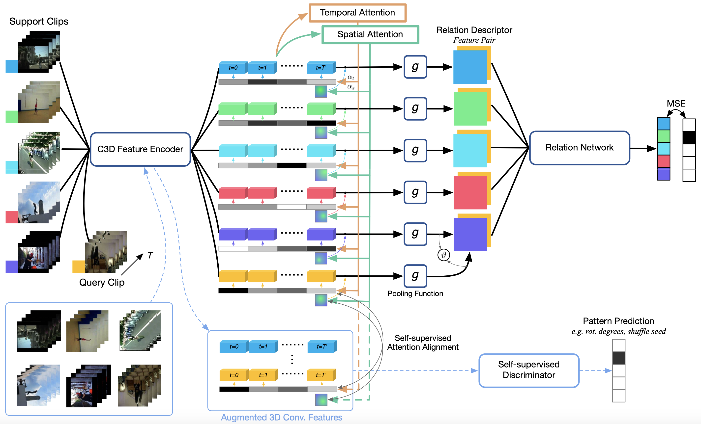
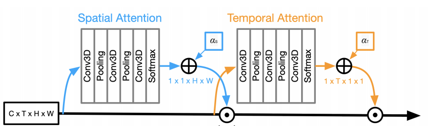
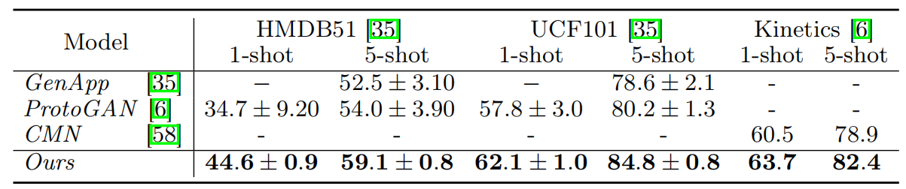

# ARN

> Zhang H, Zhang L, Qi X, et al. Few-shot action recognition with permutation-invariant attention[C]. Computer Vision–ECCV 2020: 16th European Conference, Glasgow, UK, August 23–28, 2020, Proceedings, Part V 16 (ECCV). Springer International Publishing, 2020: 525-542.

## 一、引言

1. 小样本动作识别的难点：

   （1）**样本数量**有限：小样本数据集通常只包含很少的训练样本，这使得模型难以从数据中学习到充分的知识。

   （2）数据的**多样性**（主体差异）：动作数据集中的动作类型非常多样化，每个动作类别的动作表现出不同的变化模式，这导致模型需要处理多样性的数据，从而增加了模型的难度。

   （3）动作的**时序性**：动作的时序性非常重要，因为动作的不同部分可能具有不同的含义和作用。模型需要学习如何处理动作序列的时序信息，以便正确地分类不同的动作。

2. 相关工作：

   （1）Siamese Network：基于双流架构学习**图像描述子**并进行相似度计算。

   （2）Prototypical Networks：计算数据点与**类表示**之间的距离。

   （3）**生成模型**、 **3D 坐标上的图形匹配**、带有类分类器的**扩张网络**。

3. 研究贡献： 

   （1）提出一种使用 **C3D 编码器**、**置换不变池化**和**关系描述符**对视频进行少量动作识别的方法。 

   （2）利用**时空注意力**模块和**自我监督**来改善低样本制度下的训练。

   （3）通过置换片段的区块，并将生成的注意力区域与非置换片段中类似注意力**区域对齐**，以训练注意力机制与区块排列不变的注意力机制来解决判别模式的**长期时间分布偏移问题**。

   （4）引入**新的数据拆分**，对少量动作识别算法进行系统比较，并将其用于未来的研究。

## 二、ARN

1. 使用 C3D 骨架捕获短程的时空信息。再进行受时空注意力控制的二阶池化得到功率归一化自相关矩阵（AM）。最后计算相关性。

2. 时空注意力：将编码后的视频块聚合为固定长度的表示形式，使用自注意力加权每个区块对最终表示的贡献：

   

   直接计算时空的注意力在计算上很昂贵并且会导致过度参数化，因此拆解为空间注意力和时间注意力。

3. 二阶池化（g）：
   $$
   \boldsymbol{\Psi}=\eta\left(\frac{1}{N} \sum_{n=1}^N \boldsymbol{\phi}_n \boldsymbol{\phi}_n^T\right)=\eta\left(\frac{1}{N} \boldsymbol{\Phi} \boldsymbol{\Phi}^T\right) \\ 其中\quad \eta(\mathbf{X})=\frac{1-\exp (\sigma \mathbf{X})}{1+\exp (\sigma \mathbf{X})}\quad 用于计算幂归一化\\
   输入\boldsymbol{\Phi} :C*N，N=H*W*T\\
   输出\boldsymbol{\Psi}:C*C
   $$

4. 时空自监督：通过学习如何在时间和空间上对输入视频进行自重建来进行训练。

   （1）在时间上的自监督学习中，模型被要求重构输入视频的未来或过去帧。学习输入视频的时间关系和序列中的上下文信息。

   （2）在空间上的自监督学习中，模型被要求重构输入视频的不同部分或随机裁剪的片段。学习输入视频中不同区域之间的关系和特征。

## 三、结果

