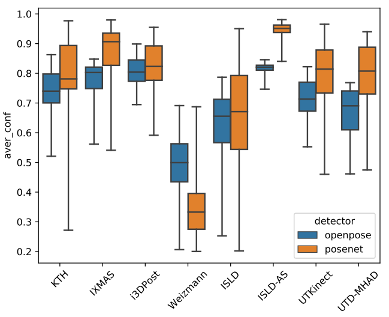
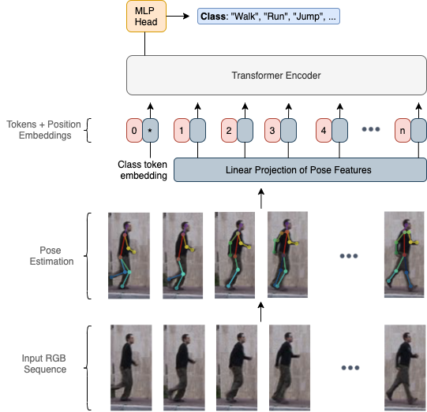
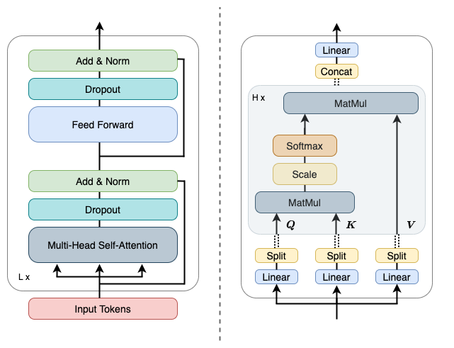
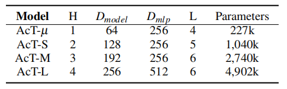
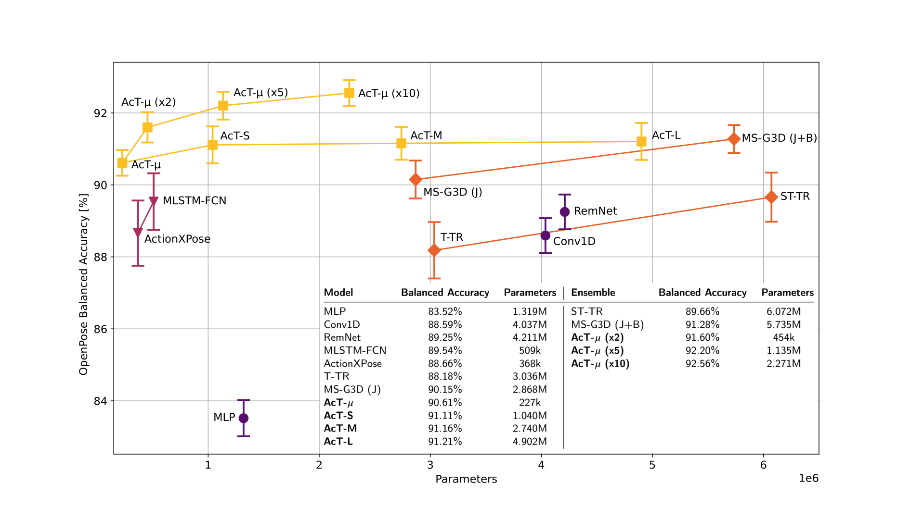

# Action Transformer

> Mazzia V, Angarano S, Salvetti F, et al. Action Transformer: A self-attention model for short-time pose-based human action recognition[J]. Pattern Recognition, 2022, 124: 108487.

## 一、引言

1. 以往在 HAR 中应用注意力机制主要是添加在标准卷积层和循环层之上，用于提高整体泛化能力。

2. 短时 HAR ：在一段很短（1s以内）的时间步长内对动作进行连续分类。

3. 基于姿态的 HAR ：给定一组人体关节点坐标来判别动作。

   （1）基于视频的方法：基于 RGB 帧，使用 OpenPose、PoseNet 等算法计算关节点。

   

   （2）基于深度的方法：采用 Kinect 传感器等采集关节点的三维坐标，再投影到二维空间。

4. MPOSE2021 数据集：基于姿态的动作视频，包含来自 20 个常见动作类的 15429 个样本。

## 二、Action Transformer

1. 2D pose 检测：采用一个 2D 检测器，将 T \* H \* W \* C 的 RGB 序列（视频）转为 N \* T \* P 的关节点，其中 N 是该帧内的主体个数，P 是关节点个数。

2. 对于每个主体单独使用 Transformer（输入是 1D 序列）。

3. 使用一个线性变换将 T \* P 的序列映射到 T \* Dmodel 的更高维，并添加位置编码。

4. 在序列前补上一个 class token [CLS] ，文中表示这是为了使 self-attention 将信息聚合成一个紧凑的高维表示，用于分离不同的动作类。
   $$
   X^{l_0}=[x_{cls}^{l_0};X_{2Dpose}]+X_{pos}
   $$

5. Transformer Encoder：

   

   （1）Multi-Head Self-Attention：与 Transformer 中的 Multi-Head Self-Attention 相同。
   $$
   A=\textrm{softmax}\!(\frac{QK^T}{\sqrt{D_h}})\\
   \textrm{SA}(X)=AV\\
   \textrm{MSA}(X)=[\textrm{SA}_1(X);\textrm{SA}_2(X);...;\textrm{SA}_H(X)]W_{MSA}
   $$
   （2）feed forward：一个两层的 MLP（一层维度扩展至 4 \* Dmodel，一层维度还原）和一个 GeLu 非线性变换。

6. 网络堆叠：层次堆叠中交替使用 dropout、layernorm、residual connection。

   根据堆叠层数多少分为：

   

## 三、结果

