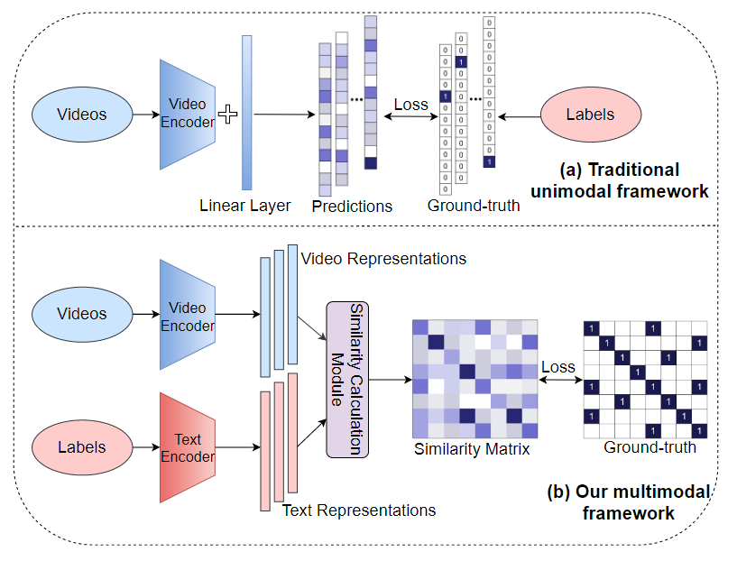
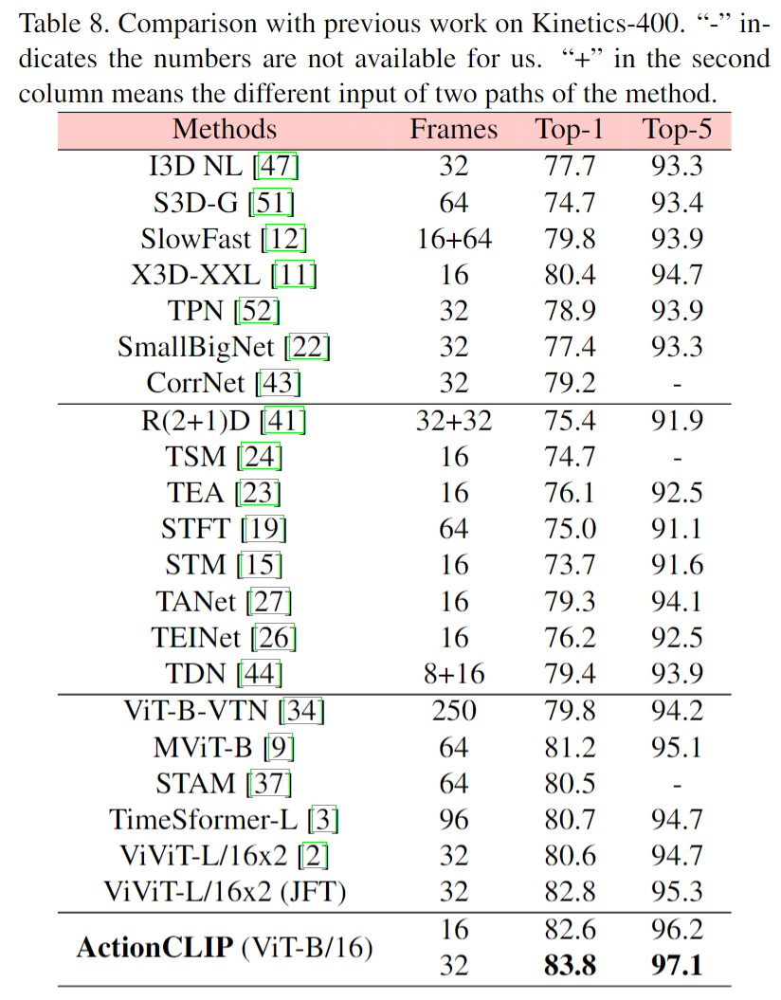

# ActionCLIP: A New Paradigm for Video Action Recognition

> Wang, Mengmeng, et al. “ActionCLIP: A New Paradigm for Video Action Recognition.” Cornell University - arXiv, Sept. 2021.

## 1 Motivation & Contribution

### 1.1 Motivation

- 挖掘标签文本的语义信息，并与对应的视频特征进行关联，增强视频表征的语义信息。
- 使模型能够实现Zero-Shot迁移，而无需任何进一步的标记数据或参数要求 。

### 1.2 Contribution

- 提出了一个多模态的视频分类框架，将文本特征进行充分的利用，将以往的单模态视频分类问题建模为多模态的视频-文本对的匹配问题。
- 提出了一种动作识别的新范式："pre-train, prompt, and fine-tune"，即通过prompt保持住pre-trained模型的强大表征性能，然后在下游任务微调。

## 2 Method

### 2.1 Multimodal Learning Framework

- 与CLIP类似计算视觉特征与文本特征的余弦相似度。
- 由于视频的数量远大于固定标签，因此在一个batch的视频中不可避免地会出现属于一个标签的多个视频。故将similarit score学习视作1-in-N分类使用交叉熵损失(cross-entropy loss)是不恰当的。本文引入Kullback–Leibler(KL)散度作为视频文本的对比损失：

### 2.2 New Paradigm: Pre-train, Prompt and Fine-tune

#### 2.2.1 Pre-train

- 当前的大模型预训练过程中主要有三种代理任务：
  - 多模态匹配（multimodal matching，MM）。
  - 多模态对比学习（multimodal contrastive learning，MCL）。
  - 掩码语言建模（masked language modeling，MLM），近两年则提出了掩码图像建模和掩码视频建模。
- 不过大模型预训练计算量过大，本文直接应用预训练的模型，所以这部分仅限简单介绍。

#### 2.2.2 Prompt

- Prompt: 表示通过调整下游任务，使其对预训练任务有更好的相似性，同时能保持住预训练模型的表征能力。
- Textual prompt：给定一个类别标签，给出了三种手工设计的prompt方式
  - Prefix prompt： label，a video of action
  - Cloze prompt: this is label, a video of action
  - Suffix prompt: human action of label

- visual prompt: visual prompt使用与否取决于pre-trained model(video-text pretrained则无需再规划模型，相反image-text pretrained则需通过visual prompt进行视频的时序建模)，本文设计了三种visual prompt 方式：
  - pre-network prompt：此prompt主要对输入部分进行改动，对所有的输入帧的所有patch都进行时间+空间的位置编码，进行attention计算，简称为joint。
  - in-network prompt：在video encoder ViT相邻层间插入temporal shift模块(TSM) ，该模块不会引入可学习参数（部分特征通道沿时间维度移动，便于相邻帧间的特征交换），简称为Shift。
  - post-network prompt：采用两个独立的编码器依次编码空间和时间特征。空间编码器直接选择了预训练的CLIP image encoder，以获得帧级特征表示，随后将帧级特征concat到一起后输入时间编码器。本文提出了四种时序编码器：MeanP, Conv1D, LSTM and Transf。MeanP指时间维度上的Mean pooling；Conv1D是应用于时间维度上的一维卷积；LSTM是一种递归神经网络；Transf是$L_t$层的temporal vision transformer encoder。

- Fine-tune: 当有充足的下游训练数据集时，对特定数据集微调将显著提高性能。此外如果prompt引入了额外的参数，训练这些参数并使整个框架端到端学习也是有必要的。

## 3 Experiment

