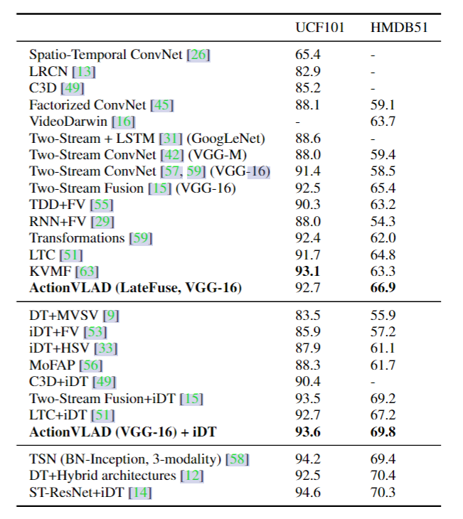

# ActionVLAD

## 1. Motivation & Contribution

### 1.1 Motivation

- 使用average等简单late fusion无法有效建模复杂动作（一帧图像中包含着多个子动作，易混淆含有相同子动作的类别），缺乏对视频的全局特征表示。
- 传统的特征聚合算法如Bag of words(BOW)、Fisher vectors(FV)、vectors of locally aggregated descriptors (VLAD)主要应用于关键点后处理阶段，无法端到端的训练。

### 1.2 Contribution

- 通过将NetVLAD推广到视频领域，实现了一种端到端可训练的时空特征聚合方法。
- 研究了关于时空融合以及多流融合的多种融合策略。

## 2. Related work

## 2.1 VLAD(vector of locally aggregated descriptors,局部特征聚集描述子)

- VLAD 和 BoW、Fisher Vector 等都是图像检索领域的经典方法。
- 通常在传统方法中我们会获得一系列的局部特征（SIFT、SURF、ORB）之类，假设为 N 个 D 维的局部特征（通常 N 可能比较大，而且每幅图特征多少不一，N 可能数量也不一定），我们希望通过这N\*D维特征获得一个可以表示全局K\*D维特征的方法（通常K是我们指定的数目，例如128维）。VLAD 的主要流程如下：
    1. 对全部 N*D 维局部特征进行 K-Means 聚类获得 K 个聚类中心，记为$C_k$
    2. 通过以下公式将 N\*D 维局部特征编写为一个全局特征 V，特征向量维数为 K\*D，其中$k\in{K},j\in{D}$，公式如下：
        $$V(j,k)=\sum_{i=1}^{N}{a_k(x_i)(x_i(j)-c_k(j))}$$
        其中$x_i$为第i个局部图像特征，$c_k$为第k个聚类中心，$a_k(x_i)$是一个符号函数，当且仅当$x_i$属于聚类中心$c_k$时，$a_k(x_i)$=1，否则$a_k(x_i)$=0。该函数是hard assignment，即不可导函数。
- VLAD是一个将若干局部特征压缩为一个特定大小全局特征的方法，通过聚类，实现了将特征降维，同时用特征与聚类中心的差值作为新的特征值。

## 2.2 NetVLAD

- NetVLAD算法对VLAD的改进有两点：
  - 将局部特征描述子的聚合k-means改成了1 x 1卷积
  - 将hard assignment改成了soft assignment，使其可导
- 经典 VLAD 方法显然是一个不可导的函数，其中主要不可导的地方在于$a_k(x_i)$这样一个符号函数，因此为了将 VLAD 变为可训练的函数，必须将其变成可微计算。因此，将$a_k(x_i)$平滑化：
    $$\bar{a}_k\left(\mathbf{x}_i\right)=\frac{e^{-\alpha\left\|\mathbf{x}_i-\mathbf{c}_k\right\|^2}}{\sum_{k^{\prime}} e^{-\alpha\left\|\mathbf{x}_i-\mathbf{c}_{k^{\prime}}\right\|^2}}$$
- 把2范数写成向量的乘法并展开得：
    $$\bar{a}_k\left(\mathbf{x}_i\right)=\frac{e^{\mathbf{w}_k^T \mathbf{x}_i+b_k}}{\sum_{k^{\prime}} e^{\mathbf{w}_{k^{\prime}}^T \mathbf{x}_i+b_{k^{\prime}}}}$$
    $w_k = 2\alpha c_k,b_k = −\alpha \|ck\|^2$，这里很容易看出来，soft assginment其实就是在对特征描述子做一个线性变换再加上一个bias，最后进行softmax操作
- 这样 VLAD 公式就被改写为：
    $$V(j, k)=\sum_{i=1}^N \frac{e^{\mathbf{w}_k^T \mathbf{x}_i+b_k}}{\sum_{k^{\prime}} e^{\mathbf{w}_{k^{\prime}}^T \mathbf{x}_i+b_{k^{\prime}}}}\left(x_i(j)-c_k(j)\right)$$
- 现在的VLAD算法其实只有一个变量，而为了能够更加方便地利用卷积操作实现上面的全部过程，作者让变成三个无关的变量。此外，也能通过监督学习获得更具辨识性的聚类中心。
- 传统 VLAD 的中心是聚类出来的，没有监督的标签数据$c_k^{VLAD}$，在聚类时我们使用了很多图像这些图像的描述符之间没有关系，那么也就很可能把本来不是一个物体的描述符聚为一类，使得我们原本期望的类内描述符都是一个物体的feature不太容易达到。
- 而在使用监督数据进行训练时，我们可以已知图像数据属于同一物体，那么训练时就可以只把属于同一物体的特征聚在一起而把不是的划分到其他类别，这样就可能学习出一个更好的$c_k^{NetVLAD}$聚类中心，使得最终的特征更有区分度。

## 3. ActionVLAD

- 在双流网络的基础上加入ActionVLAD层，进行时空特征聚合。

### 3.1 Trainable Spatio-Temporal Aggregation Layer

- 从公式上看，ActionVLAD就是将NetVLAD拓展到时空域，输出为一个矩阵。

$$V[j, k]=\sum_{t=1}^{T}\sum_{i=1}^N \frac{e^{-\alpha\left\|\mathbf{x}_{it}-\mathbf{c}_k\right\|^2}}{\sum_{k^{\prime}} e^{-\alpha\left\|\mathbf{x}_{it}-\mathbf{c}_{k^{\prime}}\right\|^2}}  \left(x_{it}[j]-c_k[j]\right)$$

### 3.2 Which layer to aggregate

- 分析了在全连接层和卷积层后做ActionVLAD layer的不同性能，实验结果表明在VGG-16 的conv5-3后加入ActionVLAD layer效果最好。

### 3.3 How to combine Flow and RGB streams

- 分析了3种双流融合策略(Concat Fusion,Early Fusion,Late Fusion),late fusion 表现最好。

## 4. 实验结果

