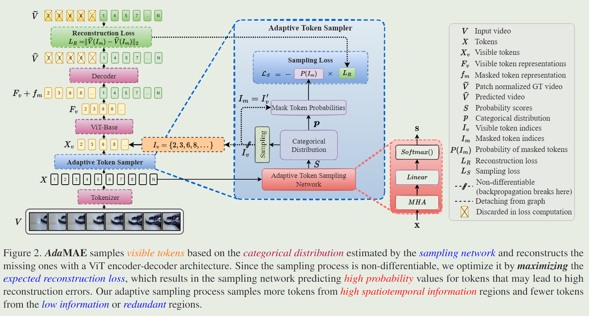
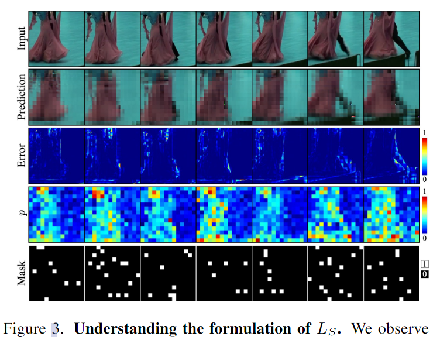
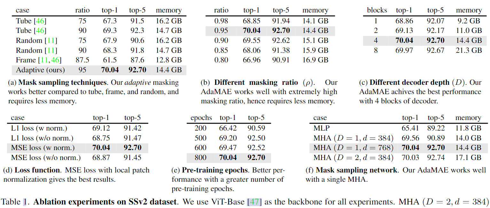
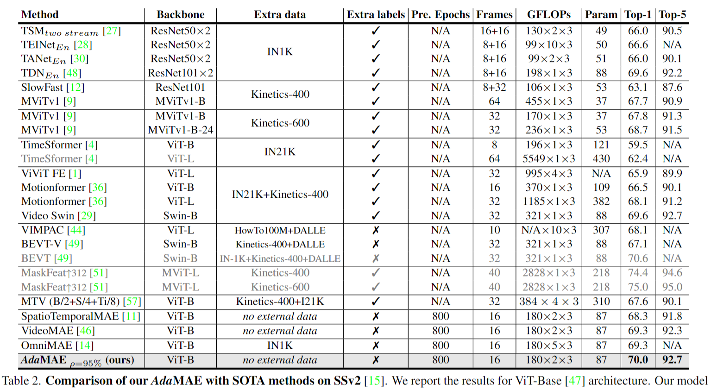
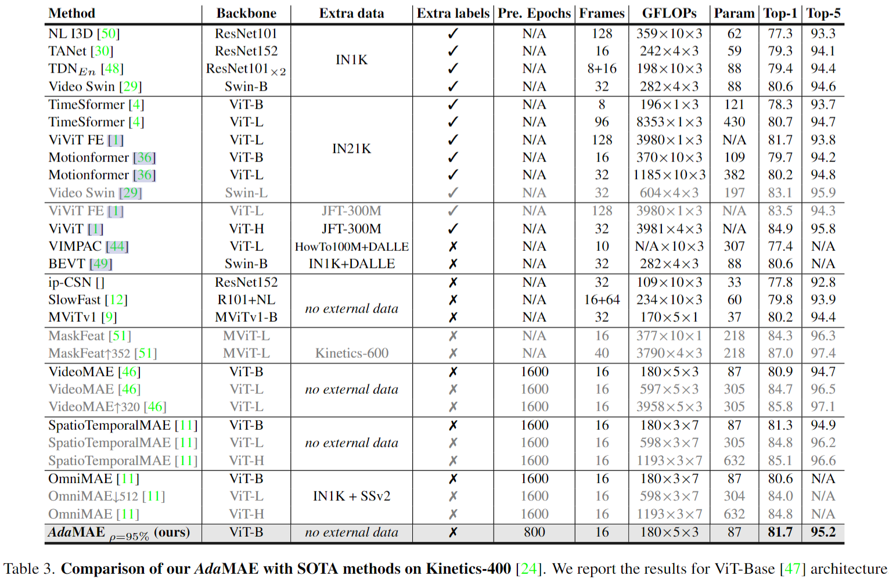

# AdaMAE: Adaptive Masking for Efficient Spatiotemporal Learning with Masked Autoencoders

> Bandara, Wele Gedara Chaminda, et al. "AdaMAE: Adaptive Masking for Efficient Spatiotemporal Learning with Masked Autoencoders." arXiv preprint arXiv:2211.09120 (2022).

## 1 Motivation & Contribution

### 1.1 Motivation

- 目前的掩码策略大多采用不同形状的随机采样掩码模板，但也存在问题，使得掩码自监督训练时长过长。原因在于随即掩码有可能从低信息区域（即背景区域）采样 visible tokens，造成重建任务困难，模型难以学习有效特征。因此本文希望尽可能地从时空学习丰富的区域采样，提高训练效率。
- 如何自适应地根据不同视频的时空特点进行针对性采样是一个问题。受强化学习的启发，本文首先使用辅助网络估计所有输入token上的分类分布，然后从该分布中抽样visible token。由于采样是一个不可微的操作，因此设计了一个辅助损失函数用于优化自适应采样策略。观察发现时空信息丰富的区域通常重建损失比背景这类低信息区域的高，所以辅助损失函数通过最大化重建损失的数学期望来优化自适应采样。

### 1.2 Contribution

- 提出了一种自适应的MAE采样策略，使得采样倾向于更少但信息更丰富的token。

## 2 Method

### 2.1 Architecture

- 主要设计了一个自适应采样网络，通过一个轻量化的MHA获取分类分布。

### 2.2 Optimizing AdaMAE

- 主要通过重建损失函数和自适应采样损失函数优化模型。

#### 2.2.1 Masked reconstruction loss

- 重建损失与MAE保持一致，ground truth 为 patch normalized 的RGB值。

$$
\mathcal{L}_{\mathrm{R}}(\phi)=\frac{1}{N-N_v} \sum_{i \in I_m}\left\|\widehat{\mathbf{V}}_i-\widetilde{\mathbf{V}}_i\right\|_2
$$

#### 2.2.1 Adaptive sampling loss

- 受强化学习RL中的REINFORCE算法的启发，本文作者将visible token sampling 是做一个action，整个MAE模型作为一个environment，而掩码重建损失$\mathcal{L}_R$作为一次动作与环境互动后得到的返回值return。
- 从重建损失的可视化图中可以发现前景（高信息区域）的损失比背景（低信息区域）高，因此通过最大化mask token的重建损失期望来优化采样网络。
- 自适应的采样策略能够进一步提高掩码率(95%)，减少token数量和计算开销，同时token包含的时空信息更丰富，加速了训练过程。
- 笔者思考：从重建损失图中也可以观察到损失较高处形状与传统算法中IDT的MBH(Motion Boundary Histograms)特征相似，观察很多视频MAE的可视化也可以观察人物动作边界往往难以精确重建，动作边界是否可以作为一种visual prompt，有待进一步探索研究。

$$
\mathcal{L}_S(\theta)=-\mathbb{E}_\theta\left[\mathcal{L}_R(\phi)\right]=-\sum_{i \in \mathbf{I}_m} P_\theta^i \cdot \mathcal{L}_R^i(\phi)
$$

## 3 Experiment

