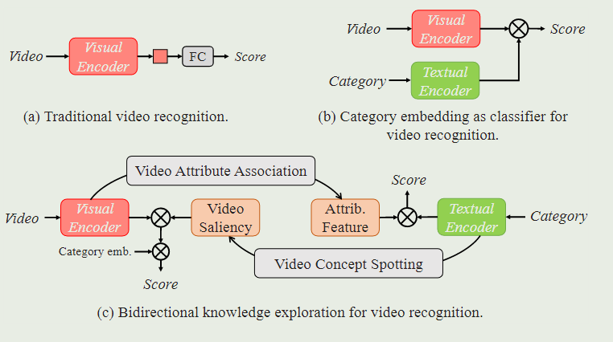
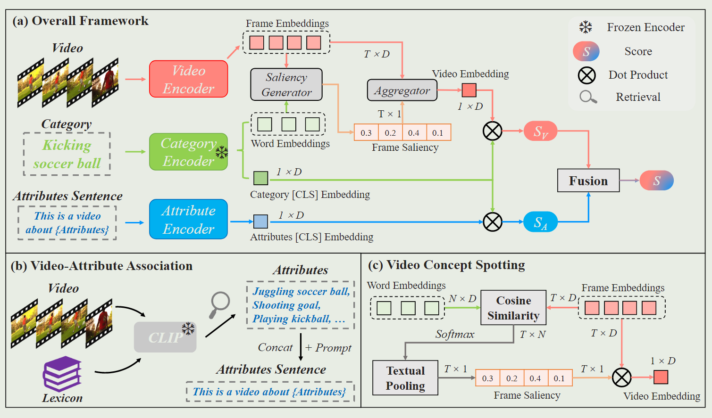
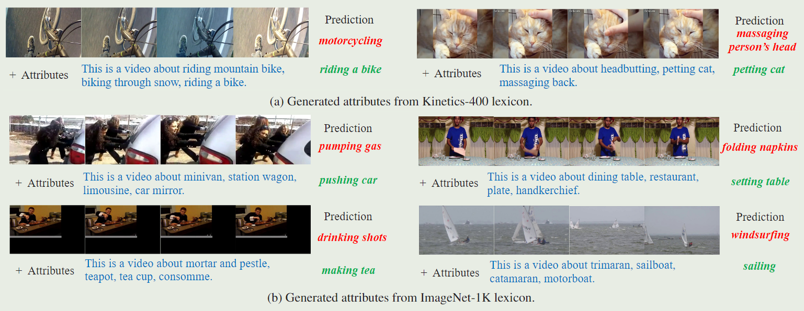
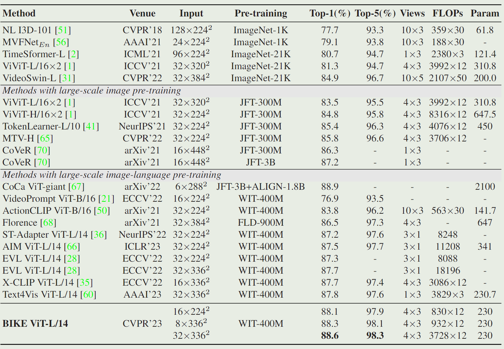
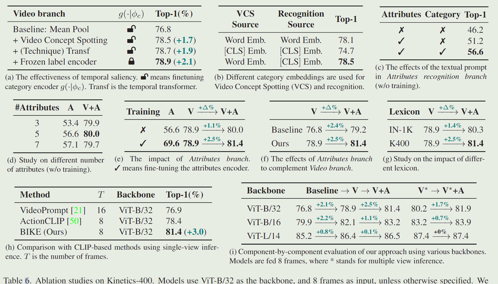

# Bidirectional Cross-Modal Knowledge Exploration for Video Recognition with Pre-trained Vision-Language Models

> Wu, Wenhao, et al. Bidirectional Cross-Modal Knowledge Exploration for Video Recognition with Pre-Trained Vision-Language Models. Dec. 2022.

## 1 Motivation & Contribution

### 1.1 Motivation

- 目前视觉语言通用大模型日趋流行，如何将大模型的知识迁移到视频任务中是一个尚未有效解决的问题。
  - 当前主流方法分为两种，一种为只使用大模型的视觉单模态分支，通过添加Adapter模块或prompt tuning的方式迁移大模型到下游任务中。
  - 另一种方法保留了多模态框架，通过将输入视频和类别描述嵌入预先对齐的语义空间，以迁移大模型中的多模态知识。但是这种存在一个不足，即只是简单的video-to-text matching，缺乏对多模态语义信息的深入挖掘。
- 本文认为文本的描述不应该局限于类别名，可以利用大模型的zero-shot能力（看图说话），发掘视频有助于分类的潜在的文本属性。本文引入了一个视频属性关联(Video Attributes Association)机制，通过检索预定义的视频词典中检索最匹配的几个视频属性描述，从而丰富类别文本信息，提高分类准确率。
- 此外，本文认为视频中存在背景和与分类不相关的帧，应该进行区分，关注视频中与分类显著相关的帧。本文引入了一个视频概念定位(Video Concept Spotting)机制，即通过计算每帧与文本类别的相似度，生成时间显著性，与帧特征结合后即可得到一个有时序自注意力的全局视频特征表示。

### 1.2 Contribution

- 提出了一个双向视觉文本知识挖掘（Video-to-Text & Text-to-Video）的迁移学习新框架。
- 提出了一个视频属性关联(Video Attributes Association)机制，为视频识别生成额外的分类属性。
- 提出了一个视频概念定位(Video Concept Spotting)机制，用于生成时序显著性。

## 2 Method

### 2.1 Video-to-Text: Video-Attributes Association

- 该模块与CLIP模型十分相似，不同之处在于3点：
  - 首先将视频clip中的帧输入CLIP模型的image encoder并将提取的特征做平均池化，得到全局视频特征表示。
  - 其次将预定义的字典（由ImageNet-1K和Kinetics400类别短语构成）输入CLIP text encoder中，并计算视频特征与文本特征的相似度，选择最相似的几个短语作为有助于分类的潜在视频属性。
  - 最后，与CLIP类似手工设计了一个Prompt将这些属性串联成一个句子，然后输入Attribute Encoder得到最终的Attribute Embedding。

### 2.2 Text-to-Video: Video Concept Spotting

- 一般做法采用的时序平均池化，忽视了视频时序存在冗余和噪声。本文选择通过计算每帧的frame embedding和类别中每个单词的word embedding的余弦相似度，得到一个帧级显著性。

## 3 Experiment

