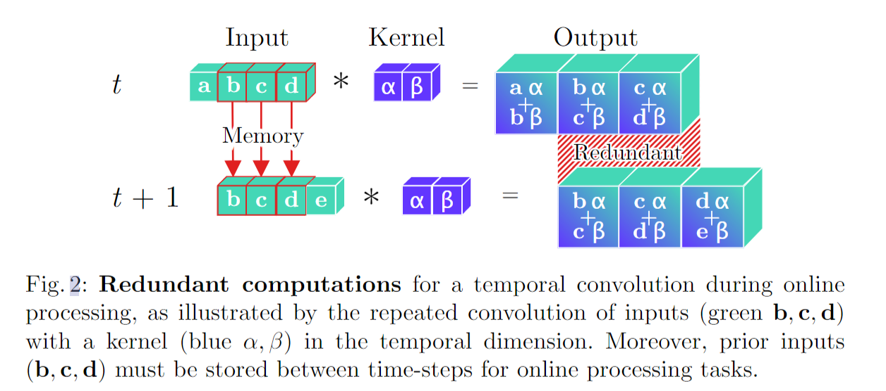
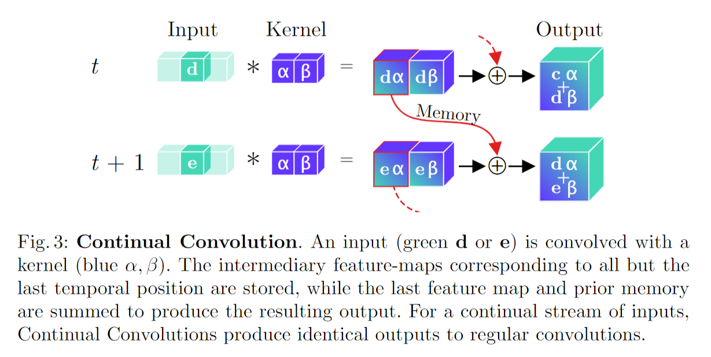
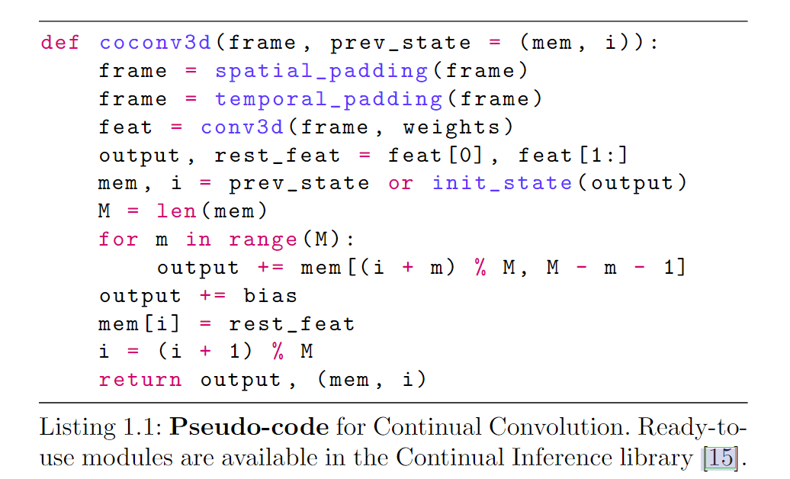
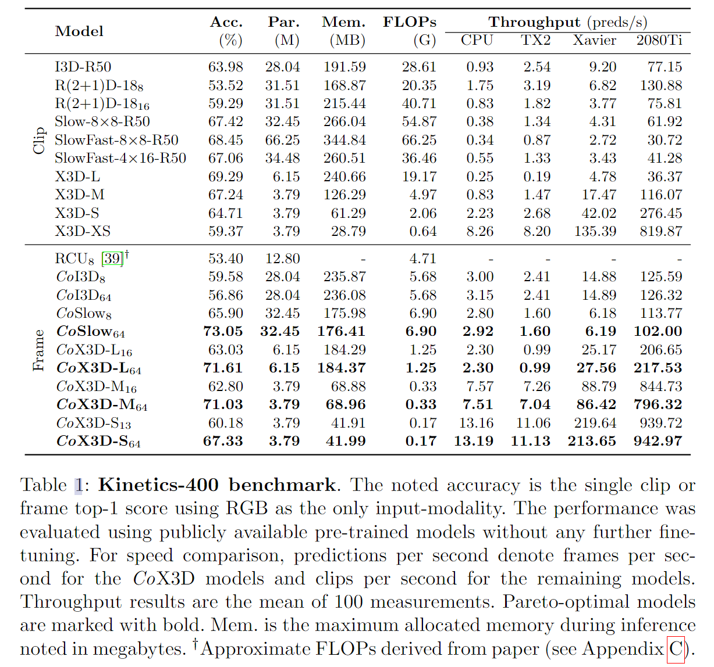
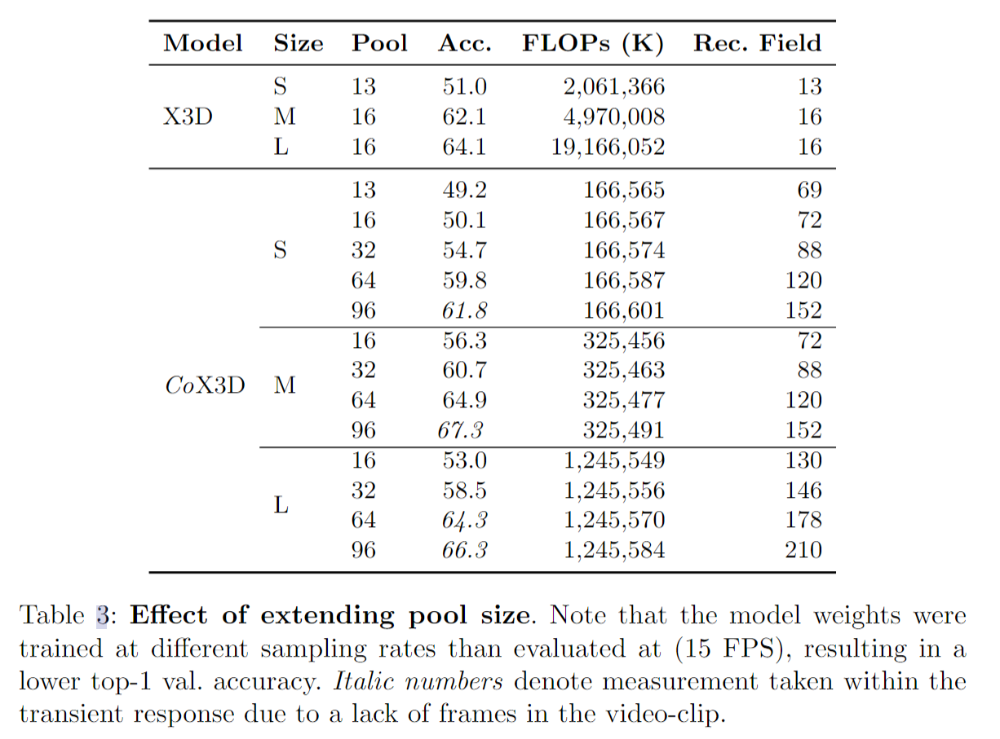

# Continual 3D Convolutional Neural Networks for Real-time Processing of Videos

> Hedegaard, Lukas, and Alexandros Iosifidis. "Continual 3d convolutional neural networks for real-time processing of videos." Computer Vision–ECCV 2022: 17th European Conference, Tel Aviv, Israel, October 23–27, 2022, Proceedings, Part IV. Cham: Springer Nature Switzerland, 2022.

## 1 Motivation & Contribution

## 1.1 Motivation

- 过去的模型大多侧重于提高模型精度，对于计算开销和处理时间方面的研究关注较少。
- 一些从2D高效图像模型扩展到视频领域的模型主要应用于离线视频处理，而应用于在线视频流处理时效果不理想。
- X3D等模型采用的3D CNN在处理视频流时会存在重复计算的问题，因为3D CNN的输入通常是一个video clip（一个clip一个类别），而视频流是连续帧（每帧都需要一个类别）。

## 1.2 Contribution

- 提出了一个轻量级的高性能实时视频流动作识别模型。

## 2 Continual Convolution Neural Networks

### 2.1 Continual Convolutions

- 3D卷积在处理连续帧输入时存在计算冗余的问题，而连续卷积通过将中间结果保存下来用于后续计算解决了计算冗余的问题。

### 2.2 The issue with Continual CNN

#### 2.2.1 Continual Residuals

- 由于CoConv是因果的(causal)，依赖之前的计算结果，所以残差连接有延迟。

#### 2.2.2 Continual Pooling

- 时空池化可以被分解为空间池化和时间池化，但这会带来存储消耗和时间延迟的问题。实验发现对于大多数3D CNN结构来说，时间池化带来的存储消耗并不重要。而对于需要实时处理视频流的任务来说，时间延迟显然更需要被解决。
- 因此，若帧内容相对于采样率变化缓慢，则可以在将一些模型扩展至Continual CNN时，可以考虑去除时间池化操作。
- 例如，本文将X3D中的3D SE block改为了2D SE block。

#### 2.2.3 Temporal Padding

- 在常规3D CNN中通常采用了temporal zero-padding，为了保持时空特征图的维度和保护边缘信息。
- 但这在处理视频流时并不需要考虑，因为当前输入帧其实是后续时间步长中的中间帧。

#### 2.2.4 Initialization

- 由于Continual CNN的权重参数是从3D CNN复制来的，所以在Continual CNN稳定处理视频流前，需要提前处理一些初始化帧（大小与3D CNN的clip尺寸相似）。
- 分为zeros初始化和replicate初始化。

### 2.3 Extended receptive field

- 常规3D CNN内存消耗高度依赖于clip大小，而Continual CNN却没有这个顾虑，因此Continual CNN可以通过增大clip大小和增大池化尺寸大小，扩大感受野，提高模型精确度。

## 3 Experiment

