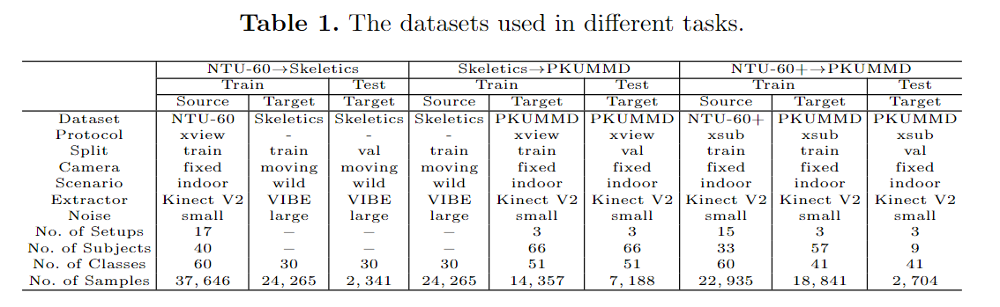
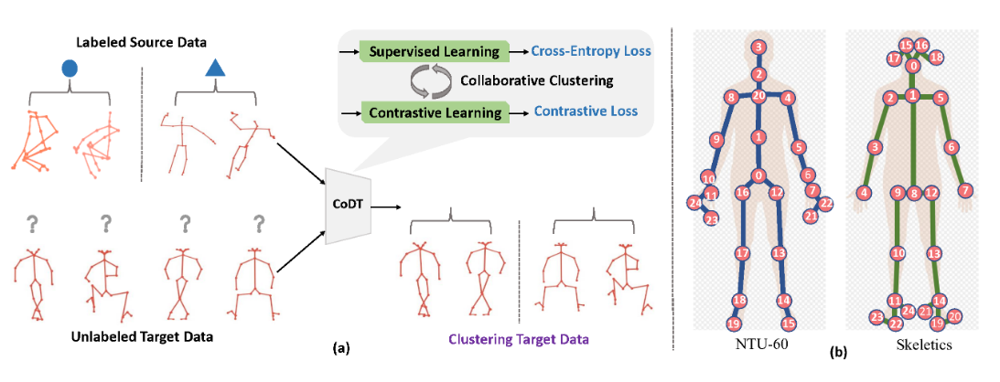
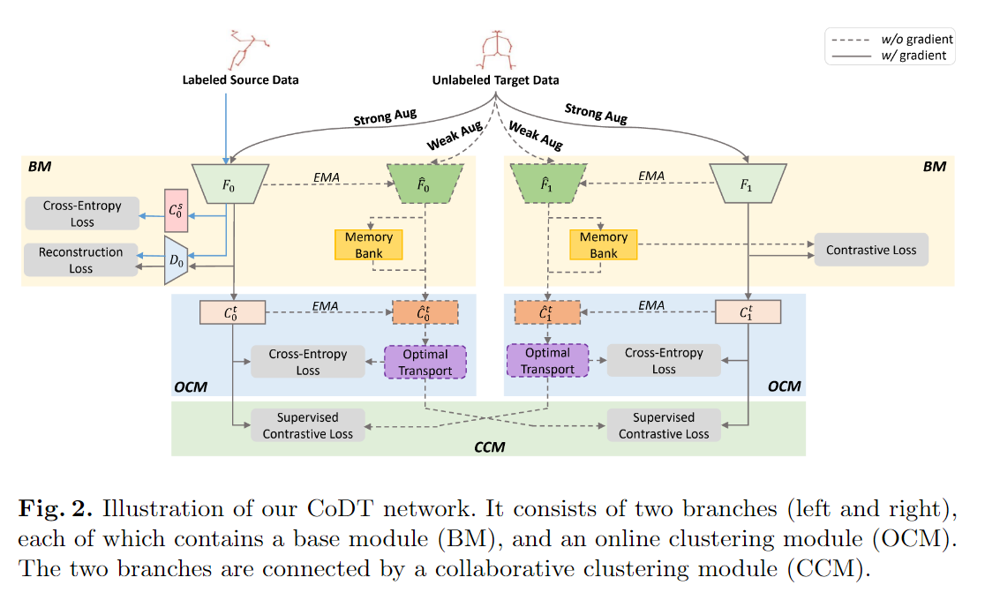
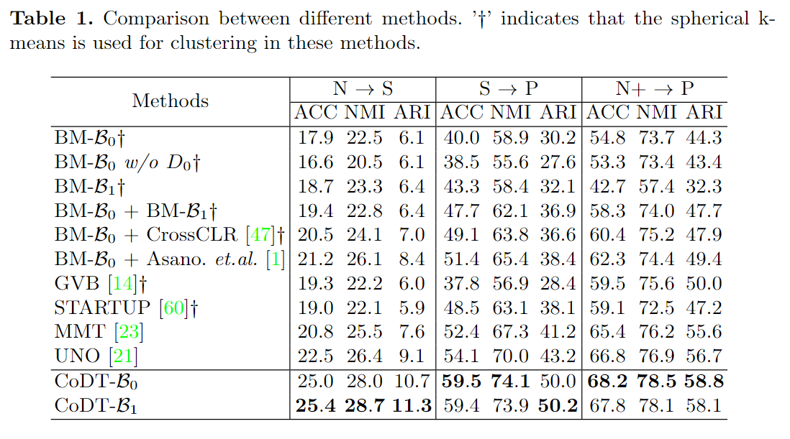
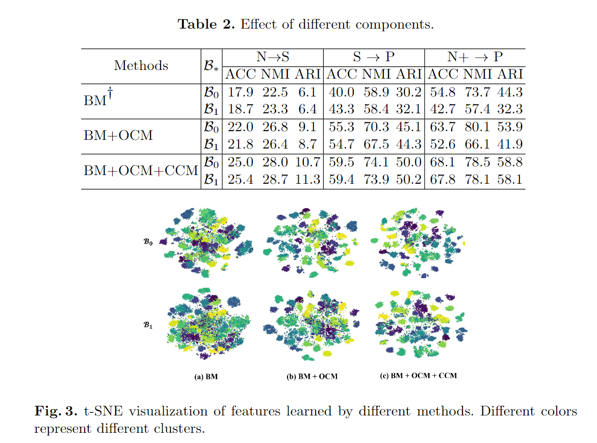

# Collaborating Domain-shared and Target-specific Feature Clustering for Cross-domain 3D Action Recognition

> Liu, Qinying, and Zilei Wang. "Collaborating Domain-Shared and Target-Specific Feature Clustering for Cross-domain 3D Action Recognition." Computer Vision–ECCV 2022: 17th European Conference, Tel Aviv, Israel, October 23–27, 2022, Proceedings, Part IV. Cham: Springer Nature Switzerland, 2022.

## 1. Motivation & Contribution

### 1.1 Motivation

- 域适应(Domain Adaptation)
  - 一般有监督方法的训练集(source dataset)和测试集(target dataset)具有相同或类似的分布，但这在现实实践中是不大可能的，一般存在着domain gap问题。在基于骨骼点动作识别领域，这是由几个方面原因引起的，其一就是设备原因（不同的传感器、不同的姿态估计算法），其二是不同相机参数造成的视角不同，还有不同的场景（如室内和室外）。这一问题具有深刻的现实意义，但相关研究较少。相关数据集中，由于NTU-60是由Kinect相机拍摄所得而Skeletics是对kinetics700中人类相关视频采用姿态估计算法所得，二者骨骼点定义和分类大不相同。而且NTU-60是处于室内环境，而Skeletics大多处于室外环境。

- Close-set and Open-set Transfer Learning
  - 闭集域适应定义了源数据集和目标数据集类别相同但分布不同，因此主流方法致力于减小二者分布的差异。
  - 开集域适应定义了二者类别也不相同，主流方法主要是基于聚类生成伪标签以及将源数据集和目标数据集协同训练得到一个域不变特征。

- 将在有标签的源数据集上监督学习与无标签目标数据集无监督学习结合
  - 在有标签的源数据集上进行监督训练虽然能得到有效的分类特征，但泛化到目标数据集的效果不佳。如果能结合目标数据集，则有助于学习域不变特征。
  - 在无标签的目标数据集进行自监督的对比学习则可以学习到目标数据集特有的特征。
  - 而这二者作者认为是互补的。

- 采用端到端的聚类方法而不是采用性能受限的线下聚类算法（如K-means）。
- 监督学习的聚类特征并不一定和自监督学习的聚类特征匹配，需要保证二者的一致性。

### 1.2 Contribution

- 提出了一种双分支的结合域共享特征和目标特定特征的基于骨架的跨域动作识别方法。
- 提出了一种聚类平衡的在线聚类算法，用于生成鲁棒的伪标签。
- 提出了一种协作聚类算法，保持两个模型成对关系的一致性。

## 2. Method

### 2.1 Base Module

#### 2.1.1 BM-$\mathcal{B}_0$

- $\mathcal{B}_0$处理两个不同域的数据以发掘域共享特征，采用一个ST-GCN作为特征编码器backbone。
- semi-supervised student-teacher framework；为了让模型学习到更抽象的具有域不变性的特征，模型自身将同时作为学生和老师，学生模型输入含噪声的数据，老师模型输入一般不含噪声或仅做弱数据增强。老师模型生成伪标签用于学生模型的训练，训练目标是二者输出保持一致性。老师模型并不是学生模型的简单复制，老师模型的参数权重由学生模型经过exponential moving average (EMA)得来，给予最后n步训练参数权重更高的加权平均，提高模型鲁棒性。
- 有标签的源数据的特征除了要做有监督的分类外，还需要与无标签目标数据的特征经解码器（2层MLP）重建回归骨骼点坐标。
- 为了学习域共享的特征，而不同域的骨骼关节不同，所以在$\mathcal{B}_0$中只使用共有的关节点。
- reconstruction loss:

$$
\mathcal{L}_{d e c}=\frac{1}{n^s} \sum_{i=1}^{n^s} \operatorname{MSE}\left(D_0\left(F_0\left(\boldsymbol{x}_i^s\right)\right), \boldsymbol{x}_i^s\right)+\frac{1}{n^t} \sum_{i=1}^{n^t} \operatorname{MSE}\left(D_0\left(F_0\left(\boldsymbol{x}_i^t\right)\right), \boldsymbol{x}_i^t\right)
$$

#### 2.1.2 BM-$\mathcal{B}_1$

- $\mathcal{B}_1$为了从目标数据集中学习目标特有的表示，采用了基于实例区分的对比学习。为了扩大负样本数量，维护了一个特征记忆库，保存了所有目标数据的$\hat{F}_0$和$\hat{F}_1$特征。

### 2.2 Online Clustering Module

- 在一般半监督任务中由于源数据集与目标数据集分布一致且类别已知，所以学生-教师模型通常直接选择教师模型输出中高置信度类别作为伪标签。而本文数据集和目标集分布不一致，因此当采用聚类方法时很可能出现聚类退化问题（全部聚类成一类），因此需要对聚类的分布进行约束（尽可能均匀，即所有聚类含有相同数量的样本）。
- 预训练BM后，首先在所有目标样本的特征上应用球形 k-means，然后使用质心来初始化目标分类器的权重。
- 此时就是一个将N个样本分配给K个聚类中心的最优运输问题，可以通过Sinkhorn-Knopp算法高效求解。
- OCM的优化目标就是保持学生模型预测结果和教师模型生成的伪标签的一致性。

$$
\mathcal{L}_{o c m}=\frac{1}{n^t} \sum_{i=1}^{n^t}\left(\mathrm{CE}\left(\hat{C}_0^t\left(\hat{F}_0\left(A\left(\boldsymbol{x}_i^t\right)\right)\right), \hat{y}_{0, i}^t\right)+\operatorname{CE}\left(\hat{C}_1^t\left(\hat{F}_1\left(A\left(\boldsymbol{x}_i^t\right)\right)\right), \hat{y}_{1, i}^t\right)\right)
$$

### 2.3 Collaborative Clustering Module

- 为了利用$\mathcal{B}_0$和$\mathcal{B}_1$的互补性，本文采用了co-training的方式。但两个分支并不完全相同，一个模型的伪标签不能直接用于训练另一个模型。作者采用了有监督的对比学习建模两个分支的对应关系，而不是直接匹配两个分支的聚类中心。作者采用了一种跨分支的成对关系构建监督信号和正负样本。
- 对于两个目标实例$x_i^t,x_j^t$来说，通过二元成对关系 $\mathcal{G}_{0, i j}^t=\delta\left(\hat{y}_{0, i}^t-\hat{y}_{0, j}^t\right) \text { in } \mathcal{B}_0 \text { and } \mathcal{G}_{1, i j}^t=\delta\left(\hat{y}_{1, i}^t-\hat{y}_{1, j}^t\right) \text { in } \mathcal{B}_1$表示二者在两个分支中是否来自同一聚类，以此作为监督信号。
- 通过成对的内积描述二者的相似度用于对比学习，$\mathcal{P}_{0, i j}^t=\boldsymbol{p}_{0, i}^t{ }^{\top} \boldsymbol{p}_{0, j}^t$ and $\mathcal{P}_{1, i j}^t=\boldsymbol{p}_{1, i}^t{ }^{\top} \boldsymbol{p}_{1, j}^t$, where $\boldsymbol{p}_{0, i}^t=\operatorname{softmax}\left(\hat{C}_0^t\left(\hat{F}_0\left(A\left(\boldsymbol{x}_i^t\right)\right)\right)\right) \in\mathbb{R}^K$

$$
\mathcal{L}_{c c m}=-\frac{1}{n^t} \sum_{i=1}^{n^t}\left(\frac{\sum_{j=1}^{n^t} \mathcal{G}_{0, i j}^t \log \overline{\mathcal{P}}_{1, i j}}{\sum_{j=1}^{n^t} \mathcal{G}_{0, i j}^t}+\frac{\sum_{j=1}^{n^t} \mathcal{G}_{1, i j}^t \log \overline{\mathcal{P}}_{0, i j}}{\sum_{j=1}^{n^t} \mathcal{G}_{1, i j}^t}\right),
$$
where $\overline{\mathcal{P}}_{0, i j}$ and $\overline{\mathcal{P}}_{1, i j}$ are defined as $\overline{\mathcal{P}}_{0, i j}=\frac{\mathcal{P}_{0, i j}^t}{\sum_{j=1}^t \mathcal{P}_{0, i j}^t}, \overline{\mathcal{P} t}_{1, i j}=\frac{\mathcal{P}_{1, i j}^t}{\sum_{j=1}^{n^t} \mathcal{P}_{1, i j}^t}$.

### 2.4 Training and Test

- 训练分为两阶段，一阶段为BM某块预训练，二阶段为OCM和CCM模块的微调。
  - $\mathcal{L}_{\text {base }}=\lambda_{\text {sup }} \mathcal{L}_{\text {sup }}+\lambda_{\text {dec }} \mathcal{L}_{\text {dec }}+\lambda_{\text {cont }} \mathcal{L}_{\text {cont }}$
  - $\mathcal{L}_{a l l}=\mathcal{L}_{\text {base }}+\lambda_{o c m} \mathcal{L}_{o c m}+\lambda_{c c m} \mathcal{L}_{c c m}$.

- 如果有一个目标分类器，使用它的预测作为聚类分配，否则，使用球面k-means来对特征进行聚类。
- 测试时使用学生模型进行测试。

## 3. Experiment

