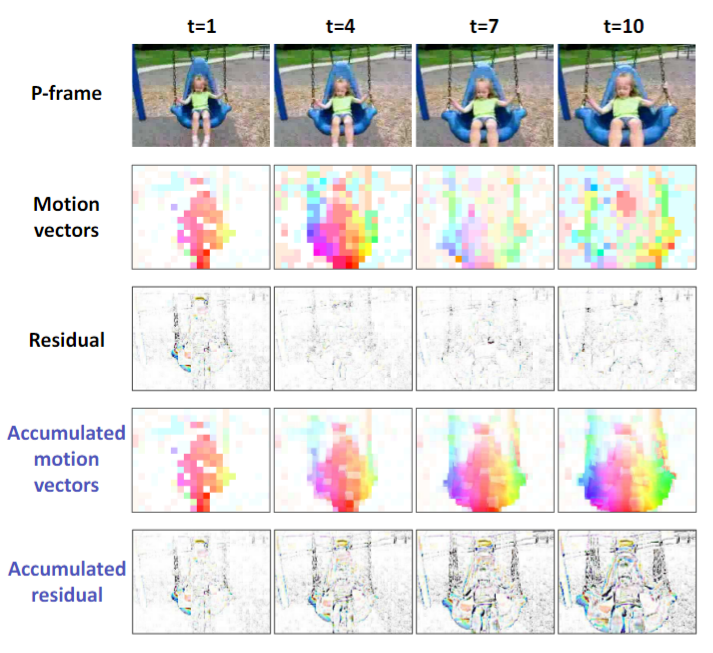
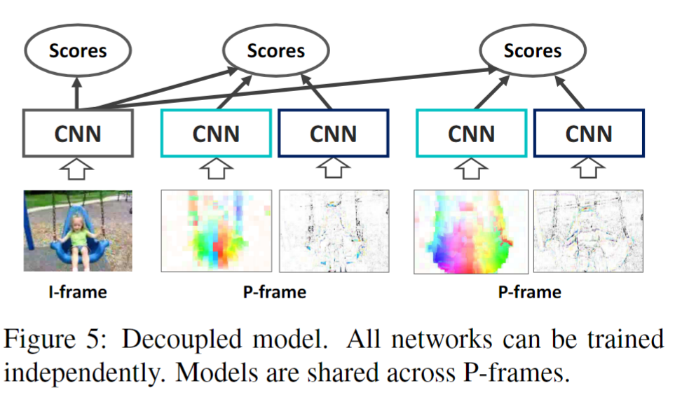
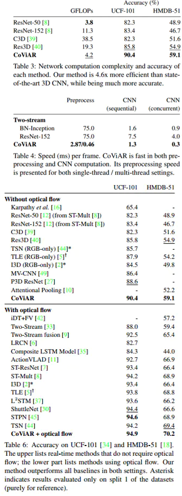

# Compressed Video Action Recognition

> Chao-Yuan Wu et al. “Compressed Video Action Recognition” computer vision and pattern recognition(2017): n. pag.

## 1. Motivation & Contribution

### 1.1 Motivation

- 视频的信息密度较低，而经过压缩后可以消除多达两个数量级的冗余信息，使得关键信息更加突出。
- 单靠RGB图像难以学习时序结构，除非加入提前计算好的光流。而压缩视频中的运动矢量能额外提供运动信息，无需计算光流。
- 压缩图像占用的存储空间小。此外，由于视频通常以压缩版本存储或传输，因此避免解压视频也可以提高效率。

### 1.2 Contribution

- 本文提出直接基于压缩视频训练深度模型的方法，主要在于降低了模型的参数量，速度得到了提升。motion vector提供的一些帧间运动信息，让模型相对于其他不用optical flow的模型更加准确，这种准确可能来自于压缩视频的相对较低的维度，信息密度更高，泛化能力更好。

## 2. Video Compression

### 2.1 原理

- 目前大部分的视频压缩算法（MPEG-4，H.264，HEVC等）是基于连续帧具有高度相似特征的事实。这样可以只存储一帧和与其他帧的差异值，然后就能根据该帧和对应差异值来得到其他帧。

### 2.2 IPB视频压缩编码

- 本文采用了常见的IPB帧编码模式，将压缩视频分为I-frames、P-frames、B-frames。
- I-frames(intra-coded frames):I帧表示常规图像（或关键帧），该帧保留完整画面，只作帧内压缩，如离散余弦变换DCT（Discrete Cosine Transform）。I帧描述了图像背景和运动主体的详情，I帧是P帧和B帧的参考帧(其质量直接影响到同组中以后各帧的质量)。
- P-frames(predictive frames):  P帧是以I帧为参考帧,在I帧中找出P帧“某点”的预测值和运动矢量,取预测差值(residual difference，$\Delta_i^t$)和运动矢量(motion vector，$\mathcal{T_i^t}$)一起传送。在接收端根据运动矢量从I帧中找出P帧“某点”的预测值并与差值相加以得到P帧“某点”样值,从而可得到完整的P帧。P帧没有完整画面数据，只有与前一帧的画面差别的数据。
- 重建P帧的递推关系为：
    $$I_i^{t}=I_{i-\mathcal{T_i^t}}^{t-1}+\Delta_i^t$$

- B帧是双向预测的帧间压缩算法。当把一帧压缩成B帧时，它根据相邻的前一帧、本帧以及后一帧数据的不同点来压缩本帧，也即仅记录本帧与前后帧的差值。
- Motion Vector 相对于Optical Flow显得有噪声和粗糙,但计算速度得到了提升。

## 3. Modeling Compressed Representations

- 从定义和可视化图像上可以发现motion vector与光流相似，而residual与运动边界相似。
- 因此，本文尝试模仿RGB-光流网络，直接将I帧（即RGB图像）、motion vector、residual直接输入卷积网络，最后将不同流的输出做fusion，但效果不好，原因可能是单独的P帧或者残差并不能包含全部的运动信息，破坏了P帧与I帧的依赖关系。
- 本文又尝试了类似于RNN或者LSTM的结构，下一个神经元的输入依赖于前一个神经元的输出，但初步实验表明该方法无效。

### 3.1 Decoupled Model

- 最后文中采用了一个简单但有效的反向跟踪策略来解耦相邻P帧的依赖关系，即用累积运动矢量和残差的方法让每一个P-frame与最接近的前一个I-frame产生关联而不是与前一个P-frame。

### 3.2 Proposed Network

- 文中采用类似于双流的方法，网络输入为一张I帧和T张P帧。
- 为了能够节约计算，采用了ResNet-152来获取I-Frame的特征，用ResNet-18来获取MV和Residual的特征。因为大多数信息存储在 I-frame 中，我们只需要学习 P-frames 的更新。另外对于是Video-level任务，采用了TSN的框架。

## 4. 实验结果

