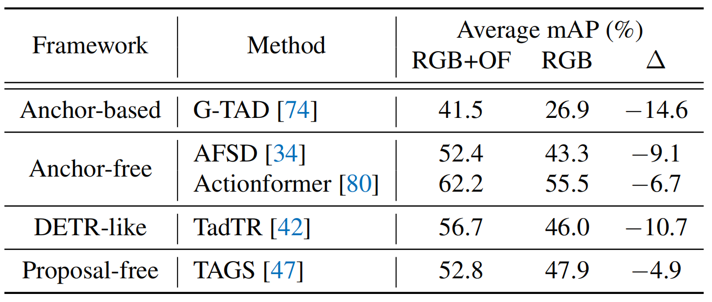
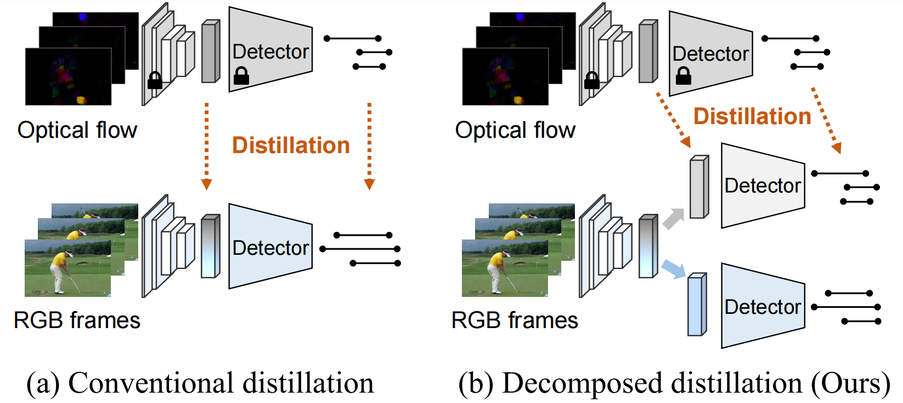
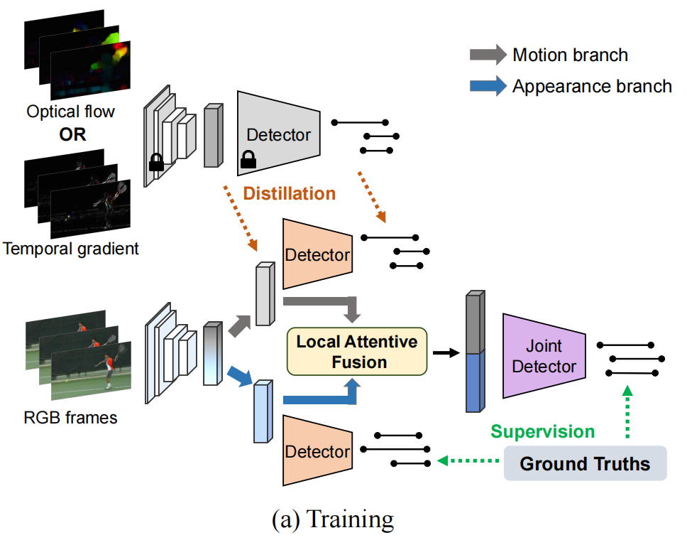
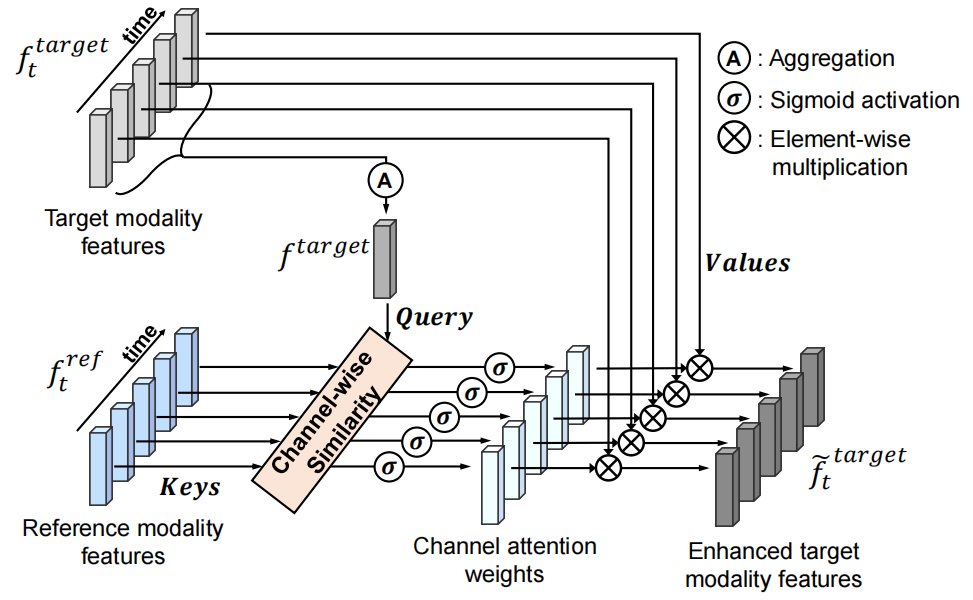
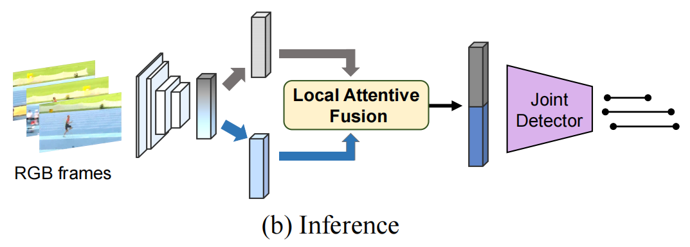
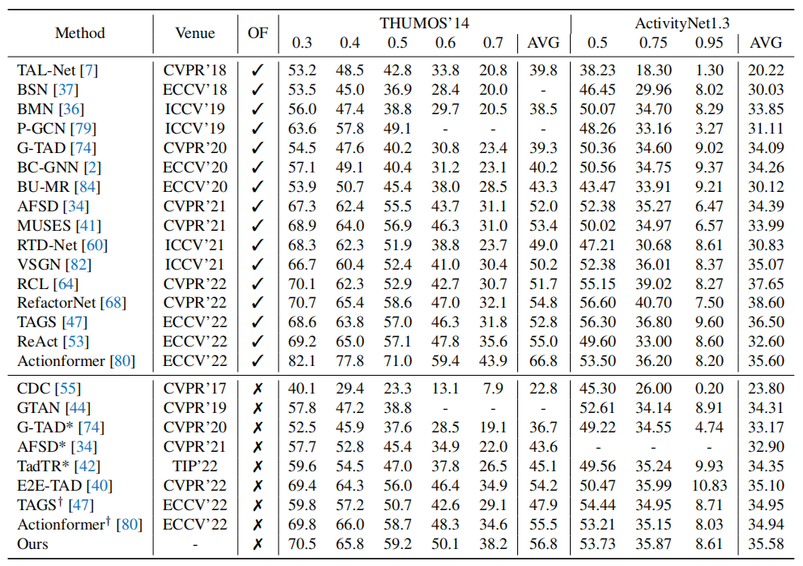

# Decomposed Cross-modal Distillation

# （跨模态的分解蒸馏）

> Pilhyeon Lee, Taeoh Kim, et al. Decomposed Cross-modal Distillation for RGB-based Temporal Action Detection[C]. Proceedings of the IEEE/CVF conference on computer vision and pattern recognition (CVPR). 2023. arXiv:2303.17285 [cs.CV]

## 一、引言

1. 研究背景：现有的双流模型在视频动作检测中表现出色，但由于它们依赖于计算昂贵的光流，因此推理速度较慢。

   

2. 跨模态蒸馏（Cross-modal Distillation）：将一个模态（例如图像）中的知识传递给另一个模态（例如文本）来提高跨模态学习的性能。是一种有监督的跨模态学习方法，其中一个模态（“教师模态”）的知识被转化为另一个模态（“学生模态”）的标签或监督信号。

3. 现有的跨模式蒸馏方法未能像传统蒸馏那样**考虑差异**，将运动知识直接传输到 RGB 模型，RGB 和运动信息相

   互**纠缠**，很难取得平衡。

   

4. 研究贡献：

   （1）提出分解的跨模态蒸馏框架，其中运动信息单独传输，保证外观信息不受损害。

   （2）设计了一种新颖的注意力融合方法，能够利用两种模式的互补性，同时保持特征的局部可辨性。

   （3）我们的方法可推广到各种主干和检测头，显示出一致的改进。

## 二、跨模态的分解蒸馏

1. 首先训练光流网络。

2. 对于 RGB 网络，运动分支需要模仿运动教师（光流网络）的行为，而外观分支应该从相同的 RGB 输入中学习原始外观信息。具体来说，先由卷积网络得到 (T / rT) \* C 的 1D 特征，再通过 1D 映射为 (T / rT) \* D 的时间部分和空间部分。时间部分受光流网络监督，空间部分受真实标签监督。

   

   但两个分支可能会达到退化的解决方案，不加区分地学习相似的表示，仅依靠检测头来产生不同的预测。为了解决潜在的问题，我们让分支**共享**检测头中分类器和回归器的**权重**。

3. 局部注意力融合：两个模态，一个（目标模态，要增强的模态）在时间维度聚合后作为 Q ，另一个（参考模态）作为 K ，做注意力：
   $$
   \omega_t=\sigma\left[\left(W_{\text {query }}^{\top} f^{\text {target }}\right) \odot\left(W_{\text {key }}^{\top} f_t^{\text {ref }}\right)\right]
   $$
   

   增强后的模态拼接，通过联合检测器得到分类。

4. 预测：只有局部注意力融合和联合检测器。

   

## 三、结果

