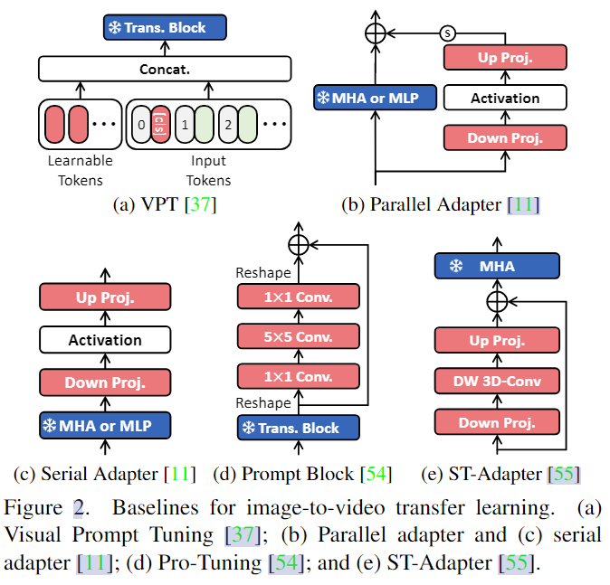
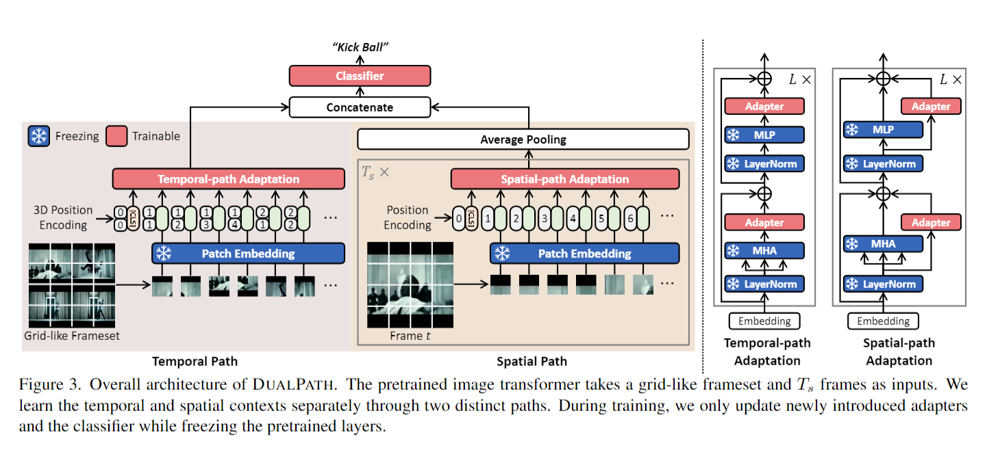
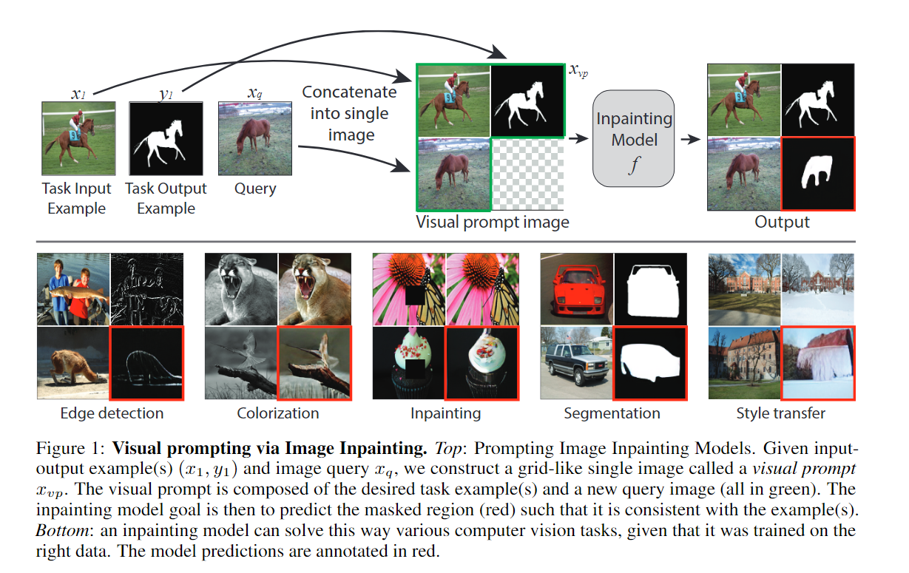
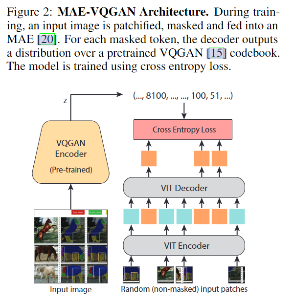
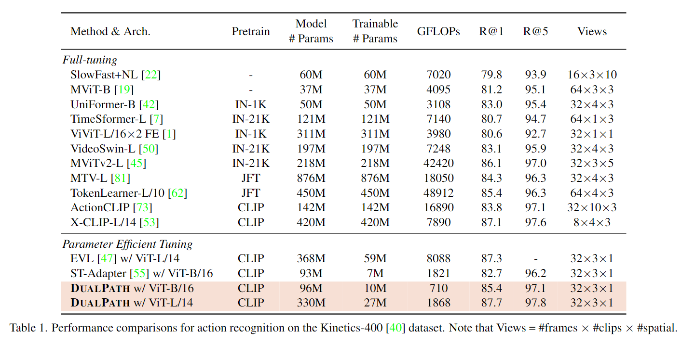
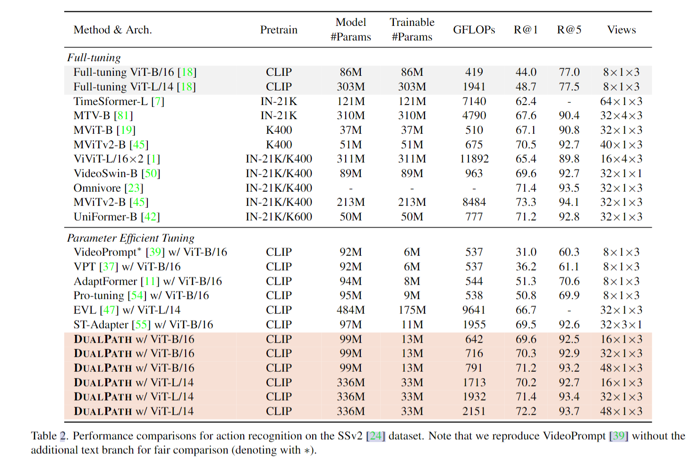

# Dual-path Adaptation from Image to Video Transformers

>Jungin Park et al. “Dual-path Adaptation from Image to Video Transformers” (2023).

## 1. Motivation & Contribution

### 1.1 Motivation

- Parameter-efficient transfer learning(PETL)：仅在保持预训练视觉模型的原始参数不变的情况下学习少量额外的可训练参数，达到与全微调模型相当甚至超过的性能。
- 之前的PETL方法忽视了视频中时序关系，性能受限。此外为了进一步减少计算负担，本文借鉴了two-stream和slowfast的思想设置了不同分辨率的时空双路模型。

### 1.2 Contribution

- 提出了一种双路参数高效的视频理解迁移学习方法。
- 提出了一种将连续帧合并到类似网格的帧集中的时序建模方法。

## 2. Dual-path adaptation

### 2.1 PETL Baselines

- 列举了最近的一些PETL方法，除了ST-Adapter之外其他方法都没有考虑时序建模，ST-Adapter的3D卷积计算量还是比较大的。

### 2.2 Dual-path Adaptation

- 空间流利用的预训练视觉模型已经足够建模qpperance信息，只需加上适配器帮助模型学习动作识别中的空间上下文信息（如交互物体）。
- 而在时间上作者借鉴了一些迁移学习中的视觉提示（visual prompt）方法构造了一个网格状的帧集合。根据时间顺序堆叠空间尺度缩小的帧，并重塑堆叠帧的形状，以与原始帧大小相同的网格形式构建一组帧集合，不过时序长度也缩短了（也是该方法的缺点）。
- grid-like visual prompting，基本思想就是给预训练模型根据具体下游任务提供先验的提示，帮助预训练模型更好地迁移到下游任务上。

## 3. Exepriment

