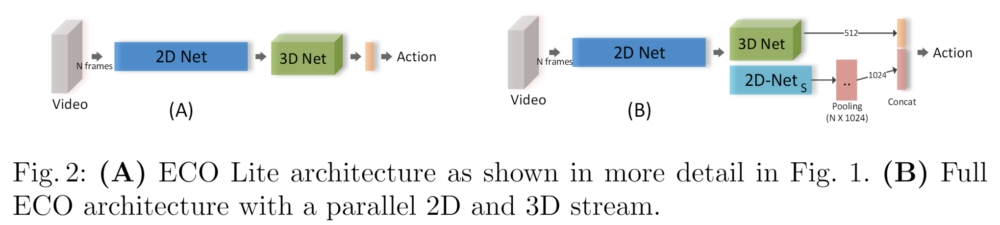
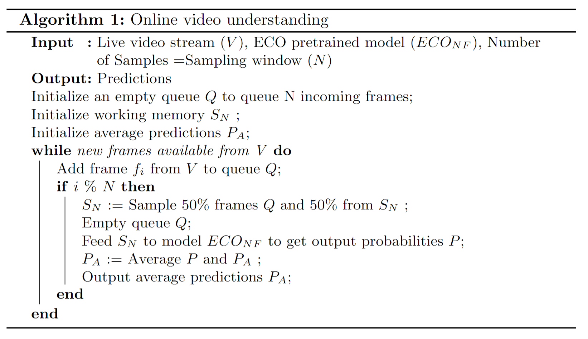
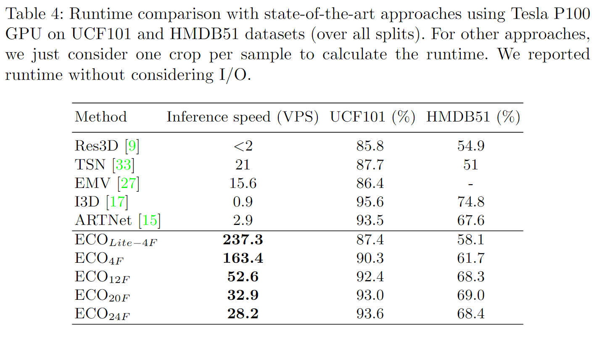

# ECO: Efficient Convolutional Network for Online Video Understanding

> Mohammadreza Zolfaghari et al. “ECO: Efficient Convolutional Network for Online Video Understanding” european conference on computer vision(2018): n. pag.

## 1. Motivation & Contribution

### 1.1 Motivation

- 大多数方法主要局限于视频的局部时空信息，忽略了长时间的联系。
- 尽管有快速的局部帧处理方法，但对整个视频的处理依然效率较低。

### 1.1 Contribution

- 使用 TSN 稀疏采样来减少不必要的冗余帧的前提下，对采样帧的 mid/high-level spatio-temporal 特征进行 3D Conv fusion，故比 TRN 只在最后特征层来做 temporal fusion的时空表达能力更强
- 提出了一整套工程化的 Online video understanding 框架。

## 2. Long-term Spatio-temporal Architecture

### 2.1 ECO Lite and ECO Full

- 本文主要将TSN与3D conv fusion 做结合，提出了两种时空网络结构ECO-Lite和Full ECO。

- 网络前半段都是将视频分段并随机采样的单张视频帧输入预训练的2D网络，然后将各帧得到的特征进行堆叠，在后半段利用3D卷积网络进行跨帧的特征提取。最后利用3D卷积网络提取出的视频表示（和2D卷积网络提取视频表示）输出视频的分类结果。这种前半段是2D卷积网络，后半段是3D卷积网络如上图中的A所示，即ECO Lite。
- 但是考虑到有些视频只需要一帧图像就可以进行分类，不需要3D卷积网络提取视频的时序信息，作者又在后半段加上了2D卷积网络，与3D卷积网络平行，专门提取视频的静态空间特征，如上图中的B所示。对于2D卷积网络提取的各帧表示，作者将它们堆叠在一起，沿着帧维度求平均值，得到的向量与3D网络的输出拼接在一起，即Full ECO。
- 这种后半段2D和3D卷积网络并行的结构做到了分工合作，“1+1>2”的效果，一方面2D卷积网络专注于提取图像的静态特征，保证在最后分类的中视频的静态空间信息得到充分的重视，另一方面3D卷积网络专注于提取视频复杂的时序特征，让模型有足够的能力应对需要观察一定时间才能分辨的动作。
- 采用BN-Inception从开始到inception-3c层的部分作为模型前半段的2D卷积网络。3D-ResNet18中的几层被用来作为模型后半段3D卷积网络。在完整的ECO模型中，BN-Inception剩余部分被用作模型后半段与3D网络平行的2D网络。

### 2.2 训练和测试细节不同

- 训练时需要做数据增强和预训练，测试时不做数据增强，节省推理时间。

### 2.3 Online video understanding

- 大多数算法采用的是批处理模式，即假设整个视频在处理开始时可用；而该模型只需要做些微的修改就可以处理流视频。算法如下：

- 每隔一定时间，就从该时间内传输过来的视频中采样N帧图像。这些图像保存在队列Q中。工作内存（working memory）$S_N$包含N帧输入模型的图像。每当一个时间段结束，我们就队列Q中采样N/2帧图像替换掉$S_N$中N/2帧图像。清空队列Q。然后将$S_N$喂给模型，得到预测P。$P_A$是平均预测结果。将新预测P与$P_A$进行平均，更新$P_A$的值，输出新的平均预测结果P_A。
- 在Tesla P100 GPU上，Full ECO处理速度达到675fps（ECO Lite可达970fps）。由于模型只保存N帧图像，因此它内存消耗较小。

## 3. 实验结果

- 这种方法在主流的数据集上取得了和当前最好模型相当的效果，同时在速度上快了10到80倍。

