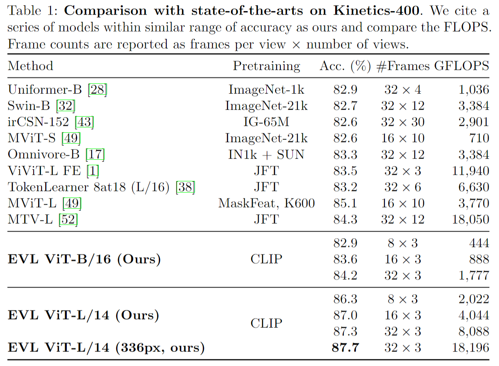
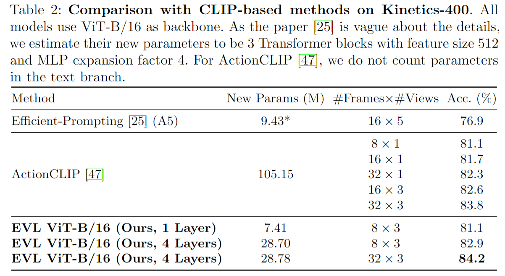
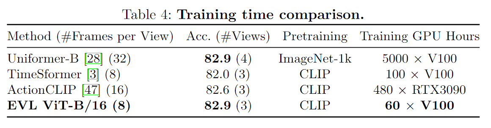
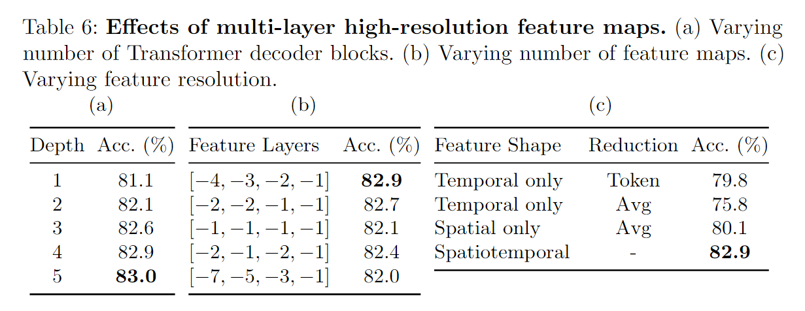
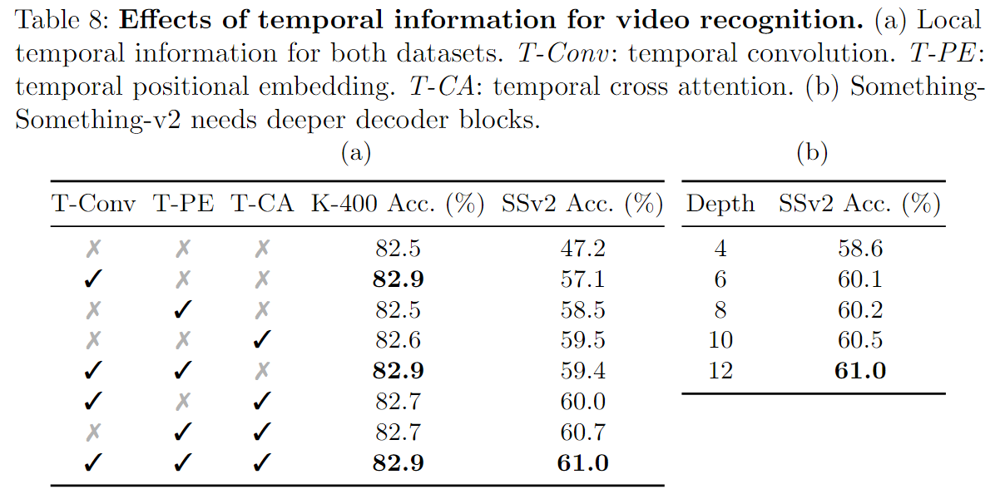
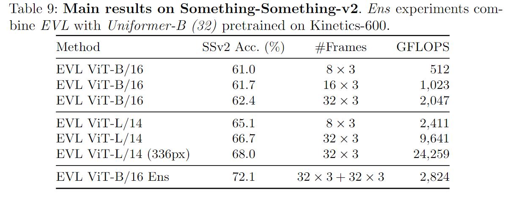

# Frozen CLIP Models are Efficient Video Learners

> Lin, Ziyi, et al. Frozen CLIP Models Are Efficient Video Learners. Aug. 2022.

## 1 Motivation & Contribution

### 1.1 Motivation

> 苏剑林. (Jun. 20, 2022). 《Ladder Side-Tuning：预训练模型的“过墙梯” 》[Blog post]. Retrieved from <https://kexue.fm/archives/9138>

- 除了直接微调全部参数外，还有像Adapter、Prompt-Tuning等很多参数高效的微调技巧，它们能够通过只微调很少的参数来达到接近全量参数微调的效果。然而，这些技巧通常只是“参数高效”而并非“训练高效”，因为它们依旧需要在整个模型中反向传播来获得少部分可训练参数的梯度，说白了，就是可训练的参数确实是少了很多，但是训练速度并没有明显提升。
- 反向传播，也就是求模型梯度，是从输出层向输入层逐步计算的，因此反向传播的深度/计算量，取决于最靠近输入层的参数深度，跟可训练的参数量没有太必然的联系。对于Adapter来说，它在每一层后面都插入了一个小规模的层，虽然其余参数都固定了，只有新插入的层可训练，但每一层都新层，所以反向传播要传到输入层；对于P-tuning来说，本质上它是只有在Embedding层中有少量可训练参数，但Embedding层是输入层，因此它的反向传播也要贯穿整个模型。因此，这两种方案能提升的训练效率并不多。
- 若直接将预训练模型当作冻结的特征提取器，在原有大模型的基础上搭建一个“旁支”（梯子），只对模型各层输出的特征做处理。所有的训练参数尽在旁枝模型中，由于大模型仅提供输入，因此反向传播的复杂度取决于旁枝模型的规模，并不需要直接在原始大模型上执行反向传播，因此是可以明显提升训练效率的。

---

- 本文采用了类似的结构，以CLIP image encoder 各层输出的特征为基础，增加了旁路 decoder 网络，以建模时序信息。

### 1.2 Contribution

- 提出了一种从图像到视频识别的高效迁移学习pipeline，在固定的可迁移图像特征之上训练了一个轻量级的 Transformer 解码器模块，以执行时空融合。

## 2 Method

- Frozen CLIP image encoder 提取每帧的特征，将每层的输出特征concat后输入对应的transformer decoder。decoder 中将一个 video-level 的cls_token 作为 query，某层输出的经时序处理后的聚合特征作为key和value。
- CLIP模型虽然可以生成带有语义信息的空间特征，但是欠缺时序特征，因此在旁路decoder中加入了三种时序建模模块：
  - Temporal Convolution：时间深度卷积能够捕获沿时间维度的局部特征变化
  - Temporal Positional Embeddings：添加了T个可学习的时序位置嵌入。虽然时间卷积也可以隐式捕获时间位置信息，但通过使不同时间的相似特征可区分，时间位置嵌入使得时序信息更加明确。
  - Temporal Cross Attention：计算两帧之间的注意力能更自然地揭示运动信息。

## 3 Experiment

