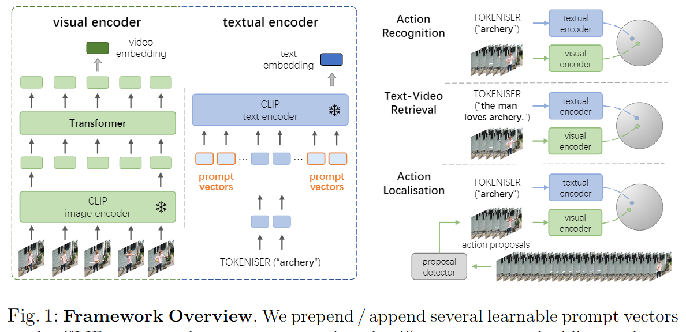
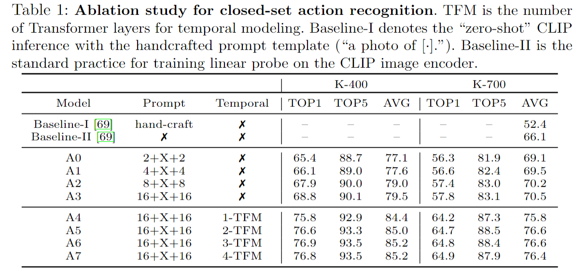

# Prompting Visual-Language Models for Efficient Video Understanding

> Ju, Chen, et al. “Prompting Visual-Language Models for Efficient Video Understanding.” Lecture Notes in Computer Science,Computer Vision – ECCV 2022, 2022, pp. 105–24, <https://doi.org/10.1007/978-3-031-19833-5_7>.

## 1 Motivation

- 将CLIP模型迁移到视频领域的下游任务中

## 2 Method

- 在视觉方面增加了一个temporal transformer encoder，获取时序信息，但过于简单，实验效果一般般
- 文本方面增加了可学习的前缀和后缀提示

## 3 Experiment

