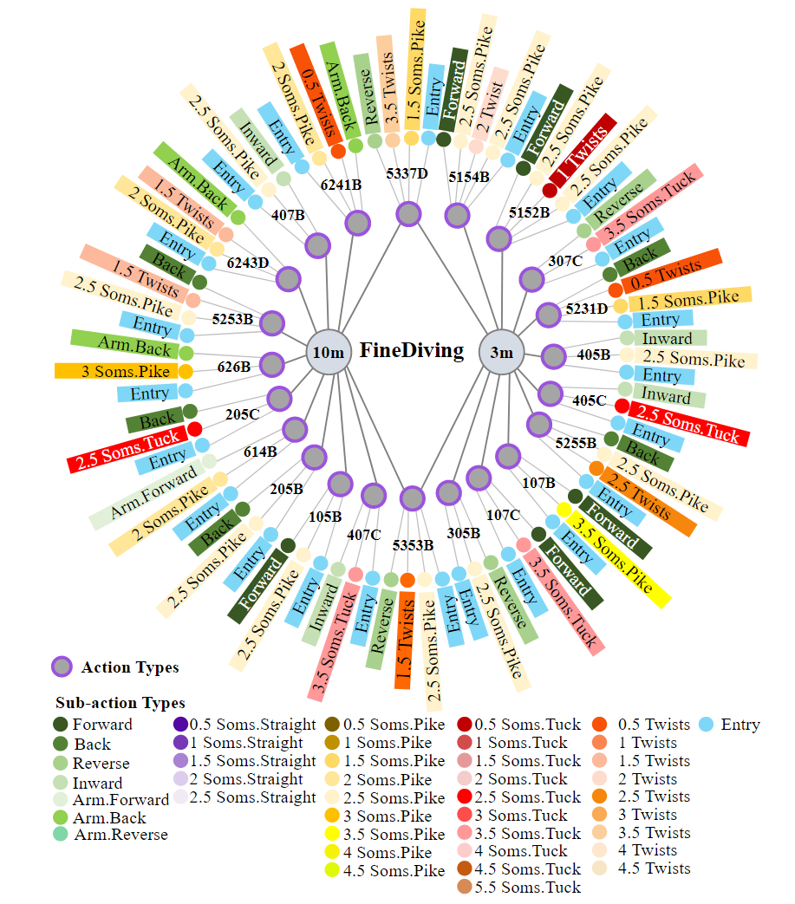
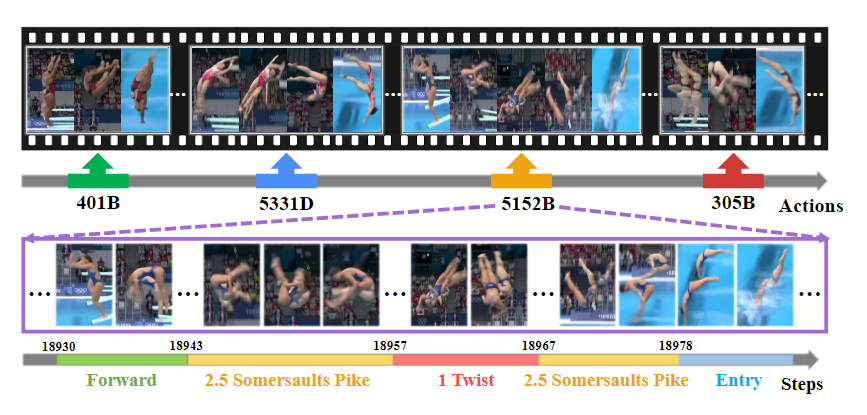
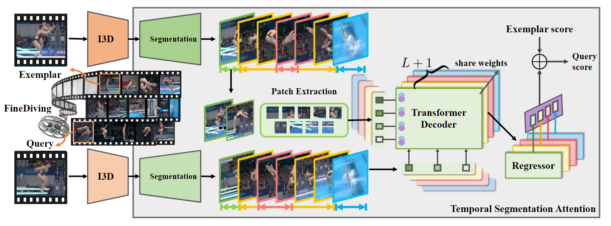
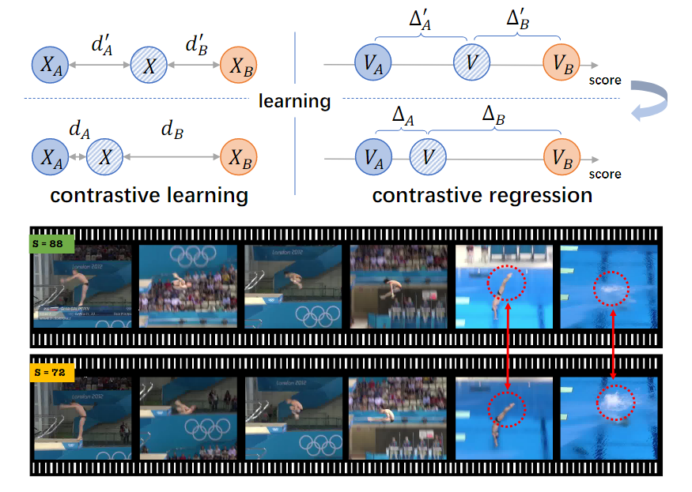
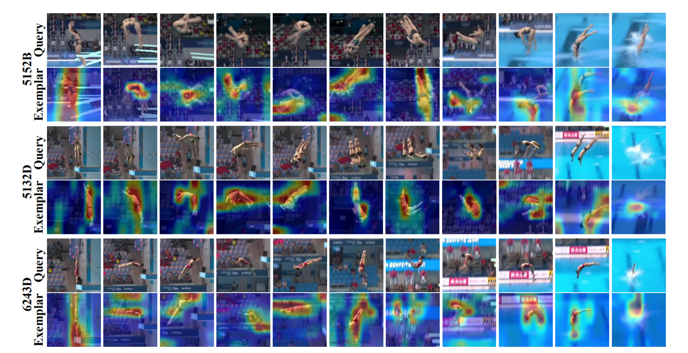

# Finediving: A fine-grained dataset for procedure-aware action quality assessment

> Xu, Jinglin, et al. "Finediving: A fine-grained dataset for procedure-aware action quality assessment." Proceedings of the IEEE/CVF Conference on Computer Vision and Pattern Recognition. 2022.

## 1 Motivation & Contribution

- 近几年，竞技体育视频理解在视频理解领域越来越受欢迎。竞技体育视频不同于主流视频数据集主要关注的日常生活视频，因其不仅收集标注数据需要领域专家知识，而且动作往往变化较快且涉及多个运动员，在细粒度分类方面更加具有挑战性。
- Action Quality Assessment (AQA)动作质量评估是竞技体育视频理解中的重要部分，该任务着力于分析完整动作执行流程并对动作完成质量评分。前人的工作主要将AQA看作一个有分数监督的视频表征的回归问题。
- 受启发于人类评估动作质量时需要细粒度标注和可靠的比较，并且当前动作质量评估数据集缺乏细粒度标注和动作时序边界，本文提出了一个具有两层语义结构、明确动作时序边界和官方评分的细粒度动作质量评估数据集。并且受启发于对比学习的思想，本文提出了一个时序分割注意力模块，以细粒度的方式量化查询样本(query)和示范样本(exemplar)之间的差异。

## 2 Dataset

- FineDiving数据集由3000个视频样本组成，涵盖52种动作类型、29种子动作类型和23种难度程度类型.

## 3 Temporal Segmentation Attention

### 3.1 Procedure Segmentation

- 动作过程分割将成对的查询动作实例和参考动作实例解析为语义和时间对齐的连续步骤。该过程主要通过预测在某一帧发生子动作转变的可能性，从而将粗粒度动作分解为细粒度子动作。

### 3.2 Procedure-aware Cross-Attention

- 过程感知交叉注意通过学习发现成对query step和exemplar step之间的时空对应关系，并在这两个步骤中生成新特征。成对的步骤相互补充，以引导模型关注exemplar step和query step中的一致区域。

### 3.3 Fine-grained Contrastive Regression

- 细粒度对比回归通过学习成对步骤的相对分数来量化查询动作实例和示例动作实例之间的步骤偏差，以指导模型来评估动作质量。

## 4 Experiment

- Visualization

