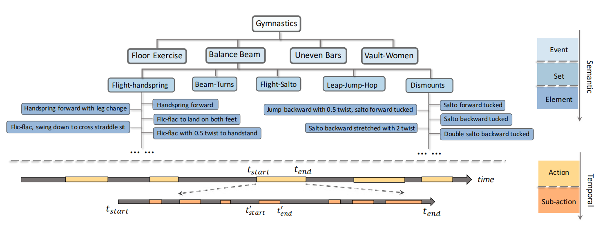
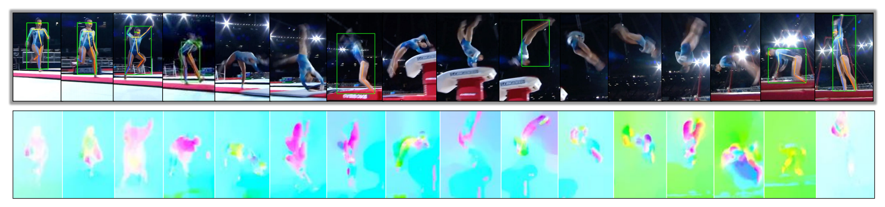
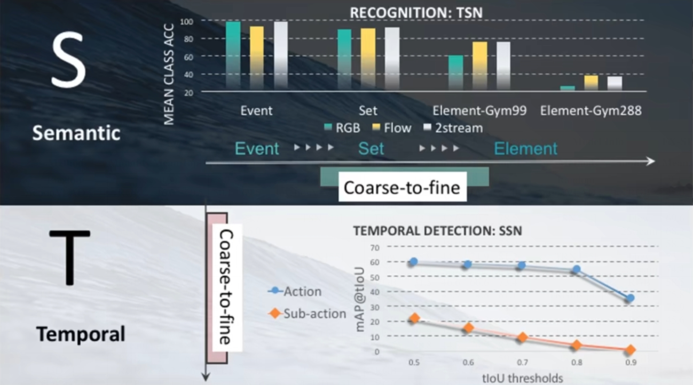
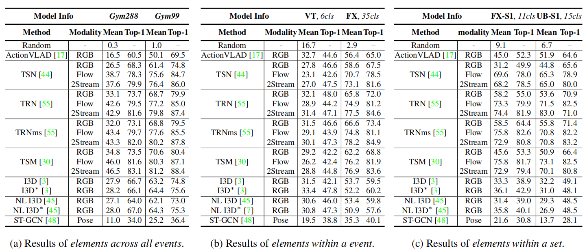
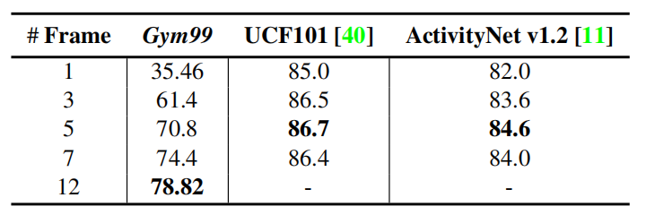
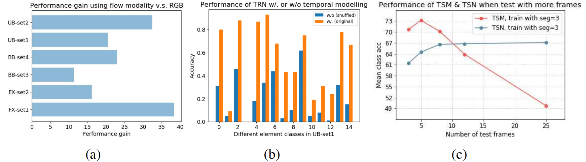
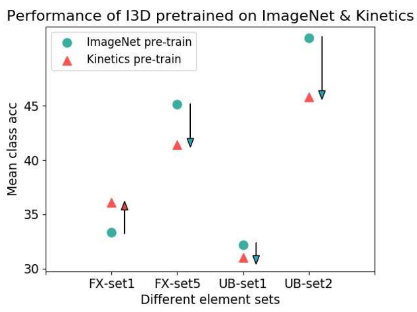

# FineGym

> Shao D, Zhao Y, Dai B, et al. Finegym: A hierarchical video dataset for fine-grained action understanding[C]. Proceedings of the IEEE/CVF conference on computer vision and pattern recognition (CVPR). 2020: 2616-2625.

## 一、引言

1. FineGym 数据集：细粒度动作识别数据集。在语义和时序（动作上）都更加细致。

   

2. 细粒度：

   （1）时序：把动作划分成更小的 element。分为事件（event）、组（set）、元素（element）三个层次。

   （2）语义：在不同的语义层级上区分语义类别。分为动作（action）、子动作（sub-action）两个层次

3. 细粒度数据集的收集：

   （1）网络爬取。

   （2）志愿者使用剧本表演。

   存在的问题：网络的视频质量（分辨率）得不到保证。复杂的动作搜不到也演不了。细粒度数据的标注错误会产生极大的影响。

4. 研究动机：

   （1）现有方法在目前的 benchmark 上遇到瓶颈。

   （2）现有方法和数据集都比较关注粗粒度的动作种类。很多场外信息（背景、人物特征）会提供线索，导致模型的 focus 并不在动作上。

   （3）可用作竞技运动的细致分析（如体操）。

   

## 二、实验

1. 动作识别 + 动作定位：

   

   动作识别使用的是 TSN 模型，细粒度的效果对模型的要求更高且更注重时间信息（Flow的贡献更高，背景等静态信息的贡献越来越小）。

   动作定位使用的是SSN模型，子动作的时间边界更不明显。

2. element-level 的模型对比：

   

## 三、结果分析

1. 采样问题：细粒度视频的密集采样更为重要。

   

2. 时域建模：

   （1）流场的效果均高于静态 RGB。

   （2）打乱时序后效果明显下降，也证明时域建模的重要。

   （3）TSM 在使用多帧测试时效果下降，猜想可能是不同帧数的时域模式不同，而采取了时域平均的 TSN 不存在这一问题。

   

3. 预训练：使用粒度较粗的视频数据集做预训练的效果不一定更好。

   

4. 挑战性：剧烈动作、细微的空间语义差别、复杂的动态时域信息、推理（Reasoning，指大部分模型都还是黑盒子的状态）。