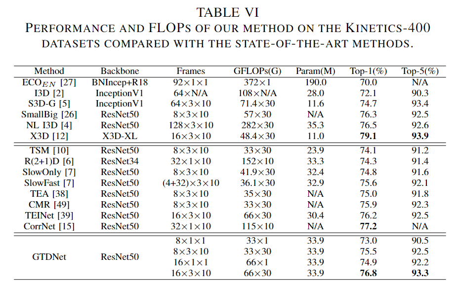

# Global Temporal Difference Network for Action Recognition

> Xie, Zhao, et al. "Global Temporal Difference Network for Action Recognition." IEEE Transactions on Multimedia (2022).

## 1. Motivation & Contribution

### 1.1 Motivation

- Local RGB Difference 虽然可以揭示相邻帧的短时运动变化，但是由于受限于局部窗口，仅能提供部分难以识别的运动残影。
- 对于 Global temporal modeling 以往的工作主要通过 aggregate local featureas建模，忽略了全局时序特征也可以给予局部时序特征全局先验信息，帮助建模更好地局部信息。

### 1.2 Contribution

- 提出了一种即插即用的global temporal difference模块，该模块主要由两部分组成。一部分是 global aggregation 模块，主要将局部特征聚合为一个全局特征。另一部分是 global difference 模块，主要将全局特征减去局部特征，为局部特征提供全局先验信息，并且通过通道自注意力丰富上下文语义信息。

## 2. Method

### 2.1 Global Aggregation Module

### 2.2 Global Difference Module

## 3. Experiment

