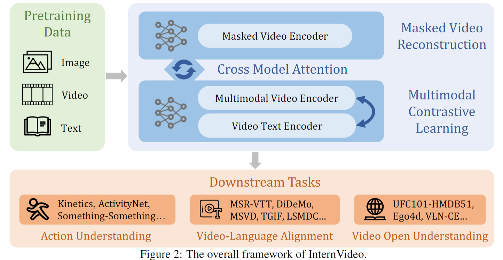
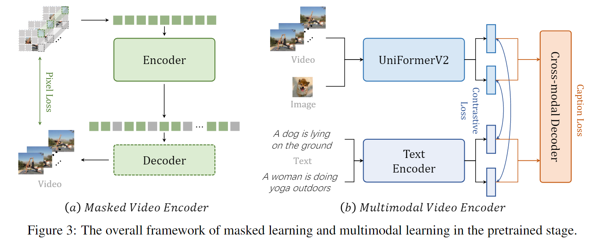
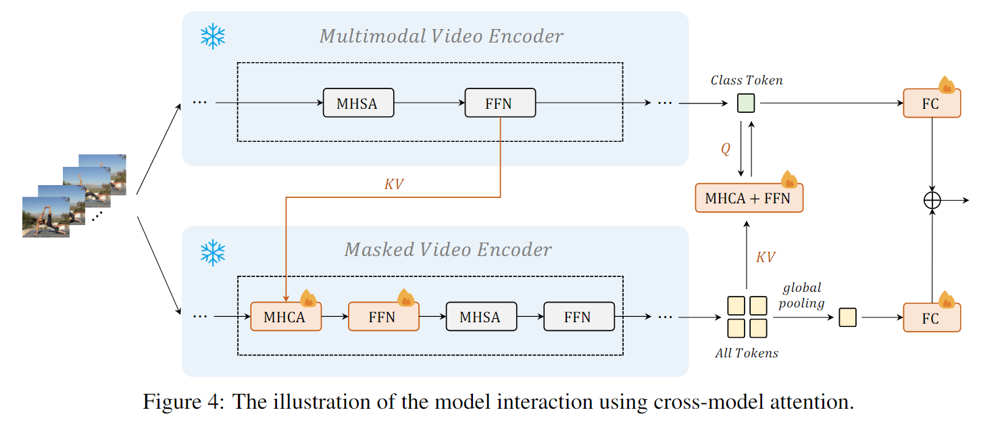
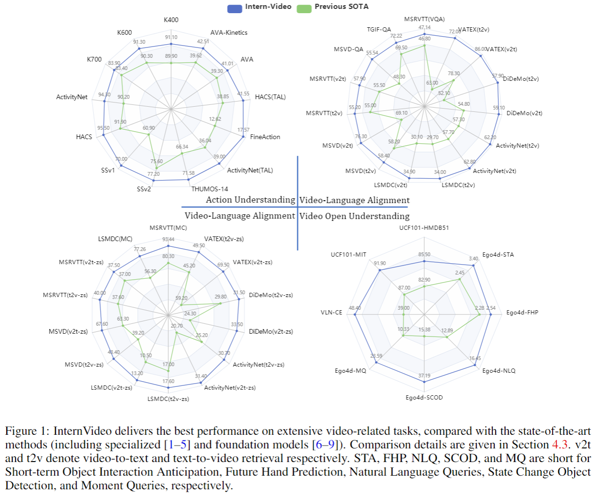

# InternVideo: General Video Foundation Models via Generative and Discriminative Learning

> Yi Wang et al. “InternVideo: General Video Foundation Models via Generative and Discriminative Learning” (2023).

## 1 Motivation & Contribution

### 1.1 Motivation

- 相较于视觉基础大模型在近几年发展飞速，而视频理解及相关任务在这方面扩展较少。原因主要是视频处理任务带来的高计算负担，并且相当一部分视频任务可以通过在图像模型中添加时序建模模块从而得到较好解决。将图像模型迁移到视频领域，主要聚焦于两种任务（动作理解、视频语言对齐），但还未有一个通用的视频理解模型。
- 近来，视频掩码建模(VideoMAE)和多模态对比学习取得了不错的成果。VideoMAE通过极高的掩码率和管道式掩码可以较好地解决视频时序冗余的问题，而多模态对比学习则可以通过加入文本信息带来丰富的语义信息（但缺少具体的时空建模）。为了提高模型的泛化性能，可以将二者结合。

### 1.2 Contribution

- 探索了一种具有掩模和对比建模的通用视频表示范式，并通过有监督的轻量级模型交互学习统一它们的表示来实现这一设计。

## 2 Method

### 2.1 Overall Framework

### 2.2 Self-Supervised Video Pretraining

- 视频掩码建模产生的特征擅长于动作识别
- 视频语言对比学习能够从没有注释的文本中理解有语义的视频

#### 2.2.1 Video Masked Modeling

- 遵循之前提出的VideoMAE工作中的大多数惯例，将一个ViT扩展为时空建模的视频编码器。

#### 2.2.2 Video-Language Contrastive Learning

- 基于预训练好的CLIP模型构建多模态结构，其中用刚提出的UniformerV2替换了CLIP中使用原始ViT的video encoder，通过一个对比损失函数将视频和文本特征投射到相同的embedding space，增加了一个 transformer decoder用于跨模态学习。

#### 2.3 Supervised Video Post-Pretraining

- 分别训练一个掩码视频编码器和一个有监督的动作分类的多模态视频编码器作为后预训练步骤，以便在不同的任务中更好地表现。

#### 2.4 Cross-Model Interaction

- 同时优化两种模型计算量过大，因此通过冻结除了分类层外的骨干网络减少训练开销。
- 为了将通过两种不同学习方式所得的特征更好地结合，从而提高特征泛化能力，加入了交叉模型注意力Cross-model attention (CMA)。CMA由多头交叉注意力Multi-Head Cross Attention (MHCA)和Feed-Forward Network (FFN)组成。
- 除最后一个CMA模块外，其他CMA使用masked video encoder中的tokens作为Key和Value,而multimodal video encoder中的tokens作为Query，使得masked video encoder能够学习到来自multimodal video encoder的知识。而最后一个CMA模块则相反。至此，两种模型的特征都得到了提升。

## 3 Experiment

### 3.1 Downstream Tasks

- 对一系列下游任务进行了广泛的实验，以评估模型泛化能力。

#### 3.1.1 Action Understanding Tasks

- Action Recognition
- Temporal Action Localization
- Spatiotemporal Action Localization

#### 3.1.2 Video-Language Alignment Tasks

- Video Retrieval
- Video Question Answering
- Visual Language Navigation

#### 3.1.3 Video Open Understanding Tasks

- Zero-shot Action Recognition
- Zero-shot Multiple Choice
- Open-set Action Recognition

### 3.2 Limitations

- 无法处理长时间视频任务
- 无法处理更复杂更高级的任务，比如从电影中看到的部分预测情节

### 3.3 Future Work

- 如何系统地协调从不同模式、预训练任务甚至不同架构训练的基础模型，以获得更好的表现仍然具备挑战性。
- 从开放世界的基础动态感知中实现大规模的时空分析(长期和大场景)。
- 将基础模型与决策相结合，形成智能体，以探索新的任务。
