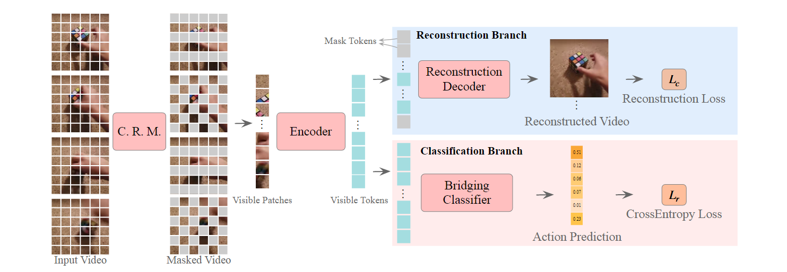
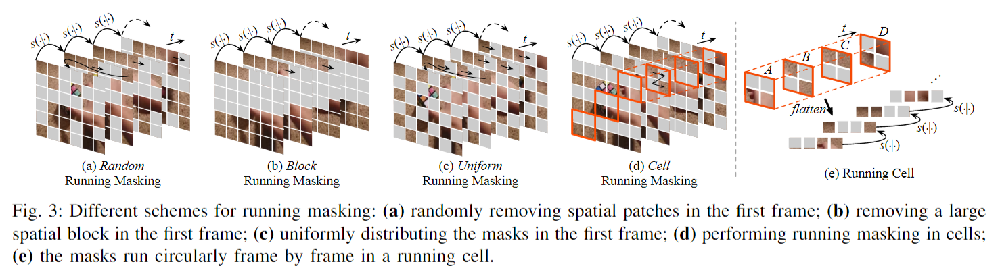
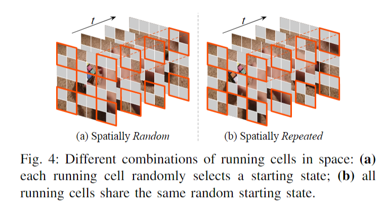
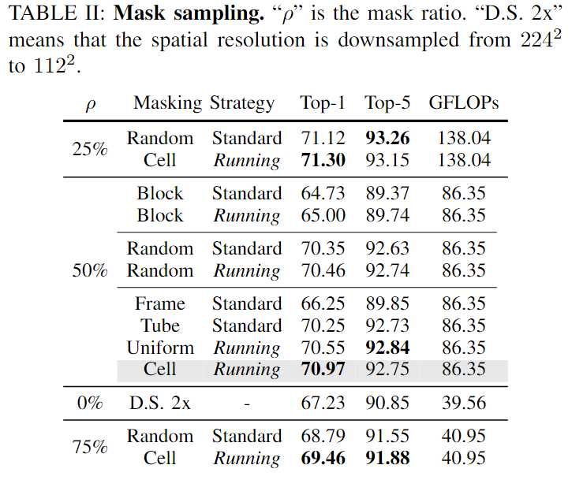
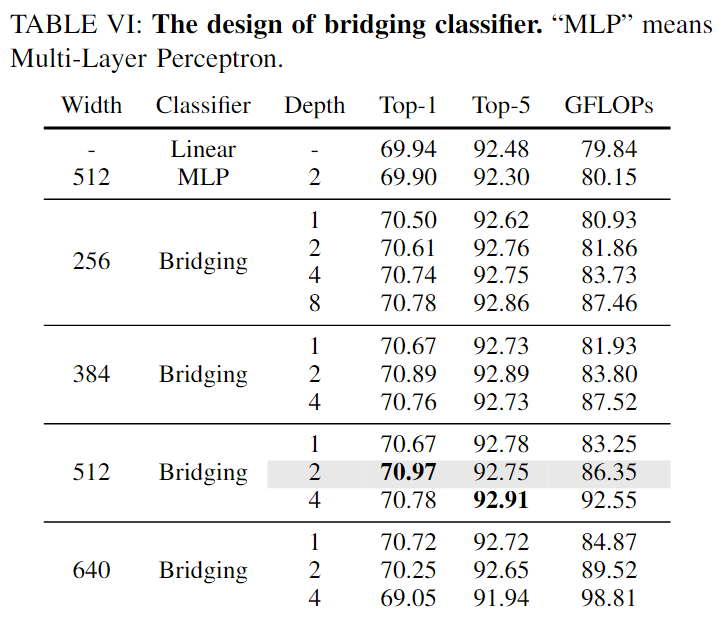
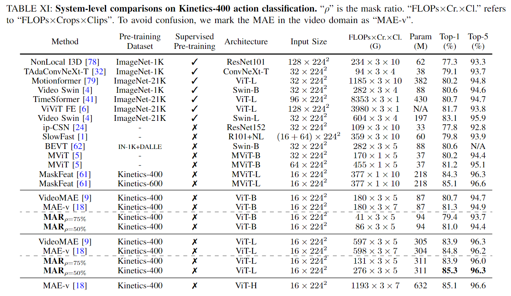
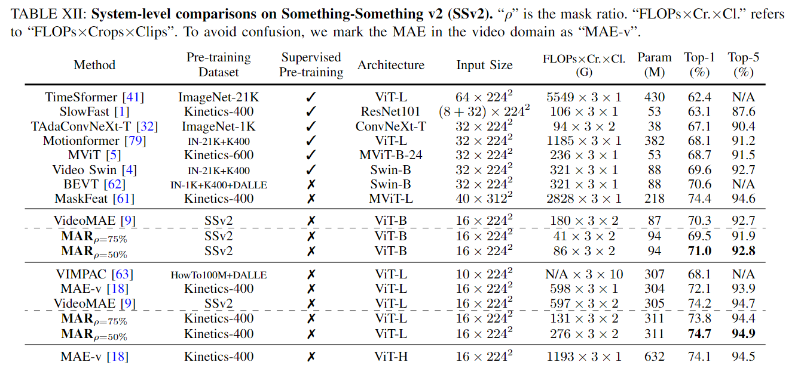

# MAR: Masked Autoencoders for Efficient Action Recognition

> Qing, Zhiwu, et al. "Mar: Masked autoencoders for efficient action recognition." arXiv preprint arXiv:2207.11660 (2022).

## 1 Motivation & Contribution

### 1.1 Motivation

- 之前的VideoMAE和MAE-v都采用了管道式掩码和极高掩码率的策略，原因是视频本身的时空冗余性和相邻帧之间的信息泄露会导致掩码任务难度降低，这会使得训练时间过长。
- 然而，视频中的上下文联系信息对动作识别很重要，本文希望通过构建合适的mask，提高encoder对掩码部分的感知，进而提高动作识别准确率。掩码率的下降，能有效减少训练时间。
- 有研究表明，通过MAE预训练的模型提取的特征主要是用于重建任务的低层次的特征，而分类任务需要更高层的特征，二者存在隔阂，本文希望通过添加一个额外的分类分支帮助模型提取更高层语义的特征。

### 1.2 Contribution

- 本文提出了新的掩码方式，降低了掩码率，缩短了训练时长。
- 提出了添加一个类似dedoder桥接分支使得提取的特征跟适合分类任务。

## 2 Method

- VideoMAE相比，只改变了掩码策略和添加一个Bridging Classifier分支。

### 2.1 Cell Running Masking

- running mask: 相邻帧间的掩码通过帧间变换往复循环。
- Running cell：没有采用tube形式将同一位置的Patch完全掩码，而是采用了一个$2\times2$的单元格，使得同一位置的patch可以在时序变换周期中有相同的可见概率。
- 初始位置可以选择随机设置单元格掩码形式或同一格式，可以作为数据增强的一部分。

### 2.2 Bridging Classifier

- 采用了一个类似MAET结构中的encoder，不同之处是二者的输入。MAE encoder的输入包括masked tokens，而本文的bridging classifier 的输入只有visible tokens，更加轻量化。这样设计的原因是masked tokens偏向于低层次的重建任务，与分类任务不适合。

## 3 Experiment

