# MLP-3D

> Qiu Z, Yao T, Ngo C W, et al. MLP-3D: A MLP-Like 3D Architecture With Grouped Time Mixing[C]//Proceedings of the IEEE/CVF Conference on Computer Vision and Pattern Recognition (CVPR). 2022: 3062-3072.

## 一、引言

1. MLP-3D 解决的问题：

   （1）使用 MLP 捕捉复杂的时间信息。

   （2）减少时空建模的计算成本。

2. 相关工作：

   （1）用于视频分析的 CNN 类模型：C3D、I3D、SlowFast 等。

   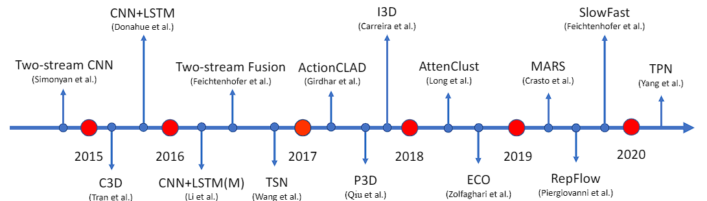

   （2）用于图像分析的 convolution-free 模型：ViT、MLP-Mixer 等。

   （3）用于视频分析的 convolution-free 模型：VTN、ViViT、Vidtr 等。

   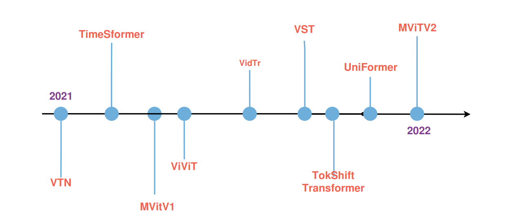

## 二、MLP-3D

1. MLP-3D 的总体架构：

   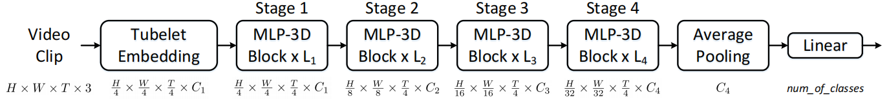

2. Tubelet Embedding：这里借鉴的是 ViViT 里面的线性变换操作，这一层的目的主要是使用在大型图像数据集上预训练的模型将原始图像转为具有特征性质的 token。一般说来，token的提取有两种方式，一种是 Uniform frame sampling，一种是这里的 Tubelet embedding。

   > Arnab A, Dehghani M, Heigold G, et al. Vivit: A video vision transformer[C]. Proceedings of the IEEE/CVF International Conference on Computer Vision (ICCV). 2021: 6836-6846.

   （1）Uniform frame sampling：比较直接的方式，从输入视频片段中均匀采样帧，使用与图像处理中 ViT 相同的方法独立嵌入每个2D帧，在输入的 clip 中均匀采样 n 帧然后将每帧按照 VIT 中的方式划分成一个个 patch 输入 embedding 网络生成 patch embedding，再concatenate在一起。

   > Dosovitskiy A, Beyer L, Kolesnikov A, et al. An image is worth 16x16 words: Transformers for image recognition at scale[J]. arXiv preprint arXiv:2010.11929, 2020.

   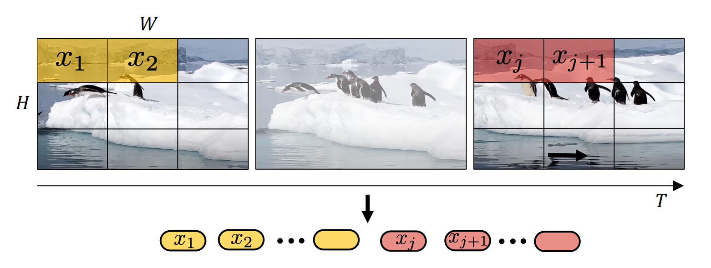

   （2）Tubelet embedding：Uniform frame sampling 的采样是 2D 的，Tubelet embedding 可看做在 3D 层面上提取特征，定义非重叠的 tube 同时在空间和时间维度上进行线性映射，tubelet embedding 融合了时间维度的帧信息，即这种构建方式可以在获取的序列 token 的同时融合空间和时间信息。

   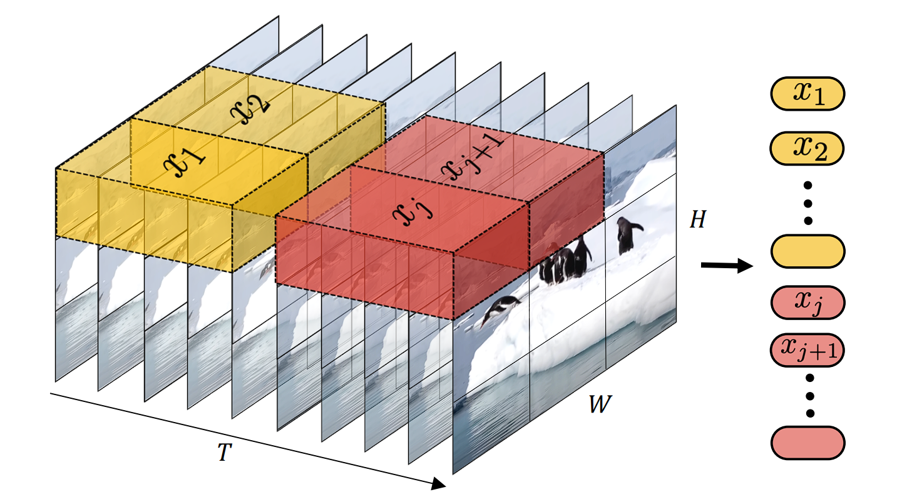

3. MLP-3D block 的架构：

   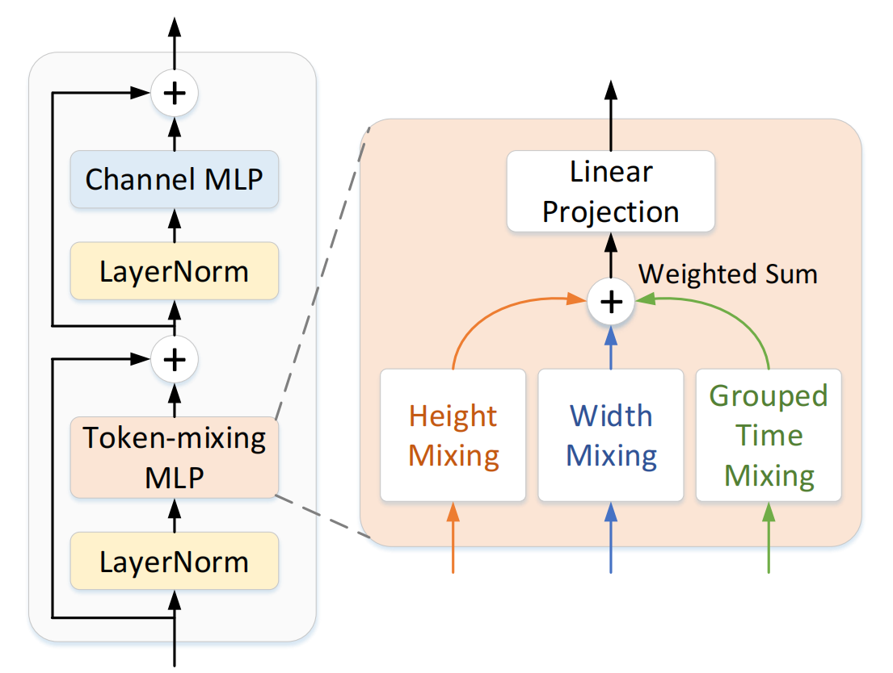

   针对线性映射得到的输入的四个维度（Channel \* Time \* Height \* Width），分为：

   （1）token-mixing MLP：channel 内不同时空位置的 MLP，由 Height、Width、Grouped Time 三个子块加权平均得到。其中空间维度（Height、Width）使用”循环全连接层“（Cycle FC）。时间维度采用新提出的”分组时间混合方法“（GTM）。

   （2）channel MLP：channel 间的 MLP。

   先进行 token-mixing MLP，再进行 channel MLP。
   $$
   Y=\textrm{Token-mixing-MLP}(\textrm{LN}(X))+X\\
   Z=\textrm{Channel-MLP}(\textrm{LN}(Y))+Y
   $$

4. 循环全连接层（Cycle FC）：这里借鉴的是CycleMLP。

   > Chen S, Xie E, Ge C, et al. Cyclemlp: A mlp-like architecture for dense prediction[J]. arXiv preprint arXiv:2107.10224, 2021.

   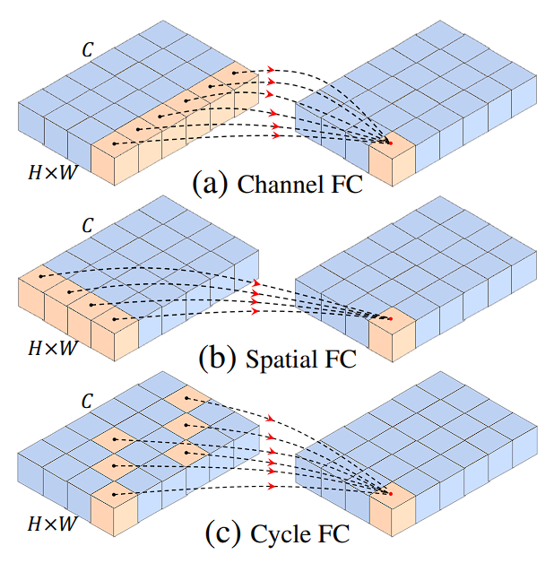

   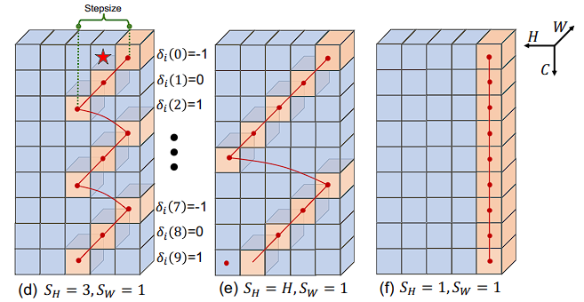

5. 分组时间混合方法（GTM）：时间轴信息的混合，也就是帧间的混合。

   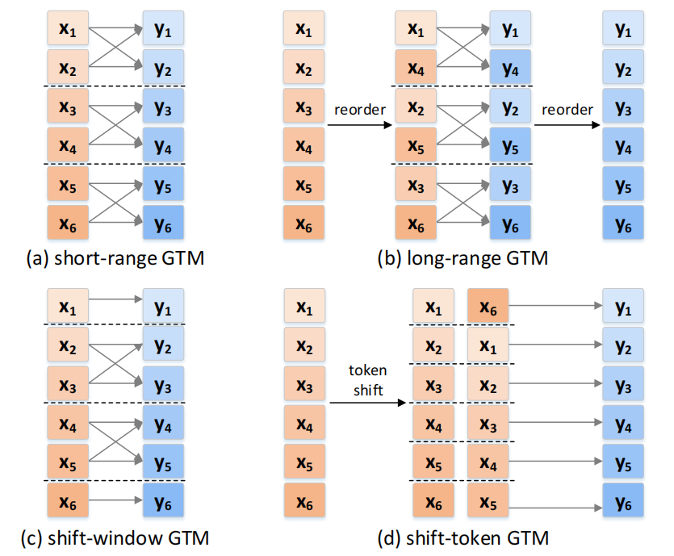

6. block 堆积：若干个 MLP-3D block 堆积成最终的 MLP-3D 网络。

   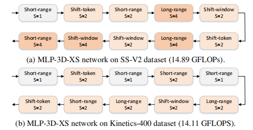

## 三、结果

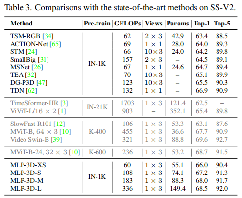

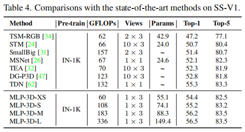

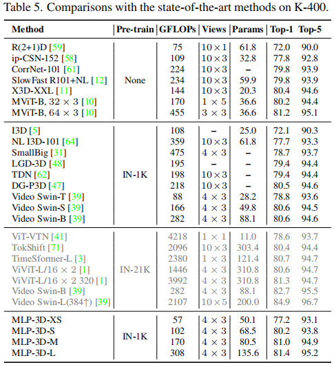