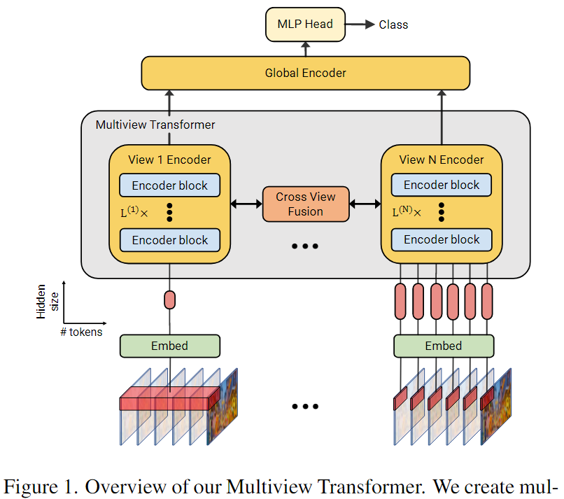
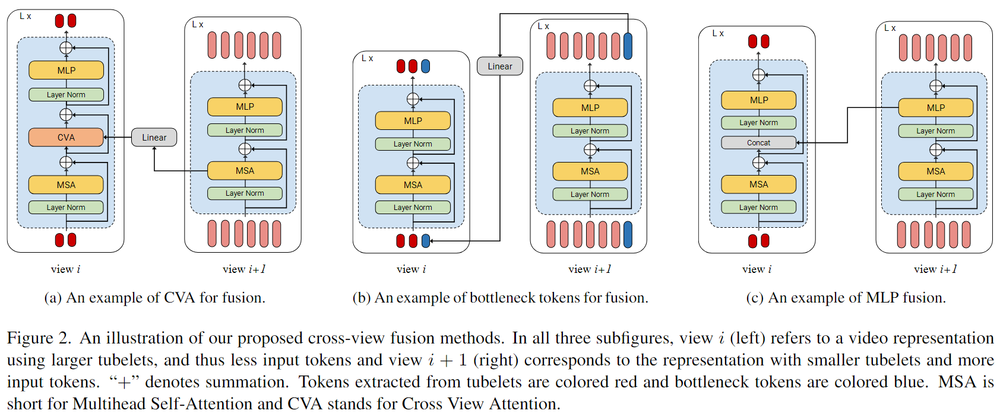
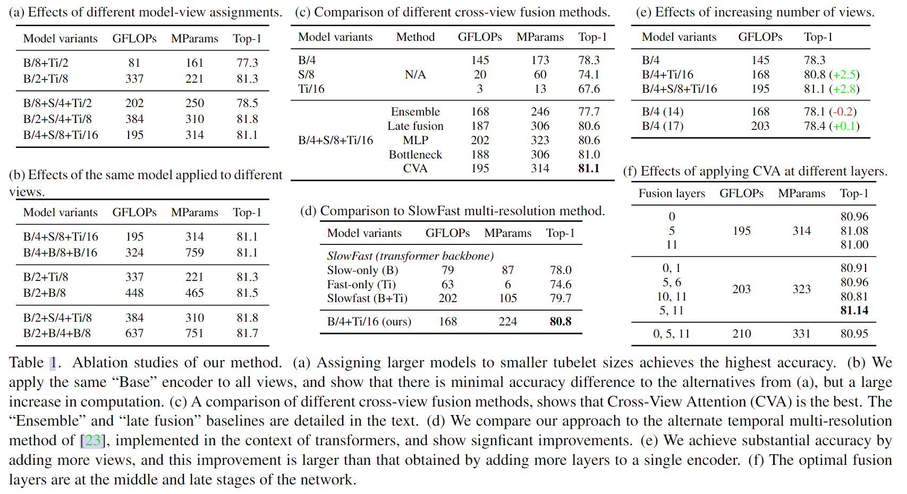
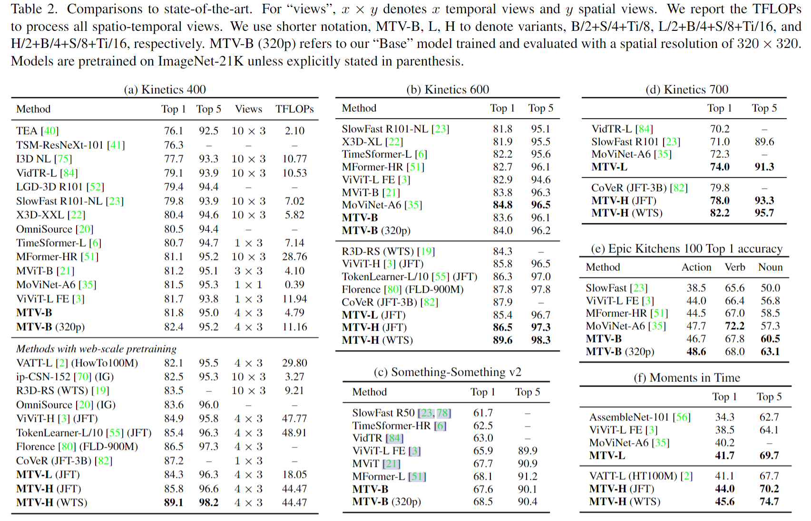

# Multiview Transformers for Video Recognition

> Yan, Shen, et al. “Multiview Transformers for Video Recognition.” 2022 IEEE/CVF Conference on Computer Vision and Pattern Recognition (CVPR), 2022, <https://doi.org/10.1109/cvpr52688.2022.00333>.

## 1 Motivation & Contribution

### 1.1 Motivation

- 视频理解需要不同的时间空间分辨率，从短的细粒度的动作到长的事件。一般做法是采用金字塔结构或者下采样输入，但是下采样会导致详细的丢失。
- ViViT提出了tubelet token，但其tubelet的长度是一致的，缺乏多尺度信息。

### 1.2 Contribution

- 通过不同长度的tubelet token及对应的encoder建模多尺度的时序信息。

## 2 Method

### 2.1 Multiview tokenization

- 使用3D conv来tokenization，对每一个view，可以使用不同的卷积核，隐层大小。作者将视频表征为一系列固定大小的tubelets。一个大的view就是，tubelets的大小更大，但是tokens的数量更少。小的view，就是tubeltes的小大更小，但是tokens的数量更多。
- 细粒度的动作通过小的tubelets来获得。场景等信息通过大tubelets来获得。最后，通过late fusion来实现信息的融合。

### 2.2 Multiview encoder

- 因为自注意力的计算复杂度和长度有关，如果将所有的token联合到一起训练，计算复杂度太高。每个view 的token都有对应的encoder,每个encoder 只计算自己的部分，最后通过一个global encoder 来实现信息交互。
- encoder结构则采用了ViViT中的Factorised encoder，先做spatial encode，再做temporal encode。

### 2.3 Cross-view fusion

#### 2.3.1 Cross-view attention (CVA)

- 对两个View 的token一起做joint self-attention计算量过大，因此在相邻两个view中做cross attention，token数量少的view作为query，token数量多的作为key和value。在做cross attention之前先要做一次线性投影，保持二者维度相同。

$$z ^ { ( i ) } = \operatorname{C V A} ( z ^ { ( i ) } , \operatorname{W^{proj}}z ^ { ( i + 1 ) } )$$

$$\operatorname{C V A ( x , y ) }= \operatorname { S o f t m a x } ( \frac { W^Q  x  W ^ { K } y ^ { T } } { \sqrt { d _ { k } } } ) W ^ { V } y$$

#### 2.3.2 Bottleneck tokens

- 在两个view的token间加入bottleneck模块，以迁移信息。

#### 2.3.3 MLP fusion

- 在MPL中fuse

#### 2.3.4 Fusion locations

- 没有必要在cross-view encoder中每层都做cross-view fusion，因此每个fusion都自带全局感受野。
- 此外，不同view 的encoder 深度也不一定相同。

### 2.4 Global encoder

- 最后用全局编码器聚合来自每个view 的cls token，以生成最终的分类结果。

## 3 Experiment

