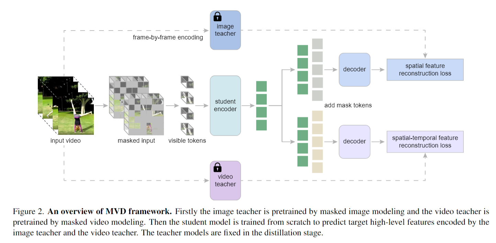
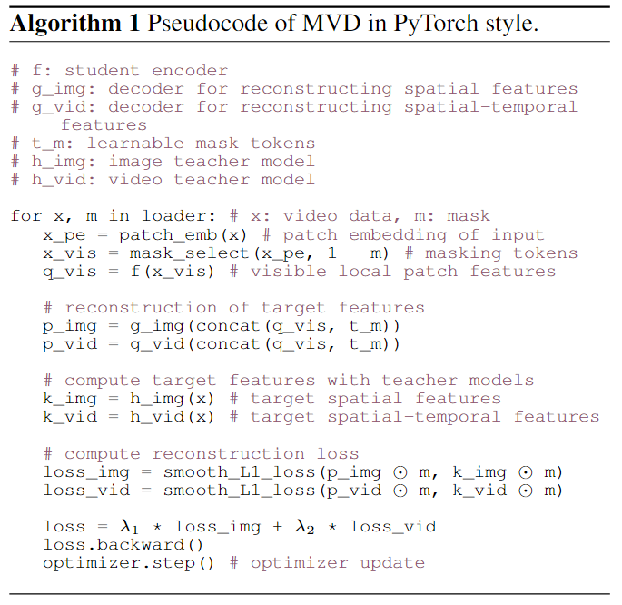
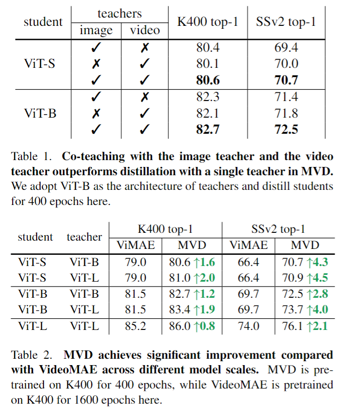
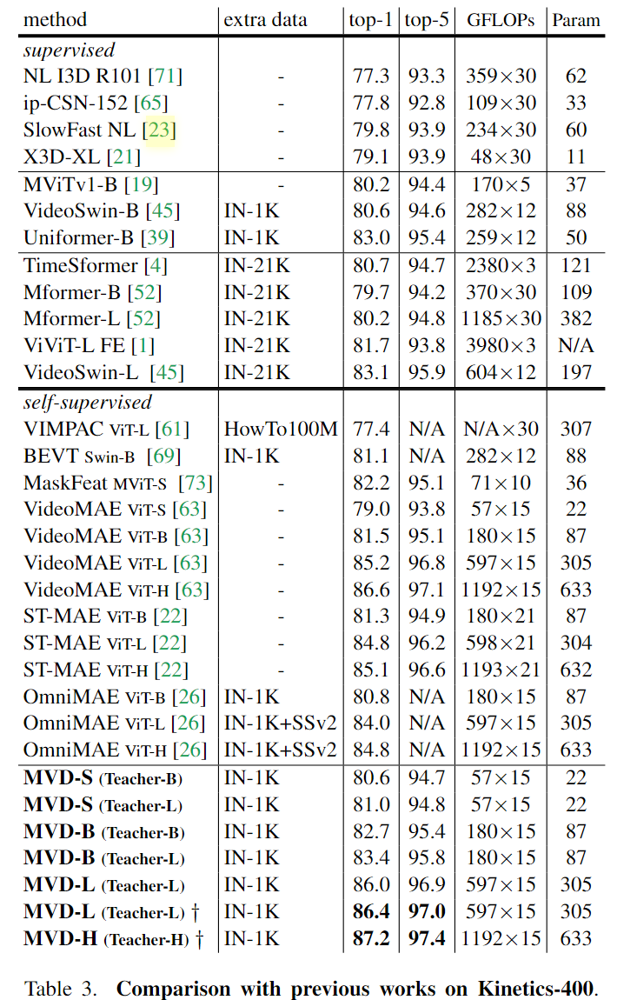
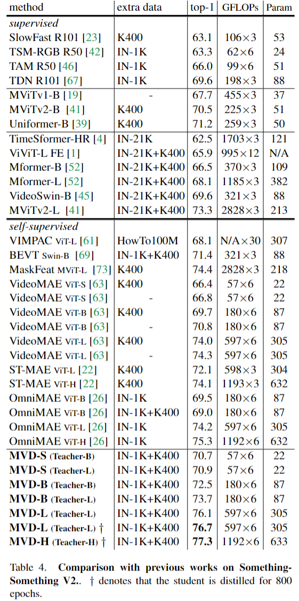

# Masked Video Distillation: Rethinking Masked Feature Modeling for Self-supervised Video Representation Learning

> Wang, Rui, et al. "Masked Video Distillation: Rethinking Masked Feature Modeling for Self-supervised Video Representation Learning." arXiv preprint arXiv:2212.04500 (2022).

## 1. Motivation & Contribution

- 最近基于MIM(Masked Image Modeling)和MVM(Masked Video Modeling)的方法表现出了与有监督方法相当的性能，这二者重建的目标都是低层次的特征，比如原始像素值或者VQVAE(vector quatization variational autoencoder) tokens，但是这会导致大量的噪声，而视频本身又存在时空冗余，所以MVM方法通常采用非常高的掩码率。
- 由于 MIM 与 MVM预训练使用的数据集模态不同（图像数据集和视频数据集），当二者作为知识蒸馏中的教师模型时也会引导学生模型学习针对不同模态的特征。MIM能使学生网络学习更有空间意义的特征，而MVM会鼓励学生模型学习更强的时间动态特征。
- 本文采用了一个简单的共同训练的策略，将MIM和MVM作为教师模型，采用一个MVM模型作为学生模型，同时学习重建两个教师模型输出的高级特征。

## 2. Method

### 2.1 Masked Video Distillation

- Encoder采用了与VideoMAE相似的结构，3D Patch 的尺寸也为$2\times16\times16$，这是为了防止相邻帧间的信息泄露，缺点是token数量依旧很多，模型依然比较大。
- 通过共同训练的方式，相对减少了训练时间，但是提点并不多，主要来自于两种不同模态的叠加，如何将图像预训练模型和视频预训练模型更好地结合到一起需要进一步思考。

### 2.2 Algorithm

## 3. Experiment

