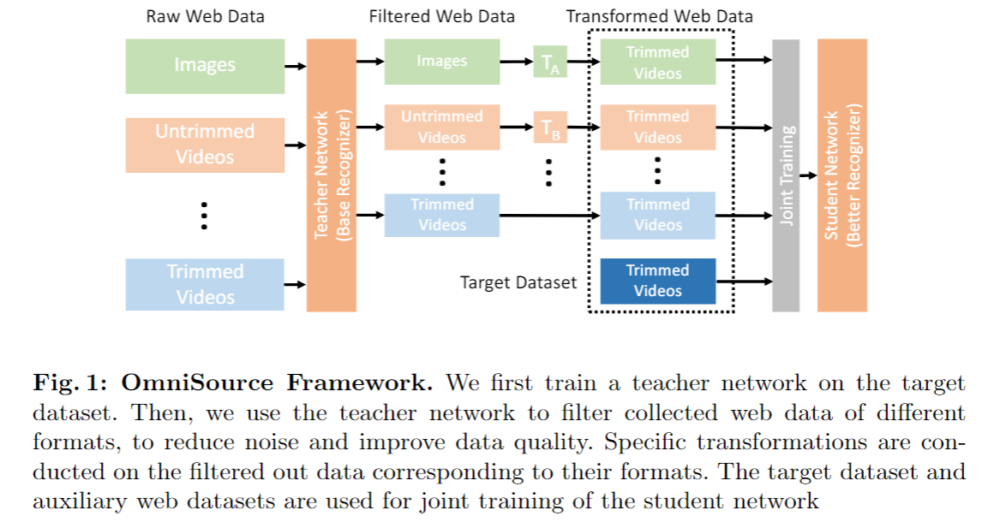
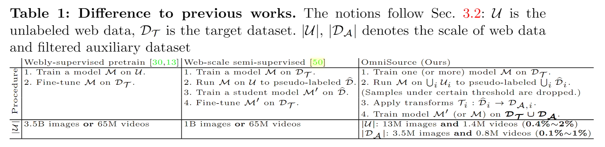
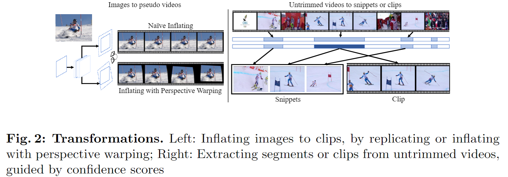
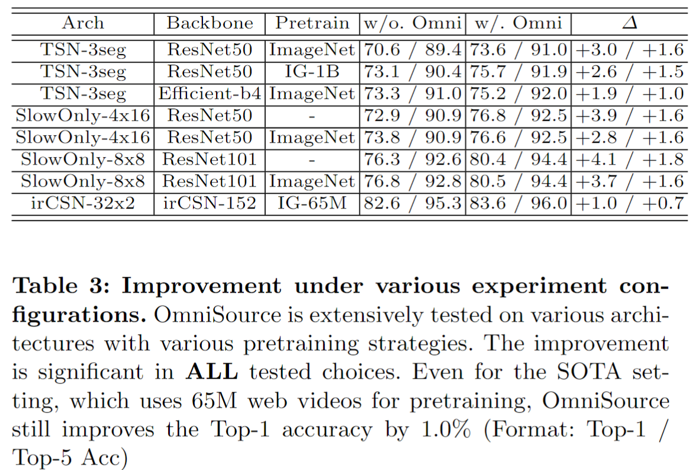
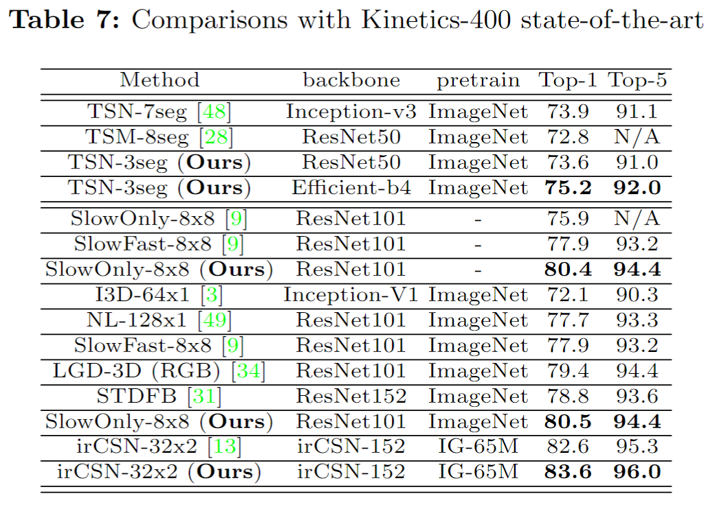

# Omni-sourced Webly-supervised Learning for Video Recognition

> Duan, Haodong, et al. "Omni-sourced webly-supervised learning for video recognition." Computer Vision–ECCV 2020: 16th European Conference, Glasgow, UK, August 23–28, 2020, Proceedings, Part XV 16. Springer International Publishing, 2020.

## 1. Motivation & Contribution

### 1.1 Motivation

- 构建大规模的视频识别数据集，是一项极为耗费金钱与时间的工作。为得到一段带标注的视频片段，标注者需要查看整个视频并从中选取有意义的片段，这一冗长的标注过程很大程度限制了视频识别数据集的规模增长速度。随着网络视频数量在过去数年间指数增长，相比之下，带标注的视频数据集的规模增长却显缓慢。
- 互联网上的数据更加丰富并且表现方式多样，常见的格式包括图片、短视频和长视频。不同的格式表示视觉特征各有特点。图片偏向于捕捉质量更高的显著性时刻；短视频通常经过编辑，信息密度较高；长视频通常从多个视角描述事件。

### 1.2 Contribution

- 为解决视频识别任务标注昂贵，较难获取的问题，提出利用丰富且异质化的网络数据来进行辅助训练。
- 提出了多种转换方式，将不同格式的网络数据（包含图片，短视频，长视频等）转换为目标格式，从而得以与目标数据集联合训练。
- 相比大规模预训练，在利用远少于其的网络数据的情况下，达到了与之相类似的效果。

## 2. Framework

1. 针对特定任务的网络数据收集
2. 利用 Teacher 模型滤去网络数据中噪声
3. 将不同格式的网络数据变换为目标格式
4. 将得到的网络数据集与目标数据集联合训练

### 2.1 Task-specific data collection

- 为最大程度上减少人力的介入，利用了最简单的方式来生成用于搜索的关键词及标签。对于 Google，仅利用类名作为关键词进行搜索。对于 Instagram，由于其上的图片与视频仅能通过标签（连续不含空格）进行查询，因此，将类名通过一定的排列组合得到查询的标签（如 "bee keeping" -> "beekeeping", "keepingbee"）。
- 在爬取完成后，利用一个ResNet50提取帧级特征，通过计算特征的余弦相似度，去除这些网络数据中与测试集相同的图片和视频。

### 2.2 Teacher filtering

- 爬取得的网络数据中包含许多噪声（即用某类类名爬取，但实际不属于某类）。直接将爬取到的网络数据与目标数据集联合训练，会显著损害模型的识别效果。
- 因此，会先在目标数据集上训练一个 Teacher 模型，并利用它来过滤网络数据中的噪声。在实践中，若 Teacher 模型预测的类别与其本身类别一致，我们保留这一数据，反正则将它过滤不用。

### 2.3 Transforming to the target domain

- 在视频识别这一任务中，目标格式是短视频（通常小于 10s），而收集到的网络数据中，还存在图片及长视频（数分钟到数小时不等）。
- 对于图片，将其在时间轴上复制，并进行类似透视投影的数据增强（模仿相机运动）以构造出一段伪视频。
- 对于长视频，将其裁剪成为很多小段，每次随机选取其中置信度较高的一小段进行训练。置信度通过一个2D或3D的teacher网络得到。

### 2.4 Joint training

- 最终，将目标数据集与我们采集到的网络数据集进行联合训练，以得到更好的识别效果。在联合训练的过程中，为达到更好的效果，需要调整来自不同数据集的数据比例，以及来自不同类别的网络数据比例（对于爬取得到的网络数据，不同类别的数据量往往差异悬殊）。
- 此外，应用跨数据集的 mixup 策略对于最终的识别效果也有所帮助。

## 3. Experiments

