# Parameter-efficient Image-to-video Transfer Learning

> 观[B站朱毅视频](https://www.bilibili.com/video/BV1oX4y1d7X6?t=1323.2)有感

## 1 Motivation

- 小团队 full finetune 大规模预训练模型难以实现，而开源的大规模预训练基础模型(visual foundation model)zero-shot效果已经不错,将通用大模型高效迁移到下游任务中是被迫的选择。
- 因为需要将大模型参数完全冻结以防止下游任务的不充分的微调破坏大模型良好的泛化表征能力，而这又使得大模型欠缺对其他下游任务自身特点的建模能力，所以只能在backbone附近添加针对不同下游任务可训练的小分支，解决Domain Gap。

## 2 Method

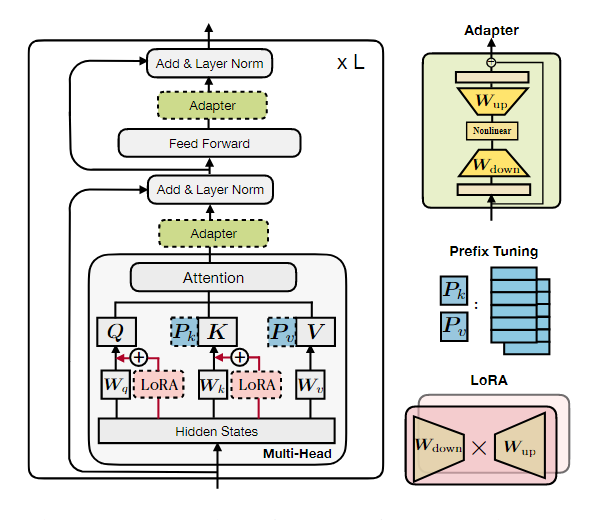

### 2.1 Adapter

- **AIM: Adapting Image Models for Efficient Video Action Recognition**

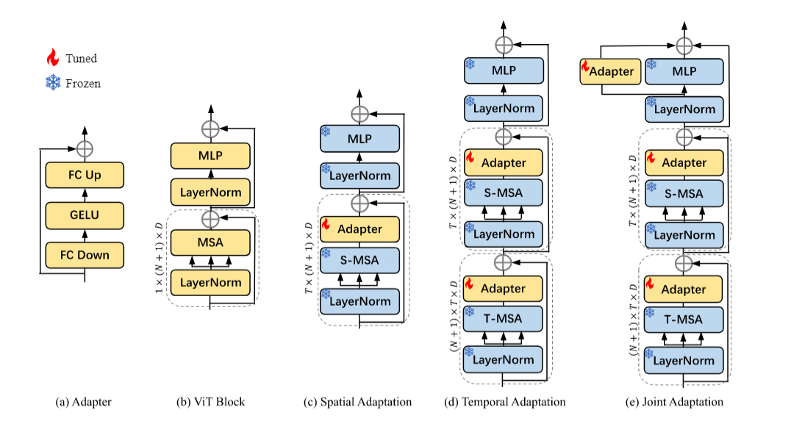

---

- **ST-Adapter: Parameter-Efficient Image-to-Video Transfer Learning for Action Recognition**

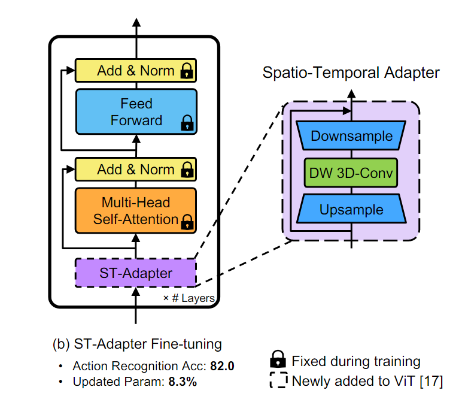

- **CLIP-Adapter: Better Vision-Language Models with Feature Adapters**

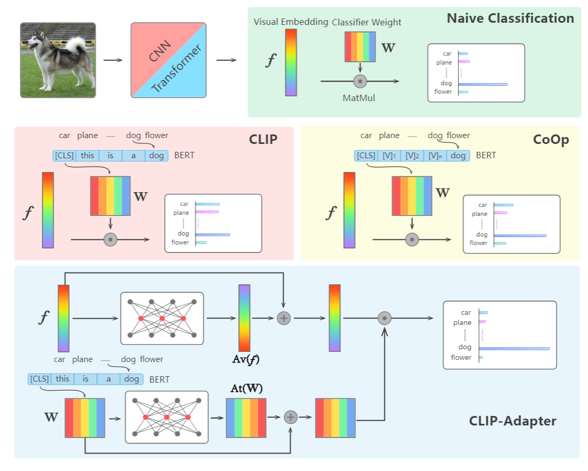

- **Tip-Adapter: Training-free CLIP-Adapter for Better Vision-Language Modeling**

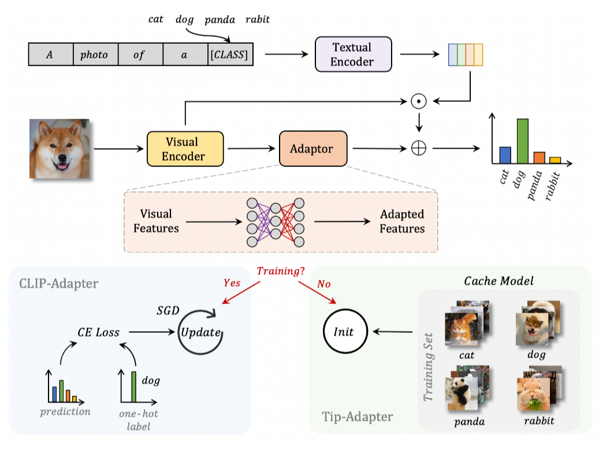

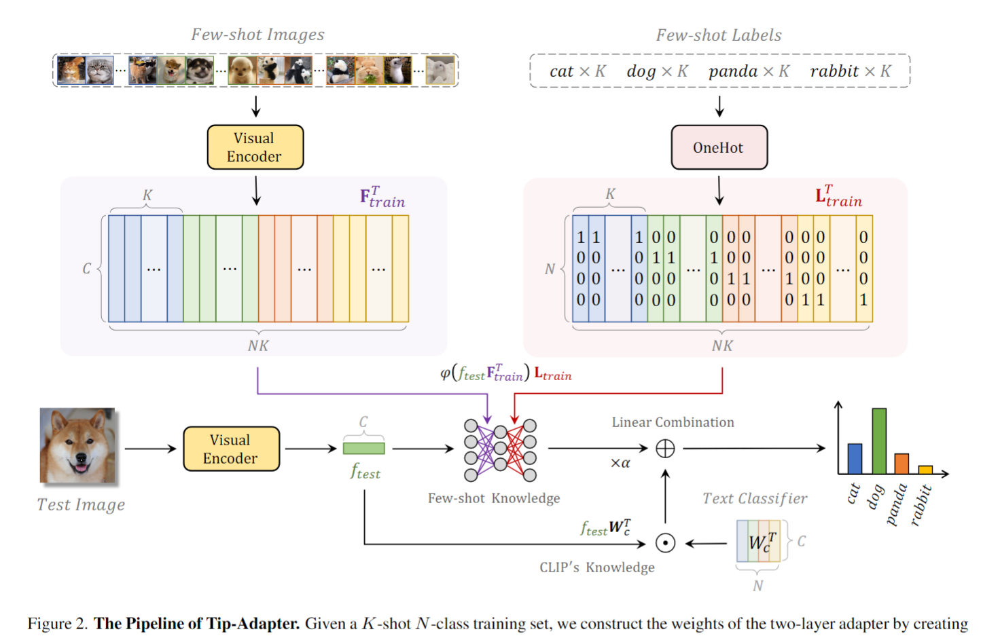

### 2.2 Prompt

#### 2.2.1 Prompt Tuning

- **Prefix-Tuning: Optimizing Continuous Prompts for Generation**

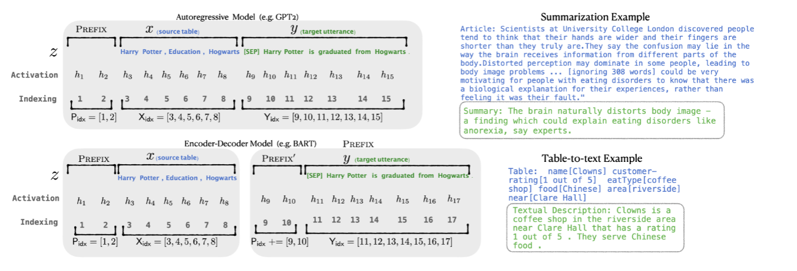

- **Learning to Prompt for Vision-Language Models(CoOp)**

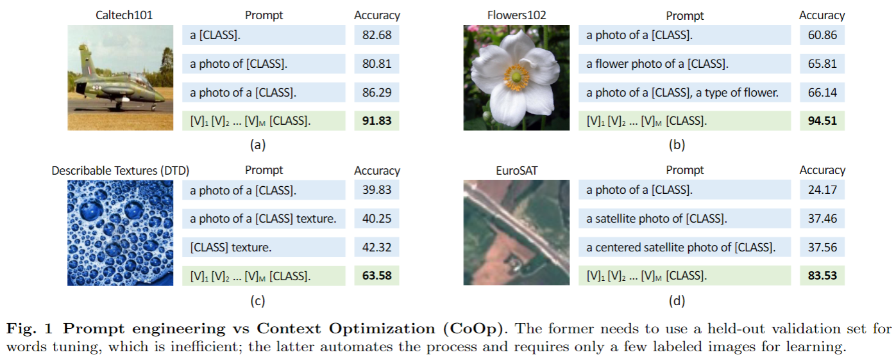

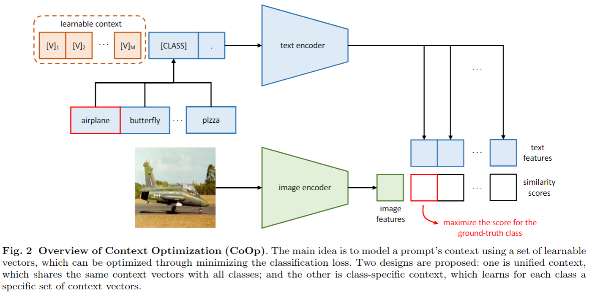

- **Conditional Prompt Learning for Vision-Language Models(CoCoOp)**

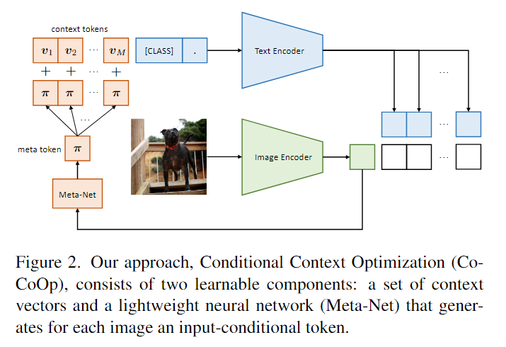

#### 2.2.2 Visual Prompt

- **Visual Prompt Tuning**

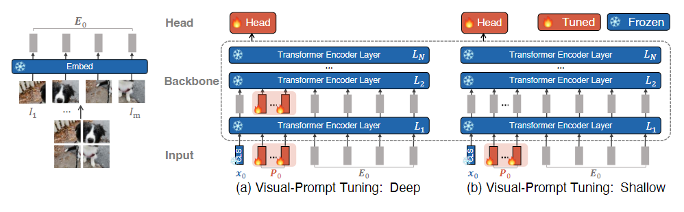

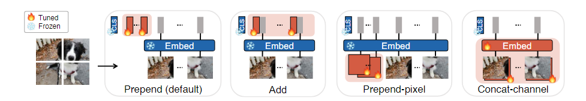

- **Prompting visual-language models for efficient video understanding**

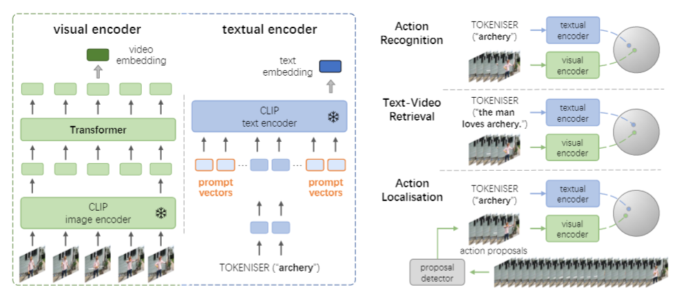

- **Expanding Language-Image Pretrained Models for General Video Recognition(X-CLIP)**

- **ActionCLIP: A New Paradigm for Video Action Recognition**

- **Frozen CLIP Models are Efficient Video Learners**

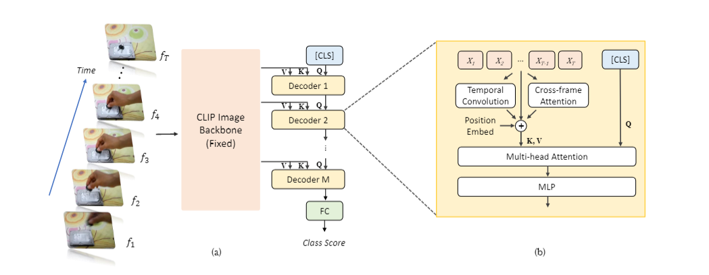

### 2.3 Low-Rank Decomposition

- **LoRA: Low-Rank Adaptation of Large Language Models**.

$$
h=W_0 x+\Delta W x=W_0 x+B A x
$$

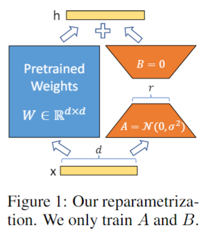

### 2.4 Towards a Unified View of Parameter-Efficient Transfer Learning

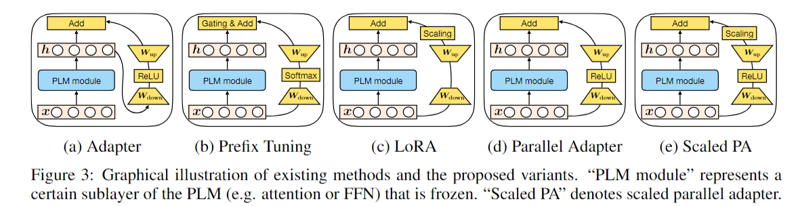

## 3 Future Work

- multimodal prompt: optical flow, RGB difference
- temporal adaptation: different sparse tubes
- self-supervised learning
- openset recognition: conditional prompt
