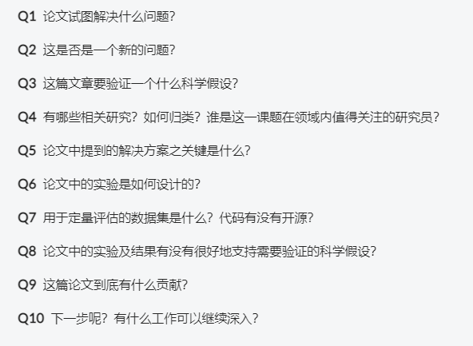

# 学习笔记

## 介绍

主要上传阅读论文后的阅读笔记，便于互相学习交流

## Notes List

1. paper_list.md
2. 综述.md
3. 双流网络.md
4. 局部特征点.md
5. two-stream-fusion.md
6. dense trajectory.md
7. iDT.md
8. 运动检测.md
9. 轨迹池化深度卷积描述子（TDD）.md
10. TSN.md
11. TLE.md
12. RAFT.md
13. STRM.md
14. ActionVLAD.md
15. CoViAR.md
16. TRN.md
17. ECO.md
18. TSM.md
19. FlowNet.md
20. TPN.md
21. PWC-Net.md
22. LiteFlowNet.md
23. MLP-3D.md
24. TEA.md
25. AcT.md
26. X3D.md
27. TDN.md
28. 分组时空聚合（GST）.md
29. OmniSource.md
30. VideoMAE.md
31. UniFormerV1.md
32. UniFormerV2.md
33. 联合原子动作建模.md
34. FineGym.md
35. 弱监督原子动作模型.md
36. InternVideo.md
37. TubeViT.md
38. Co3D CNN.md
39. FineDiving.md
40. 有向图神经网络（DGNN）骨架识别.md
41. Survey on Sports Video.md
42. TQN.md
43. CoDT.md
44. Shift-GCN.md
45. Dual-path Adaptation.md
46. PETL.md
47. MVD.md
48. MAR.md
49. VideoMAEV2.md
50. ARN.md
51. GTDNet.md
52. Decomposed Cross-modal Distillation.md
53. UMT.md
54. TPS.md
55. TokenShift.md
56. BIKE.md
57. AdaMAE.md
58. SIFA.md
59. Vita-CLIP.md
60. ActionCLIP.md
61. X-CLIP(video recognition).md
62. EffiPrompt.md
63. EVL.md
64. SparseFormer.md
65. ViViT.md
66. MTV.md
67. PoseC3D.md
68. DirecFormer.md
69. MViT.md
70. MViT V2.md
71. Swin Transformrer.md
72. Text4Vis.md
73. X-CLIP(video retrieval).md
74. TCL.md
75. Temporal Gradient Semi-supervise.md
76. SIFAR.md
77. HyRSM.md
78. Shift Chunk Transformer.md
79. Frame Flexible Network.md
80. ViFi CLIP.md
81. ACR.md
82. TA2N.md
83. U-Tuning.md
84. STAN.md
85. SFA-ViViT.md
86. Hiera.md
87. ObjectViViT.md
88. PLAR.md
89. ATM.md
90. UPR-Net.md
91. MAE-WSP.md
92. M3Video.md
93. AFNet.md
94. CLIP-FSAR.md
95. MoLo.md
96. OTAM.md
97. HyRSM++.md
98. TempCLR.md
99. ITANet.md
100. FSVC-ATA.md
101. A Closer Look at FSVC.md
102. MA-CLIP.md
103. Knowledge Prompting for Few-shot Action Recognition.md
104. ST-Sampler4FSAR.md
105. SimDA.md
106. Token Merging.md
107. Semantic-aware Temporal Accumulation Token Pruning.md
108. Adaptive Token Sampling.md

## 笔记图片

- 使用[PicGo](https://picgo.github.io/PicGo-Doc/zh/guide/)图床上传图片

## 论文十问

