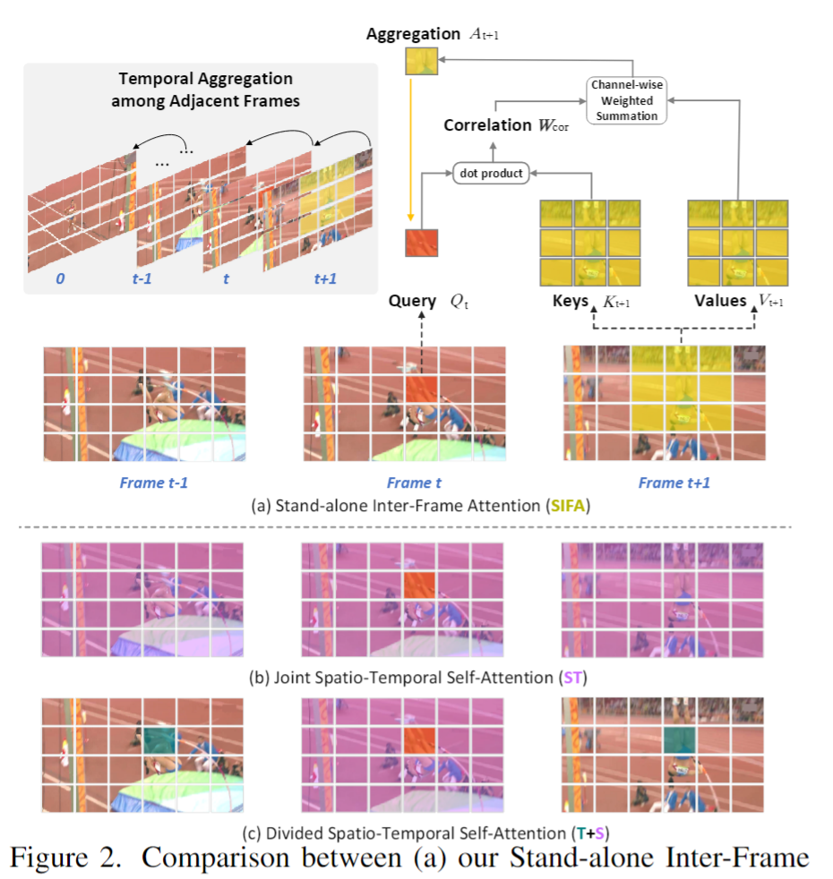
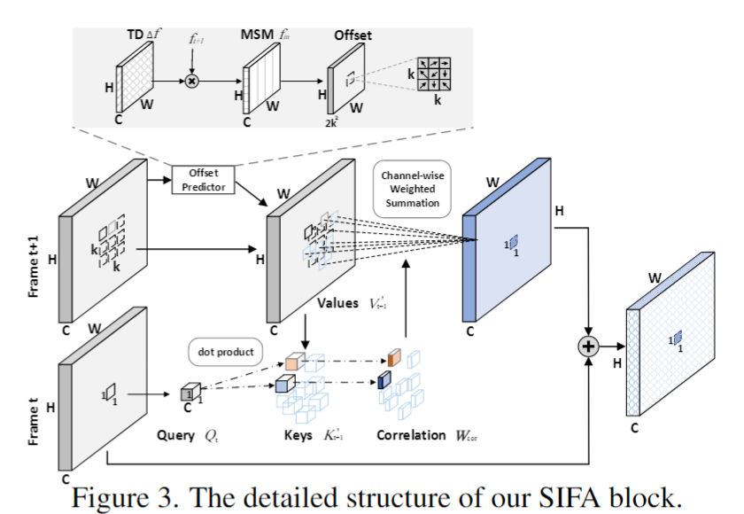
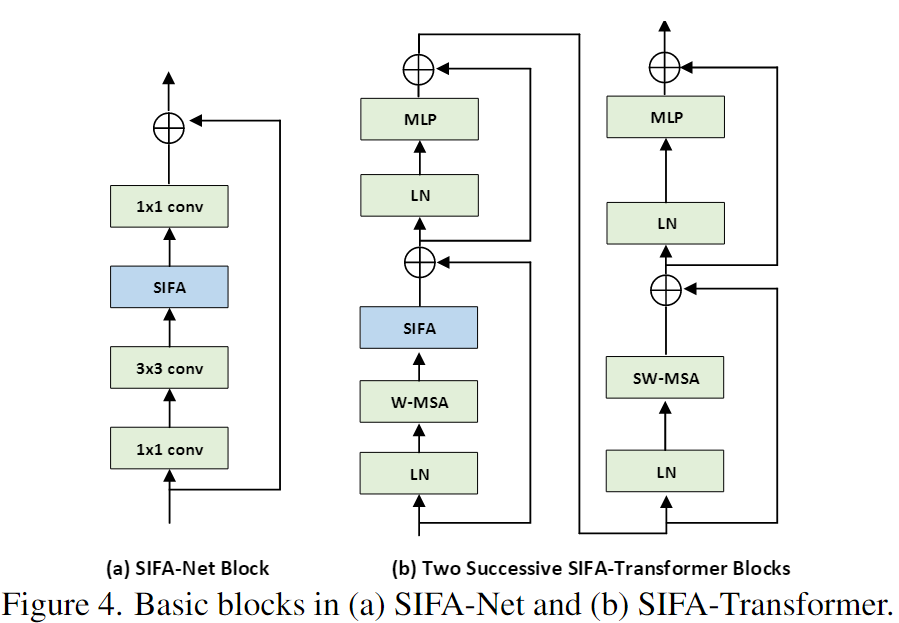
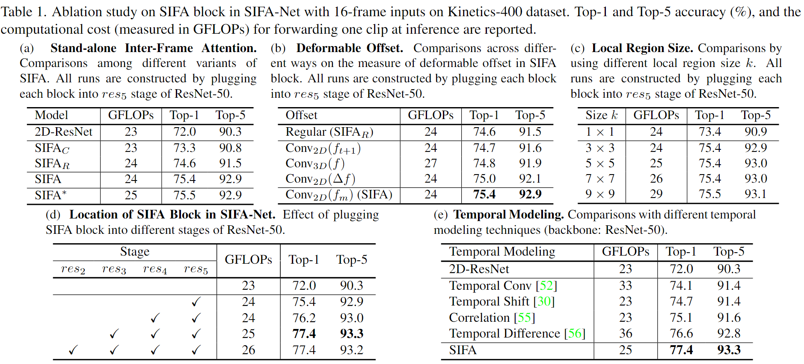
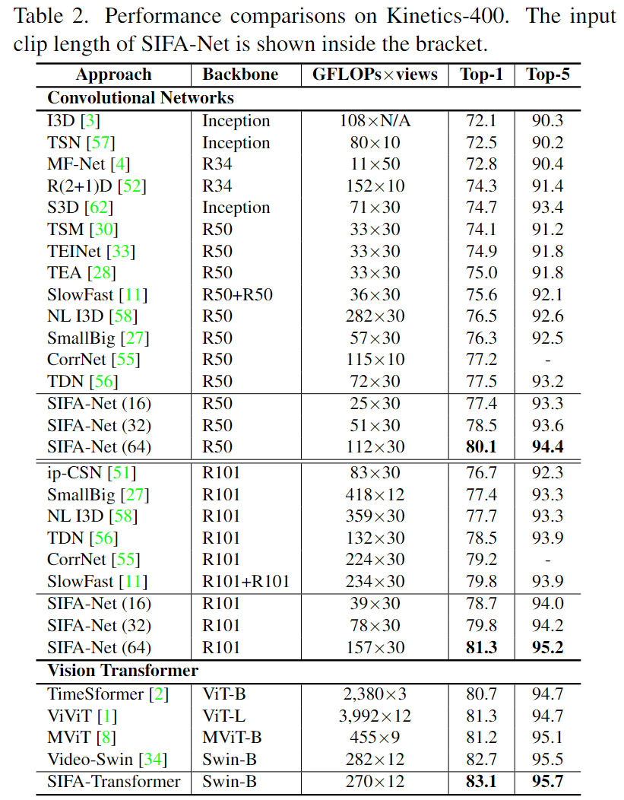
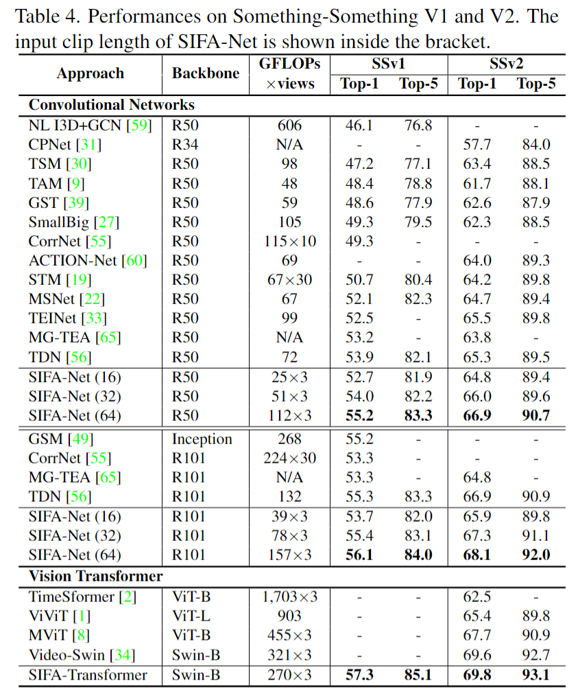
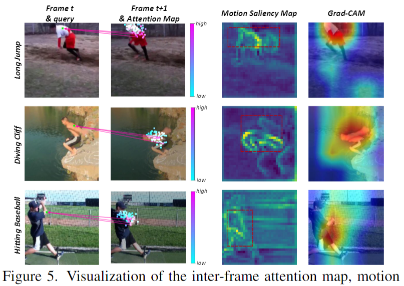

# Stand-Alone Inter-Frame Attention in Video Models

> Long, Fuchen, et al. "Stand-alone inter-frame attention in video models." Proceedings of the IEEE/CVF Conference on Computer Vision and Pattern Recognition. 2022.

## 1 Motivation & Contribution

- 过去的3D conv 、joint spatial-temporal SA、divided spatial-temporal SA、Tube embedding、Temporal shift等操作虽然一定程度上建模了时空变换，但是除了联合时空注意力（计算代价过高），其他方法不能很好地对齐帧间局部特征，尤其是当运动形变较大时。
- 相邻帧间的局部运动信息可以为局部特征的对齐提供指引，因此本文提出了一种以当前帧中的每个空间位置作为query，并相应地将其在下一帧的由运动引导的局部区域内作为key/value的帧间自注意力,是一种可形变的注意力机制。

## 2 Method

### 2.1 Stand-alone Inter-Frame Attention (SIFA)

- Inter-frame attention是一种相邻帧局部区域的自注意力，若局限于规则的局部窗口则会忽视的目标不规则几何变换，因此SIFA加入了由运动偏移引导的可变形区域。
- 在CNN中已经有了可形变卷积，其通过可学习的偏移估计器，改变空间重采样的位置。但可形变卷积仅根据输入特征图估计2D局部空间位移，忽视了时序运动变化。
- 因此，本文提出了基于运动显著图(MSM)估计局部区域内每个空间位置的2D偏移量，作为运动监督来指导可变形特征的重采样。
- 运动显著图MSM通过归一化的temporal difference获得。

$$\Delta f=f_{t+1}-f_t$$

$$f_m=\operatorname{sigmoid}(\Delta f) * f_{t+1}$$

- 获得运动显著图后，利用偏移估计器来预测局部区域($k\times k$ grid)内每个空间位置的2D偏移，位移估计器则通过输出通道为$2k^2$的2D conv实现，最后用双线性差值计算经过offset修正的偏移位置。

$$p=(a,b)$$

$$p^{\prime}=(a+\Delta a, b+\Delta b)$$

$$K_{t+1}^{\prime}\left(p^{\prime}\right)=\sum_p G\left(p, p^{\prime}\right) \cdot K_{t+1}(p)$$

$$\begin{aligned}
& \mathbf{W}_{c o r}=Q_t \odot K_{t+1}^{\prime} \\
& A_{t+1}=\mathbf{W}_{c o r} \odot\left[V_{t+1}^{\prime}\right]^T \\
& Y_t=Q_t+A_{t+1}
\end{aligned}$$

### 2.2 2D CNN and Vision Transformer with SIFA

## 3 Experiment

