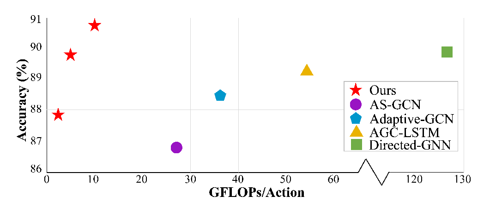
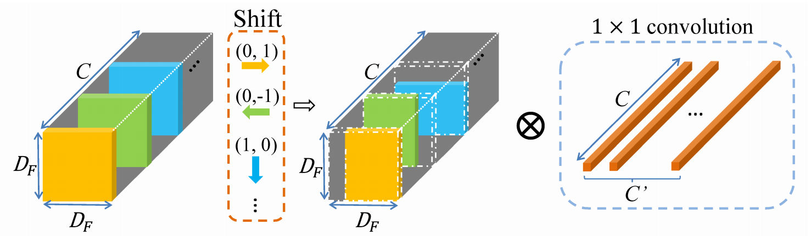
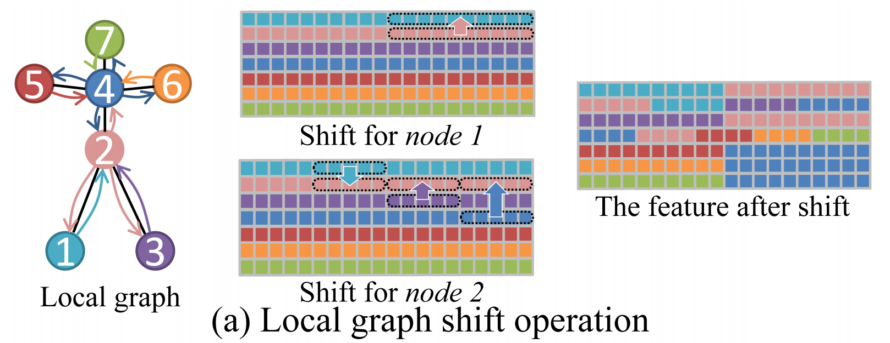
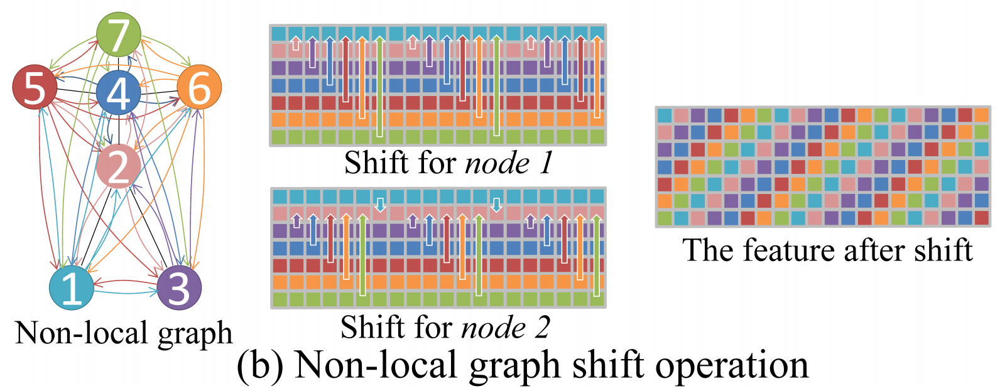
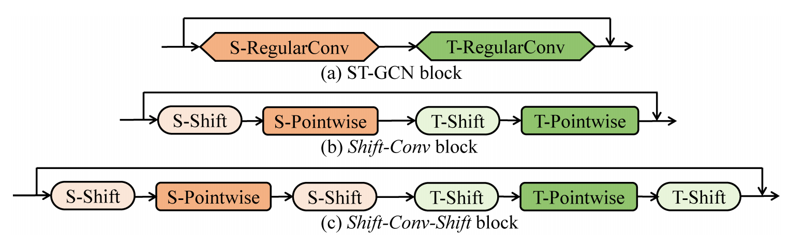
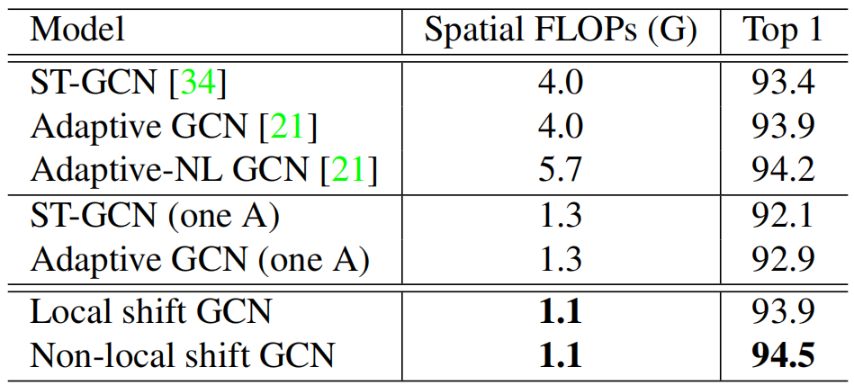
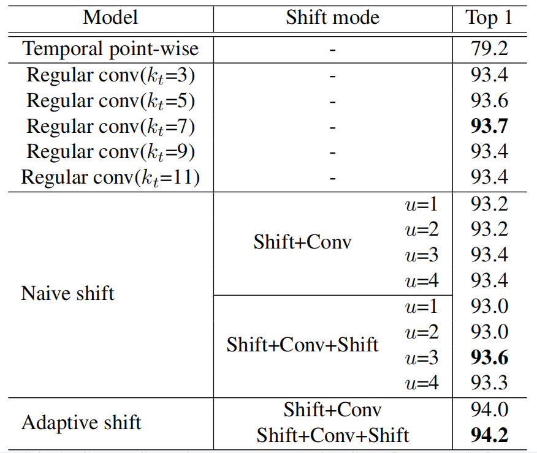
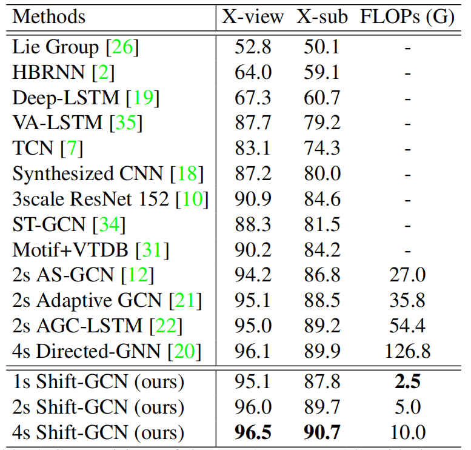

# Shift-GCN

> Cheng K, Zhang Y, He X, et al. Skeleton-based action recognition with shift graph convolutional network[C]. Proceedings of the IEEE/CVF conference on computer vision and pattern recognition (CVPR). 2020: 183-192.

## 一、引言

1. ST‑GCN 等用图卷积网络 (GCN) 对骨架数据进行建模，其中包含空间图卷积和时间图卷积。

   然而，这些基于 GCN 的方法有两个缺点：

   （1）计算量过大。

   

   （2）空间图和时间图的感受野都是启发式预定义的。尽管使空间相邻矩阵可学习，但其表达能力仍然受到常规空间 GCN 结构的限制。

2. 文章贡献：

   （1）提出了两种用于空间骨架图建模的空间移位图操作：局部移位图操作和非局部移位图操作。其中非局部空间移位图操作高效且性能强大。 

   （2）提出了两种时间移位图操作：朴素时间移位图操作和自适应时间移位图操作。其中自适应时间移位图操作可以自适应地调整感受野，并且以更少的计算复杂度优于常规时间模型。

   （3）在基于骨架的动作识别的三个数据集上，所提出的 Shift‑GCN 超过了最先进的方法，计算成本降低了 10 倍以上。

## 二、Shift-GCN

1. Shift CNN：通过将卷积核的权重在每次卷积中进行**平移**实现，可以对图像中的不同位置进行不同的卷积操作。这种方法能够使得网络更加灵活地学习到目标的位置和特征，并且具有比传统卷积神经网络更好的鲁棒性和泛化性能。

   

   优势：（1）复杂度低。（2）可以通过增大平移距离增大感受野，而不需要增大卷积核。

2. 空间 Shift-GCN：CNN 中的常规卷积核可以看作是多个逐点卷积核的融合，而空间 GCN 中的常规卷积核是 3 个逐点卷积核的融合：“向心”、“根”、“离心”。移位图操作的主要思想是将邻居节点的特征转移到当前卷积节点。

   （1）局部移位图操作：连接由原始骨架的物理连接决定。特征被分成 n+1 段，n 是该节点的相邻节点数。

   

   （2）非局部位移图操作：感受野拓宽到全局，可以构建原本不存在的边。

   

3. 自适应非局部移位机制：在非局部移位图卷积中，不同节点之间的连接强度是相同的。但是人体骨骼
   的重要性是不同的。因此引入了一种自适应的非局部移位机制：
   $$
   \widetilde{\mathbf{F}}_M=\widetilde{\mathbf{F}} \circ M a s k=\widetilde{\mathbf{F}} \circ(\tanh (\mathbf{M})+1)
   $$

4. 时间 Shift-GCN：图的时间方面是通过连接时间维度上的连续帧来构建的。因此，CNN 中的移位操作可以直接扩展到时域。

   （1）朴素时间移位图卷积：将通道平均分为 2u + 1 个分区，每个分区的时间偏移距离分别为－u,  －u + 1,  ·  ·  · ,  0,  ·  ·  ·  u－1,  u，每个帧都从其相邻帧中获取信息。通常，基于 GCN 的动作识别中，内核大小为 9。

   （2）自适应时间移位图卷积：自适应的调节感受野：
   $$
   \widetilde{\mathbf{F}}_{(v, t, i)}=(1-\lambda) \cdot \mathbf{F}_{\left(v,\left\lfloor t+S_i\right\rfloor, i\right)}+\lambda \cdot \mathbf{F}_{\left(v,\left\lfloor t+S_i\right\rfloor+1, i\right)}\\
   \lambda = S_i - \left\lfloor S_i\right\rfloor
   $$

5. 时空 Shift-GCN：

   

## 三、结果

1. 空间：

   

2. 时间：

   

3. 时空：

   