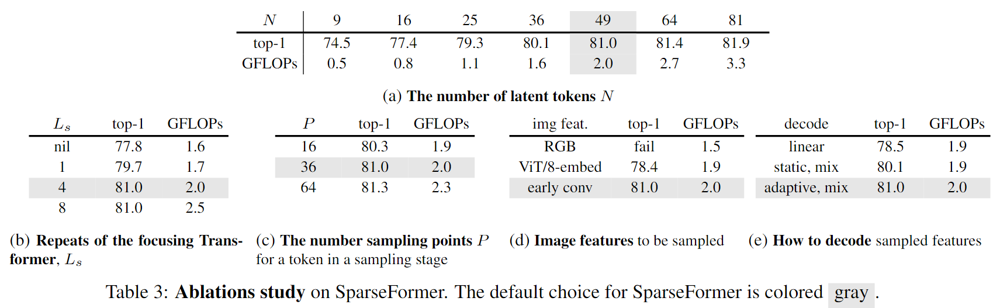
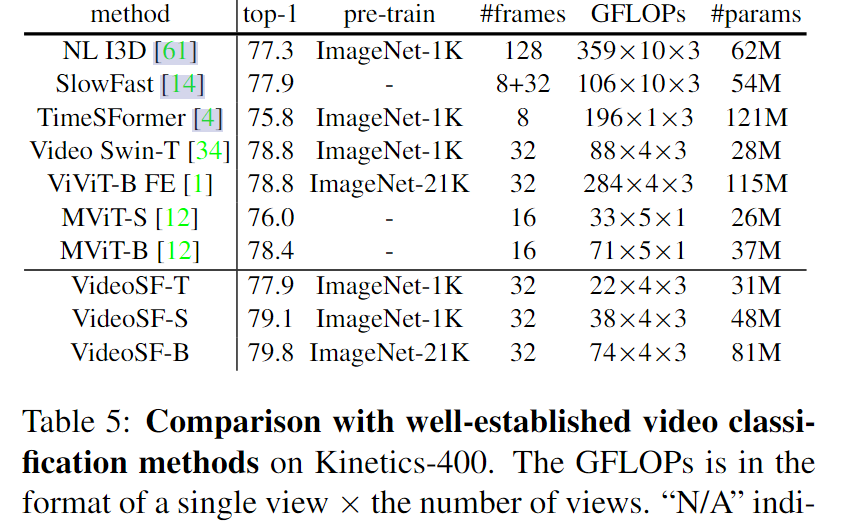

# SparseFormer: Sparse Visual Recognition via Limited Latent Tokens

> Gao, Ziteng, et al. "SparseFormer: Sparse Visual Recognition via Limited Latent Tokens." arXiv preprint arXiv:2304.03768 (2023).

## 1 Motivation & Contribution

### 1.1 Motivation

- 目前大多数基于convolution-based 或Transformer-based的视觉识别任务都需要遍历每个单元（pixel or patch）。这种源于滑动窗口的方法是基于前景目标空间均匀分布的前提，虽然能不遗漏细节，但是不可避免地增大了计算量，并且无法直接提供有关视觉模型在图像中查看的内容的详细信息。
- 这与人类的感知机制不太符合，人类通常仅瞥见一部分图像，即可发现显著区域，并识别出这些区域中的文本、边缘和高级语义等等。
- 因此，本文尝试模仿人类感知机制，首先引入了目标检测中DETR中region of interest (ROI)与 latent token结合的思想，在ROI中稀疏采样生成latent token特征，从而减少token数量，减少计算量。
- 本文也是论文一作将其另一篇AdaMixer(CVPR2022)类似的思想运用于视觉识别任务中。

### 1.2 Contribution

- 提出了一种稀疏的高效视觉识别范式。

## 2 Method

### 2.1 Building Latent Tokens

#### 2.1.1 Latent tokens

- 与DETR类似，将预设数量的token与ROI联系起来，一个latent token 由一个embedding $t$和归一化的ROI描述符$b$构成，$b=(x,y,w,h)$。
- The entire set of latent tokens:

$$T = \{ ( t _ { 1 } , b _ { 1 } ) , ( t _ { 2 } , b _ { 2 } ) , \cdots , ( t _ { N } , b _ { N } ) \}$$

#### 2.1.2 Sparse feature sampling

- 每个latent token都会对应$P$个基于ROI的采样点，SparseFormer根据embedding $t$通过一层线性层生成采样点基于ROI的偏移。

$$\{ ( \Delta x _ { i } , \Delta y _ { i } ) \} _ { p } = \operatorname { L i n e a r } ( t )$$

- 然后根据ROI的位置，将采样点的相对位置转换为绝对采样位置

$$ \begin{array}  { l  }  { x _ { i } = x + 0.5 \cdot \Delta x _ { i } \cdot w } \\ { y _ { i } = y + 0.5 \cdot \Delta y _ { i } \cdot h } \end{array}$$

- 基于采样点的双线性插值提取特征，latent token对应采样的特征形状为$\Reals^{P \times C}$

#### 2.1.3 Adaptive feature decoding

- 简单地通过线性层$\Reals^{P\times C}\to \Reals^{d}$嵌入效果不佳。
- 本文设计了一种简化的、自适应的 MLP-mixer 变体，称为自适应混合器，其动态混合器权重类似于卷积中的动态滤波器。该过程依次包含自适应通道混合和自适应空间混合，以便自适应地利用通道语义和空间结构信息。

- $\mathcal{F}: \Reals^{d} \to \Reals^{C\times C + P\times P}$，其为两层没有激活函数的线性层

$$[ M _ { c } | M _ { s } ] = \mathcal{F}( t ) , M _ { C }  \in \Reals ^ { C \times C } , M _ { s } \in \Reals ^ { P \times P }$$

$$x ^ { ( 1 ) } = \operatorname{G E L U} ( x ^ { ( 0 ) } M _ { c } ) \in \Reals ^ { P \times C }$$

$$x ^ { ( 2 ) } = \operatorname{G E L U} (M _ { s }x^{(1)} ) \in \Reals ^ { P \times C }$$

- 最后的输出$x^{(2)}$再经线性层 $\Reals^{P\times C}\to \Reals^{d}$ ，最后加回embedding $t$并更新。

- 通过这种自适应的特征解码器使得SparseForemr能推理embedding 中 _what a token expects to see_

#### 2.1.4 Adjusting RoI

- 根据更新后的token embedding更新对应的RoI

$$\left. \begin{array}  { l  }  { x ^ { \prime } = x + t _ { x } \cdot w , \quad y ^ { \prime } = y + t _ { y } \cdot h } \\ { w ^ { \prime } = w \cdot \exp( t _ { w } ) , \quad h ^ { \prime } = h \cdot \exp ( t _ { h } ) } \end{array} \right.$$

$$\{ t _ { x } , t _ { y } , t _ { w } , t _ { h } \} = \operatorname { L i n e a r } ( t )$$

- 通过ROI的调整和充分的训练，SparseFormer可以在几个阶段后专注于前景

#### 2.1.5 Focusing Transformer

- 在实际应用中，首先进行token RoI调整，生成稀疏采样点，然后使用双线性插值法获得采样特征。
- 然后，将自适应解码应用于这些采样特征，并将解码输出添加回token embedding。
- RoI调整、稀疏特征采样和解码都可以被视为一种自适应和稀疏的“交叉注意力”替代方案。
- 可以将latent token multi-head self-attention、FFN和sampling 和 decoding视作一个重复的transformer stage，称为focusing Transformer。
- 通过重复的focusing Transformer即可高效地让模型关注前景目标。

#### 2.1.6 Cortex Transformer

- focus transformer提取的视觉特征再经由一个标准的transformer encoder 进一步处理。

### 2.2 SparseFormer Architecture

#### 2.2.1 Early convolution

- 由于在原始RGB图像上使用双线性插值采样存在较多噪声，不利于训练的稳定。因此在transformer前加入 early convolution是有必要的。

#### 2.2.2 Sparsity of the architecture

- latent token数量是预设的，与输入分辨率无关。且latent token space ($N\times d_c：81\times768$)也比输入尺寸（$3 \cdot 224 ^ { 2 }$）小得多。
- 因此，计算量和内存消耗也与输入尺寸无关。

#### 2.2.3 Extension to video classification

- 将token RoI扩充两个参数$(t,l)$，使得RoI变成一个tube，$t$为RoI时序中心坐标，$l$为时序长度。稀疏特征采样3D采样点，且添加了时序偏移。双线性插值则被三线性插值取代。其他则不改变。

## 3 Experiment

