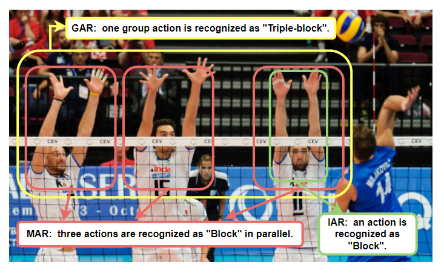
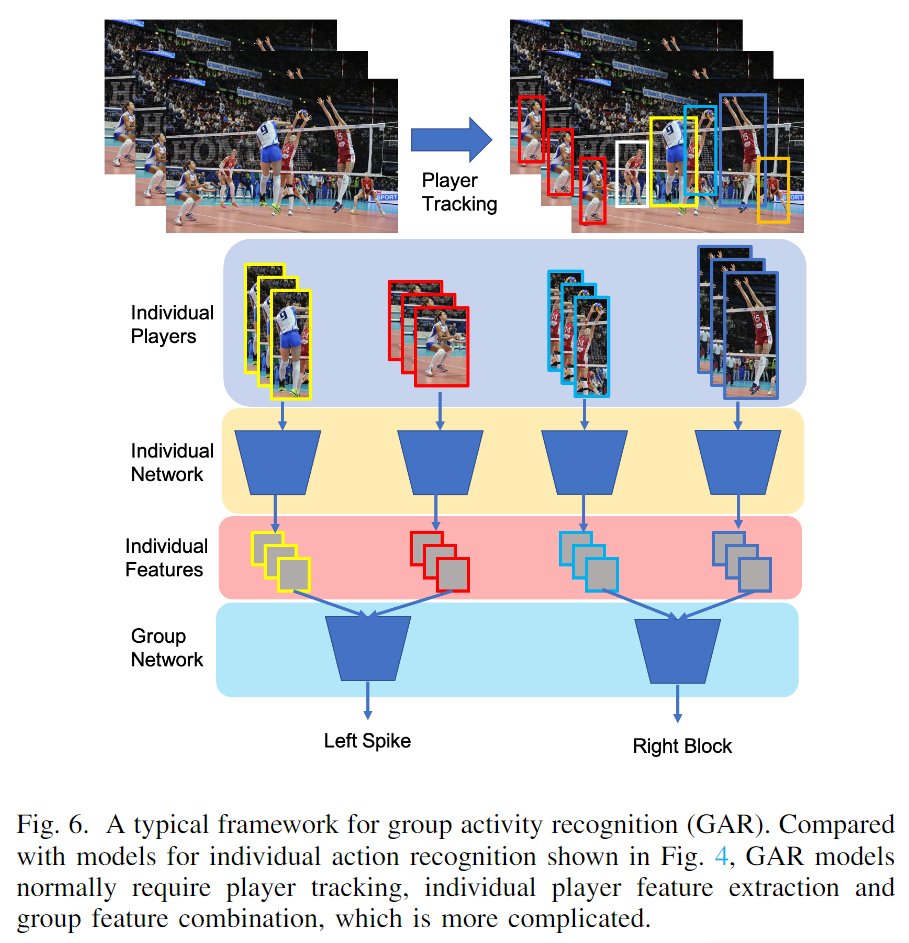

# A Survey on Video Action Recognition in Sports

> Wu, Fei, et al. "A Survey on Video Action Recognition in Sports: Datasets, Methods and Applications." IEEE Transactions on Multimedia (2022).

## 1 Introduction

- 现有的视频理解算法在常规视频数据集已经取得了不错的成果，但大多关注于日常生活中粗粒度的单人动作且缺乏明确的动作时序边界，难以直接用于细粒度的复杂动作识别，例如特定某项运动的分析。
- 运动视频相较于普通视频更具挑战性，但有助于提高视频理解模型到更高层次，且应用前景广阔。

### 1.1 Sports categories

- 单人运动：跳水，网球，乒乓球，羽毛球，体操，花样滑冰等等
- 团体运动：足球，篮球，排球，曲棍球等等

### 1.2 Challenges

#### 1.2.1 Data Collection and Annotation

- 大多数具有代表性的体育视频来自于未剪辑的体育直播片段，由于视频作者或版权的原因，体育视频的获取受到限制。
- 体育视频数据标注需要相关领域的专业知识。往往标注者越专业，在目标体育领域，标注质量越好，模型在真实推理任务中具有更好的性能。
- 当前构建数据集的趋势是能用于多样化的任务，如时序动作定位、时空动作定位和复杂事件理解等等。因此，未来的视频数据集需要更复杂详细的标注。

#### 1.2.2 Dense and Fast-moving Actions

- 体育领域的动作通常在短时间内变化更加快速且密集，如乒乓球等。

#### 1.2.3 Camera Motion, Cut and Occlusion

- 因为运动视频通常来自于赛事直播，所以运动视频中存在多视角的摄像视角变化，并且在团队运动中还存在遮挡现象。

#### 1.2.4 Long-tailed Distribution and Imbalanced Data

- 在运动视频中一些动作由于难度等原因数量较少，因此还存在长尾问题。

### 1.3 Applications

- Training Aids
- Game Assistance (Video Judge)
- Video Highlights
- Automatic Sports News Generation
- General Research Purposes

## 2 Sports-Related Datasets

### 2.1 Football

- Annotation:
  - the positions of players using bounding boxes
  - event/story categories:goal, foul, injured, red/yellow card, shot, substitution, free kick, corner kick, saves, penalty kick and background
  - shot categories:shots on target, shots off target
  - temporal boundary

### 2.2 Basketball

- Annotation:
  - the positions of players using bounding boxes
  - the estimated poses of players
  - coarse categories:dribbling, passing and shooting
  - fine-grained categories:behind-the-back dribbling, cross-over dribbling, hand-off, one-handed side passing, lay up shot, onehanded dunk and block shot,etc.
  - depth maps
  - temporal boundary

### 2.3 Volleyball

- Annotation:
  - the positions of players using bounding boxes
  - players' actions:waiting, setting, digging, failing, spiking, blocking, jumping, moving and standing
  - team activity category:winpoint

### 2.4 Multiple Types of Sports

- Hierarchical action category:team sports, ball sports, winter sports, etc.
- MultiSports,Sports 1M

### 2.5 Others

- Action quality assessment
- Recognize win or fail of actions

## 3 Individual Action Recognition

- 2D
- 3D
- Transformer
- Skeleton-based

## 4 Group/Team Activity Recognition

- Group activity recognition (GAR):由多个个人动作组成的群体动作且具有更高层的语义信息。
- Multi-player activity recognition (MAR):并行识别多个个体的独立动作。

### 4.1 Feature Combination

- 将人体目标检测、人体目标跟踪、人体姿态估计、人体动作识别等特征进行聚合

### 4.2 GNN & RNN

- 通过图神经网络建模多个个体和目标物（如球类）间的关系，然后通过RNN建模时序关系。

### 4.3 Transformer

- 用Transformer取代RNN建模时序关系

## 5 Future Work

- Multi-camera and Multi-view Action Recognition
- Transfer, Few-shot and Zero-shot Learning
- Multi-modality:video-text,optical flow,audio
