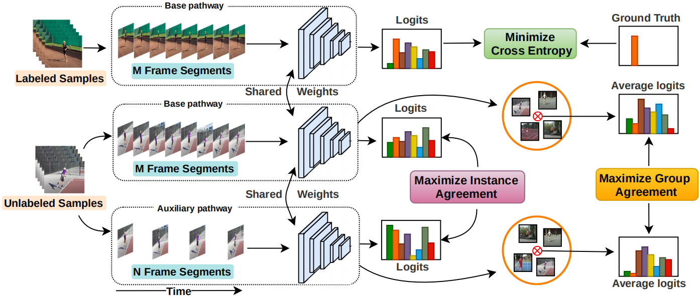
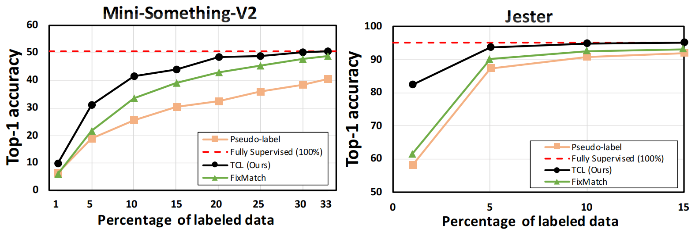
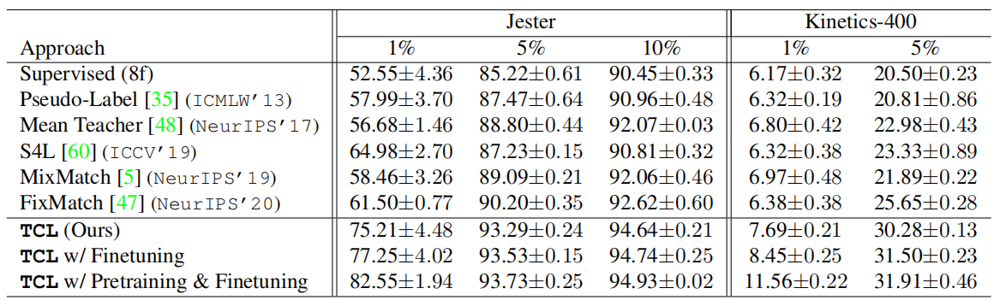

# TCL（Temporal Contrastive Learning）

## 一、引言

1. 研究背景：

   （1）监督深度学习方法在视频动作识别任务中效果优异，但严重依赖于需要繁琐的人工注释工作的大型数据集。

   （2）当前的半监督模型在图像情况下超越了半监督模型。

   （3）在不考虑丰富的时间信息的情况下将图像域方法简单地扩展到视频无法完全弥合半监督学习和完全监督学习之间的性能差距。

2. 对比学习：在没有标记的大量数据中，通过比较不同视角的同一样本的表示，可以学习到更有用的特征表示。可以通过最小化同样本表示之间的距离，并最大化不同样本表示之间的距离来实现。

3. 研究贡献：

   （1）提出一种双路时间对比半监督动作识别框架，以两种不同的速度处理未标记视频中的时间信息。

   （2）使用一种新颖的组对比损失来将判别运动表示与速率不变性相结合，从而显着提高半监督动作识别性能。

   （3）只需要 Mini‑Something V2 和 Jester 中标记数据的 33% 和 15% 即可达到完全监督方法的性能。

## 二、Temporal Contrastive Learning

1. 对于有标记的样本，直接在 base pathway 下使用 3D 卷积训练。

2. 对于无标记的样本，采样得到高速帧率的 auxiliary pathway，在使用相同权重的 3D 卷积得到伪标签。最大化以两种不同速度播放的同一视频的编码表示之间的相似性，以及最小化以不同速度播放的不同视频之间的相似性得到实例对比损失：
   $$
   \mathcal{L}_{i c}\left(U_f^i, U_s^i\right)=-\log \frac{h\left(g\left(U_f^i\right), g\left(U_s^i\right)\right)}{h\left(g\left(U_f^i\right), g\left(U_s^i\right)\right)
   +\sum h\left(g\left(U_f^i\right), g\left(U_p^k\right)\right)}
   $$

3. 组对比损失：在没有类标签的情况下直接在不同视频实例之间应用实例对比损失不会考虑高级动作语义。这种策略可能会使包含相同动作的视频学习得到不同的表示。

   伪标签的类中心：
   $$
   R_p^l=\frac{\sum \mathbb{1} g\left(U_p^i\right)}{T}
   $$
   组对比损失：
   $$
   \mathcal{L}_{g c}\left(R_f^l, R_s^l\right)=-\log \frac{h\left(R_f^l, R_s^l\right)}{h\left(R_f^l, R_s^l\right)
   +\sum \mathbb{1} h\left(R_f^l, R_p^m\right)}
   $$

4. 自监督预训练：在半监督之前将整个标记数据和未标记数据 Dl ∪ Du 仅视为未标记数据，并使用实例对比损失来鼓励在两个路径中学习的表示之间的一致性。

## 三、结果

