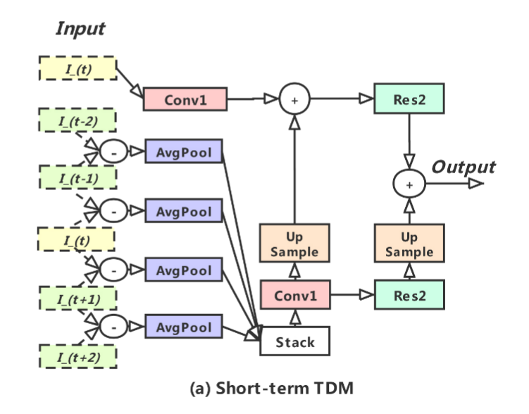
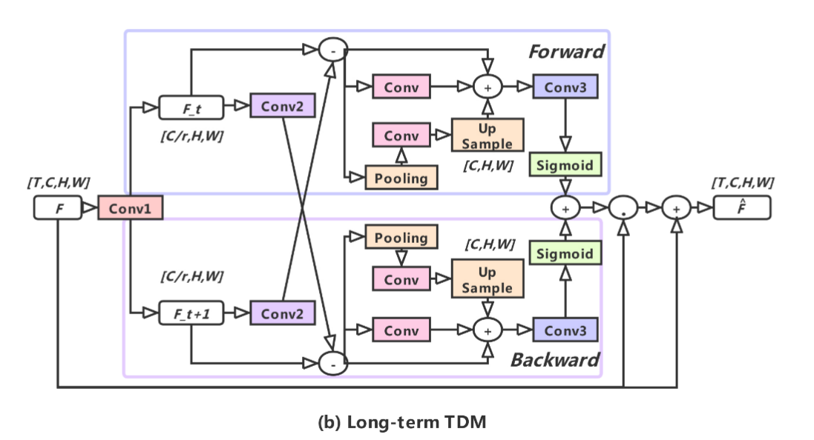
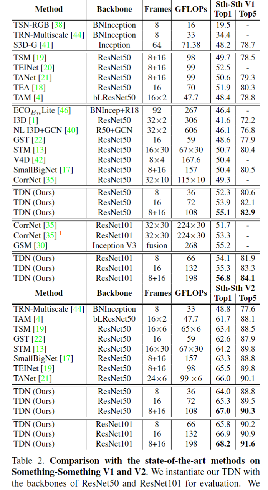
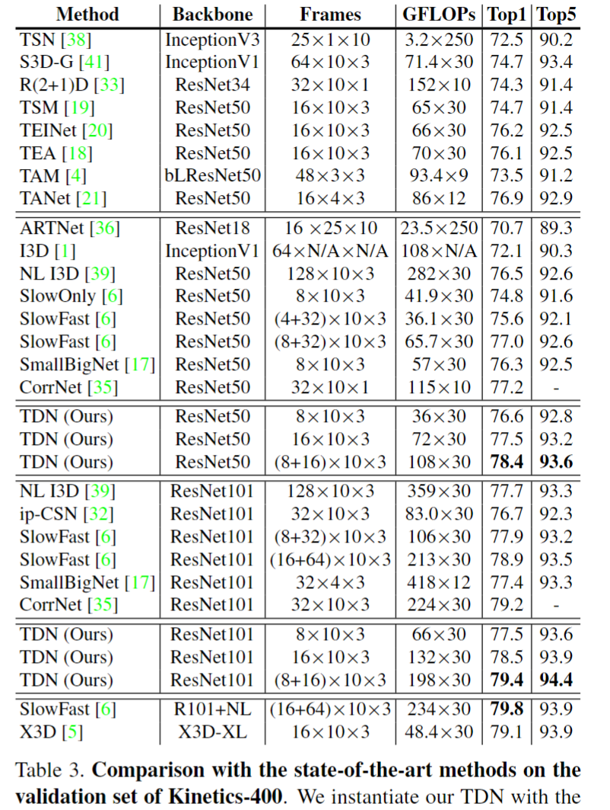

# TDN: Temporal Difference Networks for Efficient Action Recognition

> Limin Wang et al. “TDN: Temporal Difference Networks for Efficient Action Recognition” Computer Vision and Pattern Recognition(2021): n. pag.

## 1. Motivation & Contribution

### 1.1 Motivation

- 3D卷积其实并不能很好得学到时序上信息的变化，而且3D卷积学出来的时序Kernel的weight的分布基本一致，更多的还是对时序上的信息做一种 smooth aggregation。
- 在双流网络中利用光流能显式的提取高质量的运动信息，但缺点是计算开销较大。而一些工作研究发现相邻帧之间的RGB difference可以作为光流的有效近似替代。由于相邻帧运动位移较小，因此RGB差值可以较好地建模短时间运动信息，但无法建模长时间运动信息。也有一些工作认为得益于空间下采样和卷积操作能扩大感受野，feature difference可以建模长时间运动信息。
- 但是这些利用RGB和特征差值的方法只是简单地使用一个简单的差分算子进行单级运动提取，并且其时序特征和空间特征的提取仍然可以看作是“双流”，并没有实现统一。

### 1.2 Contribution

- 提出了一种高效的时序差分网络(Temporal Difference Network, TDN)，通过 Difference 这种简单的操作，去显式得提取出视频中复杂精细的运动变化，在不增加过多的计算量的前提下去更高效得进行时序建模。
- TDN 是一个 Two-level 的结构，其主要包含短时和长时两个模块——Short-term temporal difference module(S-TDM) 和 Long-term temporal difference module(L-TDM)，提出了一个视频级运动建模框架。

## 2. Temporal Difference Networks

- TDN首先参考了 TSN 的采样方式，在整个 Video-level 上均匀分段(segment)进行采样。
- 在网络的前一个阶段，为了在段内融合局部的运动变化信息，所以提取原始 RGB 帧间的 difference 作为局部运动变化的一种表征，然后 CNN 去进一步提取运动信息。
- 在网络的后一个阶段，旨在利用跨段时间结构来增强帧级特征表示。
- 上述这两个模块通过残差连接并入主网络。

### 2.1 Short-term TDM

- 由于相邻帧空间信息相似，对每帧都计算空间信息会产生大量冗余，所以只对单帧图像仅对局部窗口中间的1帧图像使用conv1）计算空间信息。
- 对于短期运动则通过局部窗口中两两相邻RGB帧做差、平均池化和stack得到。
- 为了减少计算量，该部分采取了低分辨率处理策略，先做DownSample，然后做卷积，最后做UpSample。
- 短期运动信息通过average add与原始RGB融合。

### 2.2 Long-term TDM

- 参考 TEINet 的形式，设计了一种基于 feature-difference 的通道 attention 增强方法。同时，为了提升最后的效果，还增加了multi-scale 和 bidirectional 的结构。
- 在计算Feature Difference时使用了一个卷积Conv2，这是避免物体在相邻帧之间的运动偏移较大，直接特征相减可能产生missing-alignment of spatial location的问题。
- 不同于STM和TEA，本文计算了了双向的帧间特征差异，这种方法能够增强cross-segment的特征表达。
- Pooling, Up sample等特征尺度变换操作都是针对于空间维度进行的，并不是针对时间维度。只不过能够利用具有不同空间尺度的帧间特征相减来建立不同的运动信息。
- 最终计算出Feature Difference特征差异之后，并没有像S-TDM采用相加的方式直接和输入特征进行残差连接，而是使用sigmoid产生门控权重（注意力）的方式进行相乘。

## 3. Experiments

- 在Kinetics-400数据集上，3D-based 方法采用的 dense 采样的方式，只能关注到整个视频的一小段 clip，而 TDN 参考 TSN 进行全局稀疏的采样，可以进行 video-level 的时序建模。从 one-clip, center-crop 这种单个view 改为 ten-clip, three-crop 这种 30个view 的测试方法，3D-based 方法会有 8-10 个点的提升，TDN 只有 2-3 个点的提升。但反过来，在单个 view 的 testing scheme 下，TDN 结果将会大幅度领先于 3D-based 方法。而这种单个 view 的采样方式能够在极低的计算代价下，取得比较好的结果，在工业界的现实场景下也更加实用和有意义。
