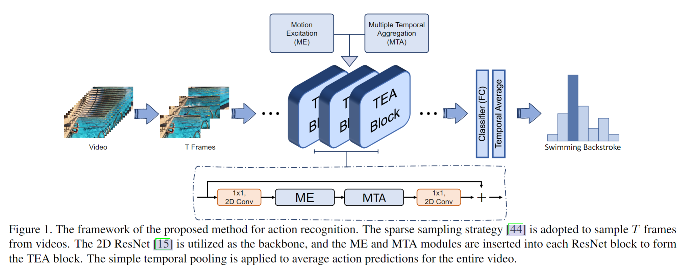
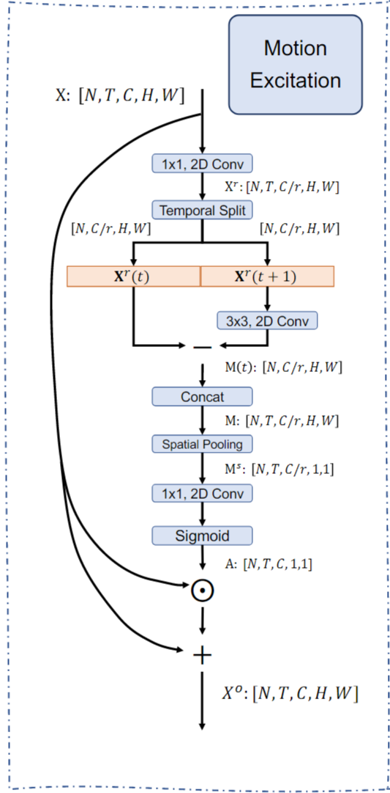
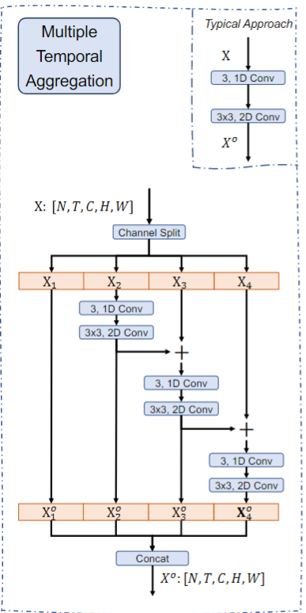
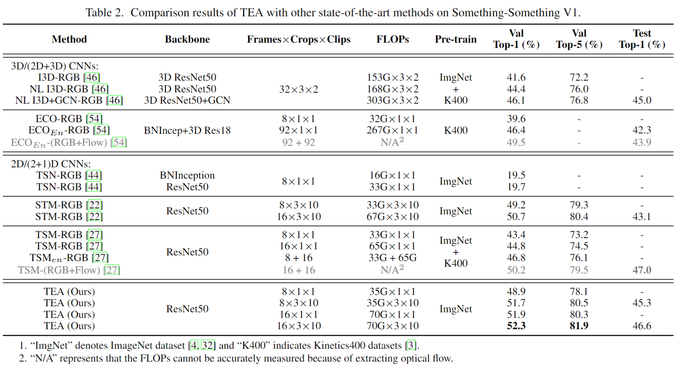
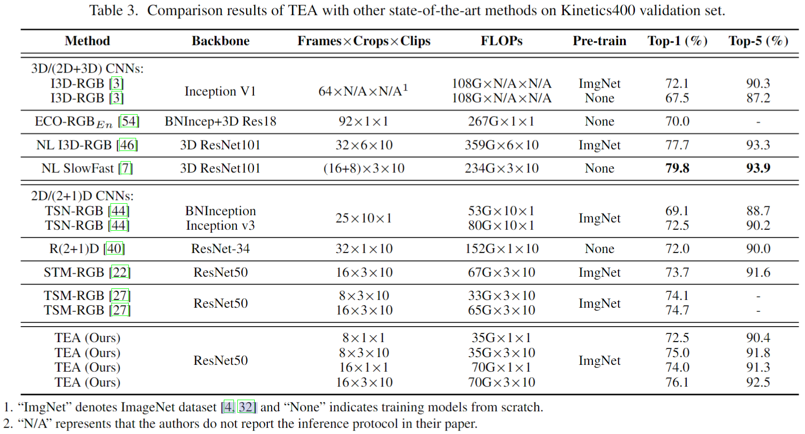
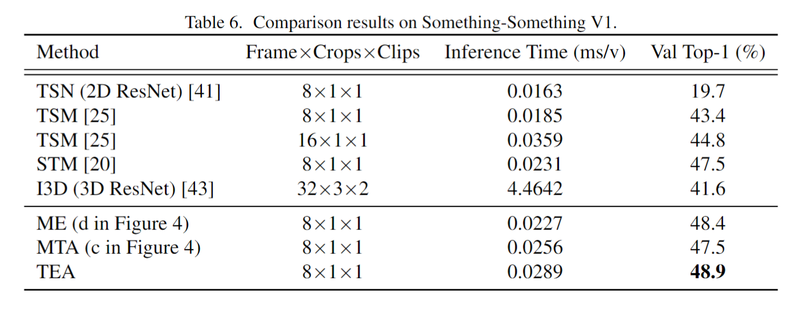

# TEA: Temporal Excitation and Aggregation for Action Recognition

> Yan Li et al. “TEA: Temporal Excitation and Aggregation for Action Recognition” computer vision and pattern recognition(2020): n. pag.

## 1. Motivation

### 1.1 Motivation

- 利用 optical flow 存储和计算的开销太大
- 现阶段的网络设计 spatio-temporal 建模 和Motion feature 建模分离
- 过去的建模都 focus 在 frame-level motion，而关注feature-level motion的比较少
- 2D CNN 提取信息结合late fusion会导致时序信息丢失，而采用 stack local 3D/(2+1)D，通过网络深度增加感受野来构建时序关系，会造成优化的困难

## 2. TEA Model

### 2.1 Framework

- 将TEA block嵌入2D ResNet中，每个TEA又由运动激励模块ME(motion excitation)和多重时间聚集模块MTA(multiple temporal aggregation)组成。
- ME用于建模feature level的时序变化
- MTA用于进行 long-range temporal aggregation

### 2.2 ME

1. 引入reduction ratio $r=16$,利用1 x 1卷积降低通道的数量
2. motion feature通过对t和t+1时刻帧做差得到，但相较于光流法，这种方法比较粗糙存在较大误差。所以先利用一个channel-wise的 3 x 3 卷积对t+1时刻做修正。这部分借鉴了另一篇论文STM(SpatioTemporal and Motion Encoding for Action Recognition).
3. 将不同时刻的motion feature 做Concat，然后将每个通道H x W池化到1 x 1，原因是在所有特征通道中，不同的通道将捕获不同的信息，ME模块主要关注运动敏感的通道，获得一个channel attention，而具体的时空布局并不重要。
4. 然后又使用一个1 x 1卷积将通道数恢复到输入尺寸，接着使用Sigmoid作为激活函数，获得motion-attentive weights A（即通道注意力权重）。这部分的池化加权与另一篇论文相似（TEINet）。
5. 最后利用权重A按位乘，对原始输入加权，增强了特征中运动敏感的部分，而背景信息则通过残差连接得到一定保留。

### 2.3 MTA

- 参考 Res2Net 进行设计，增加 group 、hierachical residual architecture 、cascade
- 纯Res2Net结构，只能对spatial的feature 进行建模，缺少temporal modeling，所以split the feature into four fragments along the channel dimension后，额外增加了一个 channel-wise 的 1 x 1 的时序卷积。从而不同分组的感受野逐渐增大，最后concat到一起。

## 3. 实验结果

