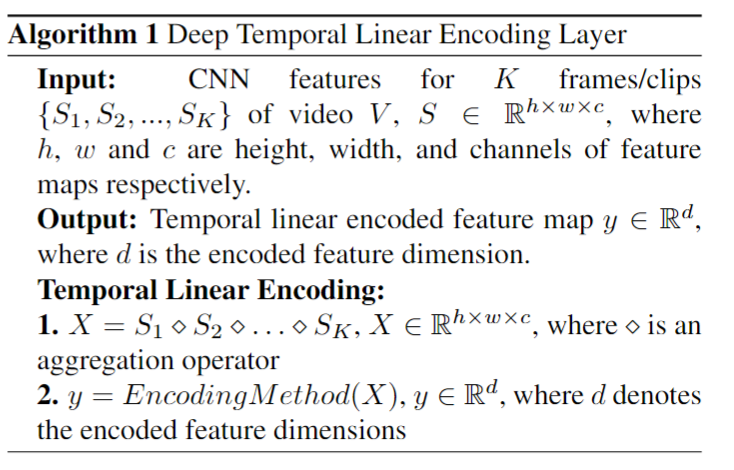
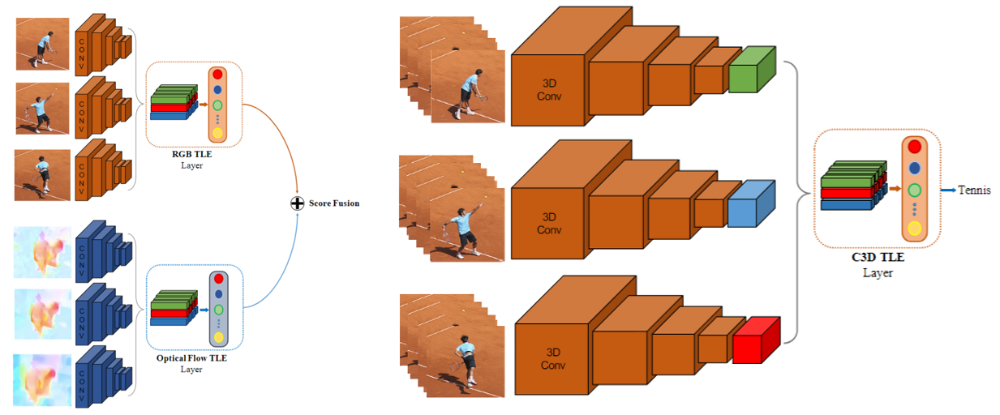
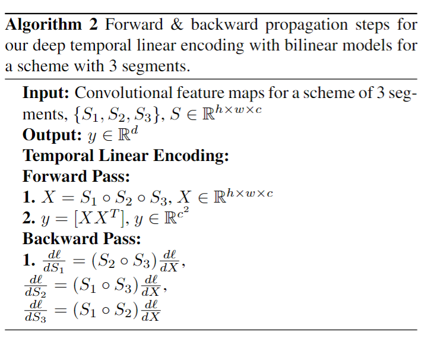
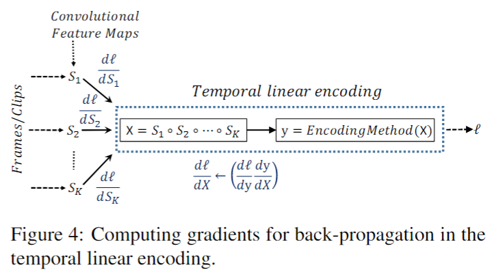

# Temporal Linear Encoding Networks

> Ali Diba et al. “Deep Temporal Linear Encoding Networks” computer vision and pattern recognition (2016): n. pag.

## 1. Motivation & Contribution

### 1.1 Motivation

- Two-stream Convnets,TSN都是采用平均late fusion的方法来融合时间流和空间流，但这并没有对整个视频进行有效编码，无法得到一个含有语义信息且易区分的特征空间。

### 1.2 Contribution

- 提出了一种可以插入CNN的特征编码模块（TLE）,该模块通过逐像素相乘融合多个片段特征图，并用双线性模型将特征图编码为一个紧凑的视频表示特征。
- 该模块灵活地适用于多种网络（2D,3D）。
- 能够更好地将视频段与段之间的关联性，特征与特征之间的相关性体现出来，因此比起纯粹的average score和fully connected能够取得更好的效果。

## 2. Related Work

- 常见的特征编码方式有BOW(Bag of Words)、Fisher Vector、fully-connect、VLAD(Vector of Local Aggregated Descriptors)、双线性模型(Bilinear model)
- 本文选择了双线性模型。原本的双线性模型由于返回的结果是维度很高的外积矩阵，但经过Tensor Sketch Algorithm改良后性能比FV,Full-connect好，且紧凑、非冗余的，避免了过拟合，能够替代全连接层，减少网络参数。

## 3. Deep Temporal linear encoding

- TLE首先将一段视频切割成K段，然后将每一段通过一个CNN网络提取到CNN feature map，这K个CNN是权值共享的。
- 对这K段的CNN features，首先用一个融合操作把它们糅合成一个feature，然后对这融合后的feature进行编码从而得到最终的video representation。
- TLE可加入two-stream 和C3D网络框架。

### 3.1 Temporal aggregation

- 3种多段特征图融合函数
- 逐元素平均(Element-wise Average of Segments)
$$X=(S_1\oplus S_2 \oplus \dots \oplus S_K)/K$$
- 逐元素最大
$$X=\max\{S_1,S_2,\dots,S_K \}$$
- 逐元素相乘（效果最好）
$$X=S_1\circ S_2\circ \dots \circ S_K$$

### 3.2 encoding method

- 2种编码方式
- 双线性模型(Bilinear Models):对两张feature map做外积,双线性特征能够捕捉所有空间位置上的特征间的相互作用，因此能够得到一个高维的特征表示。为了简化运算、减少参数量，作者使用了一个Tensor Sketch algorithm来对这个高维特征进行降维，从而避免了对外积的直接计算。W为可学习的参数。
$$y=W[X\otimes X']$$
- 双线性编码特征输入Softmax层前需要再做一次归一化，先做带符号的开平方，然后L2正则化。
$$
z\gets sign(y)\sqrt{|y|},\space\space z' \gets z/ \|z\|_2
$$
- 全连接池化层(Fully connected pooling):使用全连接层来连接融合后的feature maps和最后的Softmax分类器。

### 3.3 End-to-end training

## 4. Conclusion

- 该方法具有推广到其他体系结构的潜力，也可以很容易地与其他编码方法一起使用。
- 可以尝试先在每个段中独立地融合时间和空间流，然后再分段地融合各个网络。
