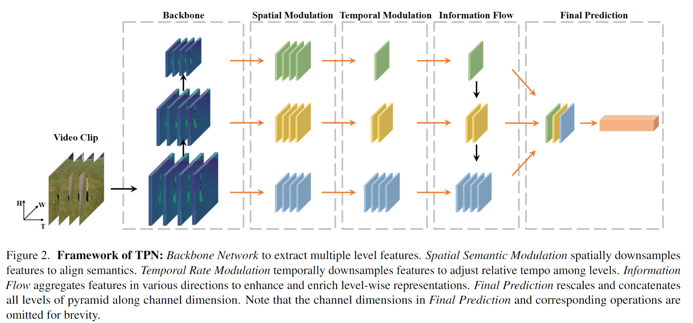
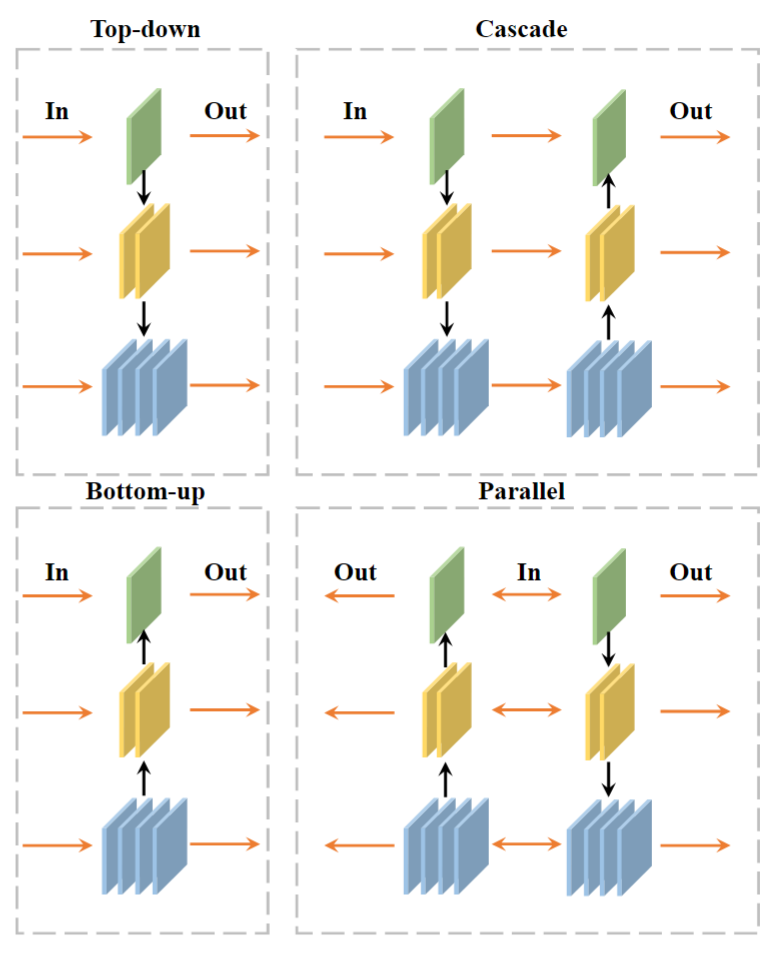

# Temporal Pyramid Network for Action Recognition

> Ceyuan Yang et al. “Temporal Pyramid Network for Action Recognition” computer vision and pattern recognition(2020): n. pag.

## 1. Motivation & Contribution

### 1.1 Motivation

- 视频中不同类别的动作和类内动作都具有不同的快慢速度的特点（文中称为visual tempo），这在之前的工作中都有所忽略。
- 之前也有一些工作在这方面做过探索，如Slow Fast等等，这些工作都是基于TSN的采样模型，构建了一个包含不同采样帧率的图像金字塔。但是金字塔的每个层级需要独立的网络来处理，最后对不同尺度的特征进行聚合，对于缩放尺度较大的金字塔来说会造成极大的计算负担。
- 3D网络通过堆叠3D卷积，随着网络的层数加深，不同层的特征会获得不同时间快慢的信息。受此启发，本文尝试直接利用单一网络不同层次输出特征直接构建时间金字塔。

### 1.2 Contribution

- 提出了一种通用的、即插即用的和特征层次的时间金字塔网络，能提高现有模型的性能（2%左右）。

## 2. Temporal Pyramid Network

### 2.1 Feature Source

- 由于TPN是基于不同层次特征图的，所以有两种不同的从骨干网络获得特征图的方法。
- 一种是传统方法，直接规定网络某一层的输出为我们想要的特征，根据不同的采样帧率采样，分别送到特征提取网络中。这种方法的输出特征空间维度都是相同的，能减少特征融合的工作量，但模型仅从单一的空间维度表示视频语义。
- 第二种方法则是直接提取网络不同的层次的输出特征，虽然输出特征的维度各不相同，需要在特征融合时进行调整，但是其蕴含了更丰富的语义信息。
- TPN将时空维度调整分为了两部分（Spatial Semantic Modulation，Temporal Rate Modulation）。

### 2.2 Spatial Semantic Modulation

- 空间语义调整由两个互补的部分组成，一部分是在空间域对特征图做下采样，使得所有特征图空间尺寸与最顶层特征图保持一致；第二部分添加了一个辅助分类器，使得下采样的卷积核学习的更充分，得到更好的监督作用。
- TPN的总体损失函数为：
$$
\mathcal{L}_{\text {total }}=\mathcal{L}_{C E, o}+\sum_{i=1}^{M-1} \lambda_i \mathcal{L}_{C E, i}
$$
$\mathcal{L}_{C E, o}$为原始的交叉熵损失，$\mathcal{L}_{C E, i}$是第i个辅助分类器的惩罚项，$\lambda_i$为平衡因子。

### 2.3 Temporal Rate Modulation

- 输出特征的时间维度只受限于原始网络的深度，这种时序不够灵活。因此，TPN引入了一个超参数集$\{\alpha_i\}_{i=1}^{M}$作为时间下采样的倍率。

### 2.4 Feature Fusion（Information Flow）

- 经过特征提取和维度调整后，TPN提出了几种特征融合的方法，公式如下：
$$
\mathbf{F}_i^{\prime}= \begin{cases}\mathbf{F}_i & \text { Isolation Flow } \\ \mathbf{F}_i \bigoplus g\left(\mathbf{F}_{i-1}, T_i / T_{i-1}\right) & \text { Bottom-up Flow } \\ \mathbf{F}_i \bigoplus g\left(\mathbf{F}_{i+1}, T_i / T_{i+1}\right) & \text { Top-down Flow }\end{cases}
$$

- 最后，所有的聚集特征将被重新缩放和连接以用于后续预测。

## 3 实验

- 3D ResNet-50和TSN、TSM加入TPN模块后，精度得到一定的提升。
- 做了大量消融实验，验证了应选取较深的特征图做特征融合，因为浅层特征主要表征了位置信息，而动作识别更依赖于更高层级的语义。
- 验证了加入时空维度调整模块和辅助分类损失函数的必要性。
- 验证了用parallel的方式做特征聚合最合适。
- 验证了将网络输入变为更密集的采样并不会导致过拟合。

## 4 结论

- 本文的特点是整合单一网络不同的层次的信息，其次引入中间层约束，更强的监督。最后通过信息流的流动，进行特征的融合。
