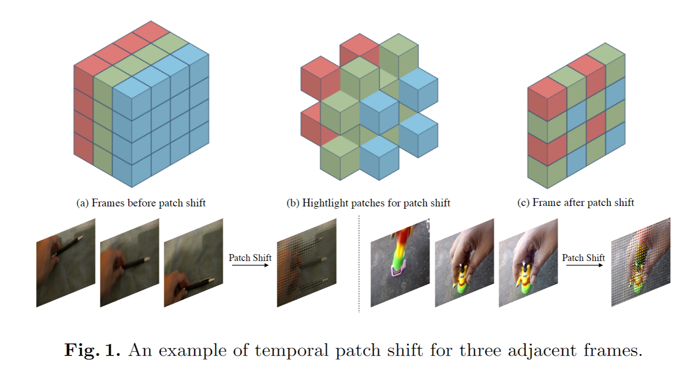
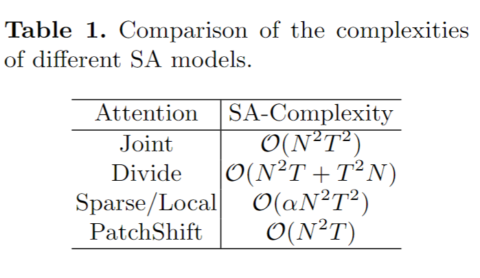
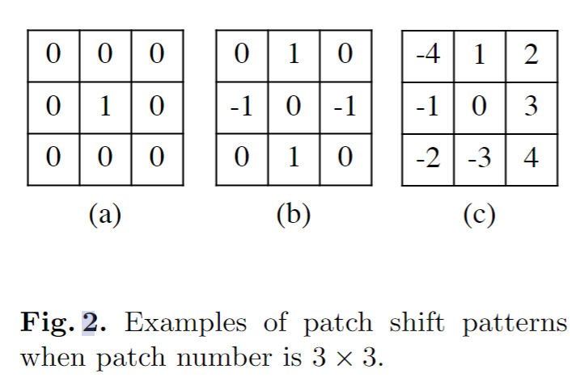
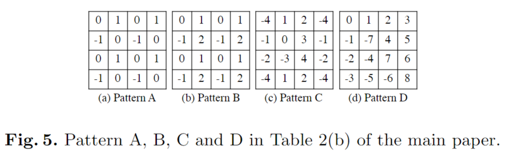
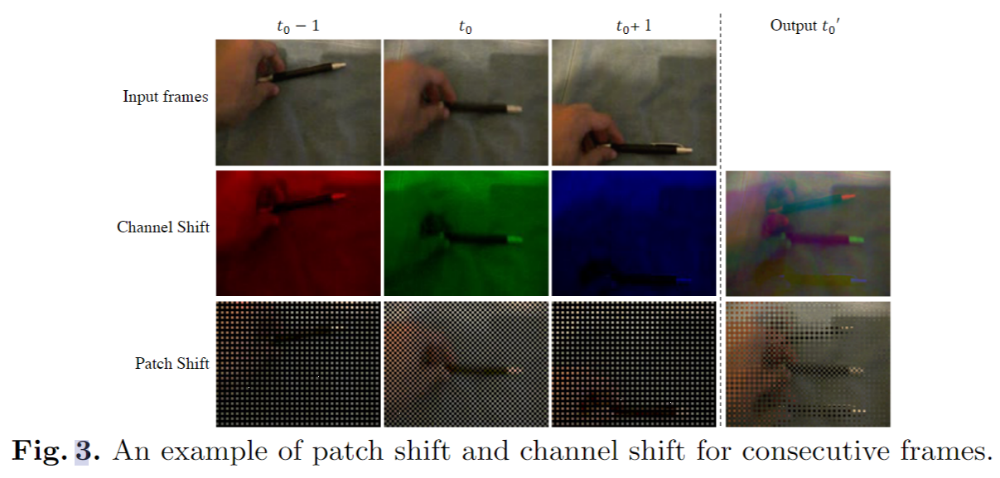
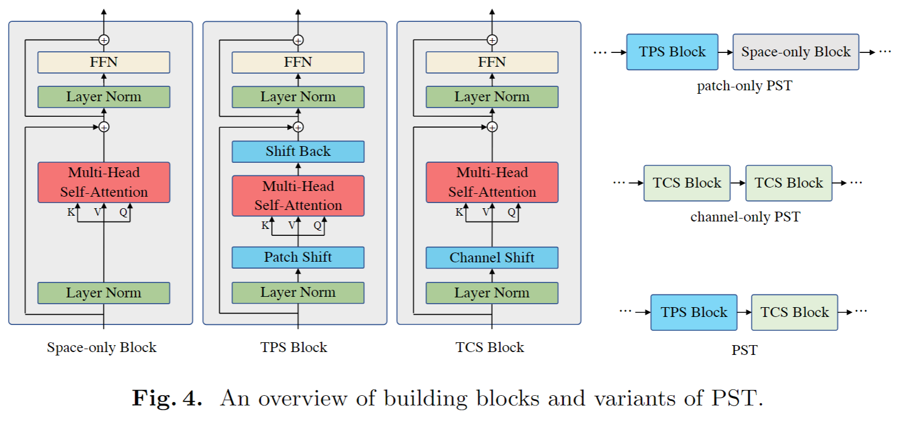
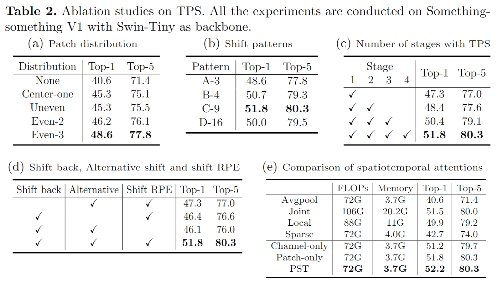
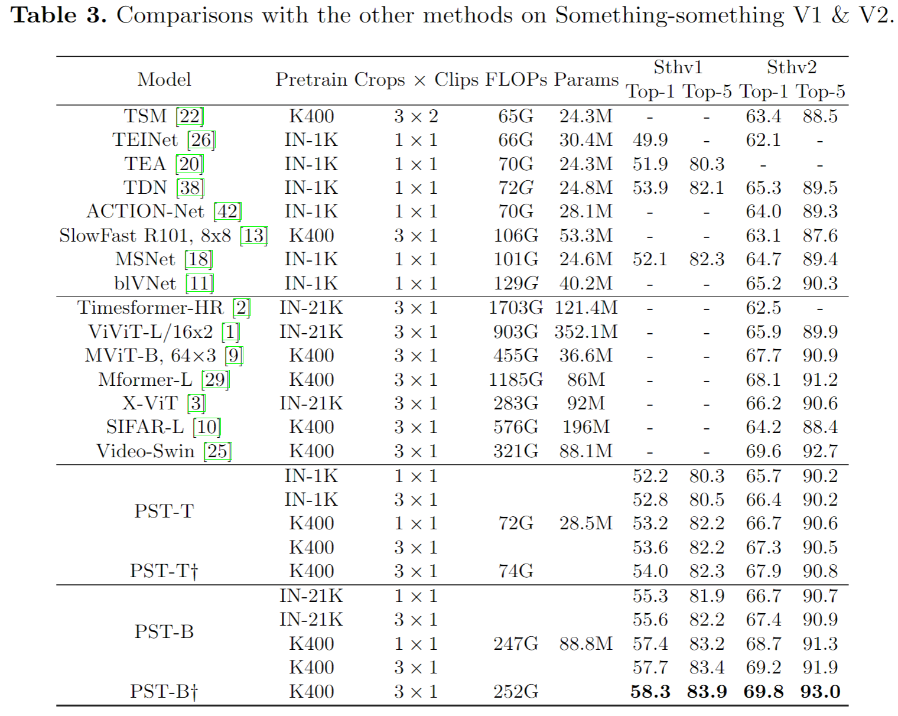
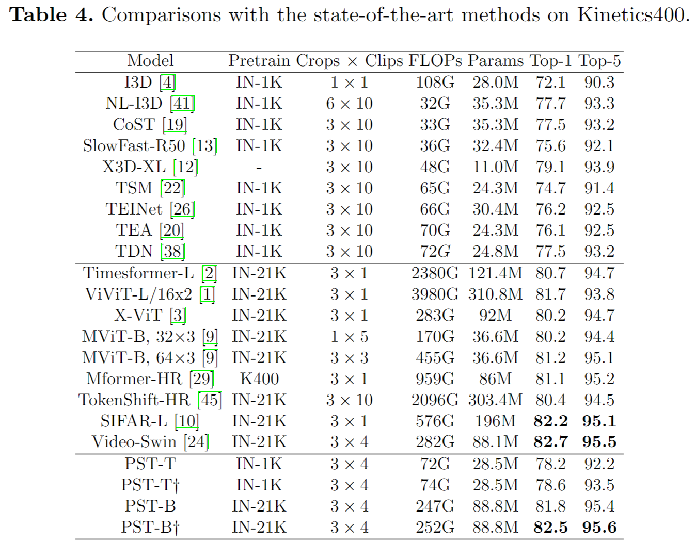

# Spatiotemporal Self-attention Modeling with Temporal Patch Shift for Action Recognition

> Xiang, Wangmeng, et al. "Spatiotemporal Self-attention Modeling with Temporal Patch Shift for Action Recognition." Computer Vision–ECCV 2022: 17th European Conference, Tel Aviv, Israel, October 23–27, 2022, Proceedings, Part III. Cham: Springer Nature Switzerland, 2022.

## 1 Motivation & Contribution

### 1.1 Motivation

- 若直接在transformer中采用联合时空自注意力，则计算和内存开销过大。
- 一些工作提出将时空自注意力分解为空间注意力和时间注意力，或者在patch embedding 中采用管道式编码代替时空自注意力，等等。这些方法计算量依然比较大。
- 尝试只用2D 模型即可构建时空关系。
- 受TSM的启发，将其中的通道移位变为了temporal patch shift 操作。

### 1.2 Contribution

- 提出了一种即插即用的用于高效时空自注意力的temporal patch shift 模块。
- 还将temporal patch shift和channel shift结合，提出了一个Patch Shift Transformer模型。

## 2 Method

### 2.1 Temporal Patch Shift

#### 2.1.1 Generic shift operation

- 一般化移位操作：

$$
\begin{aligned}
\mathbf{Z}^t & =\left[\mathbf{z}_0, \mathbf{z}_1, \ldots, \mathbf{z}_N\right] \\
\mathbf{A} & =\left[\mathbf{a}_0, \mathbf{a}_1, \ldots, \mathbf{a}_N\right], \\
\hat{\mathbf{Z}}^t & =\mathbf{A} \odot \mathbf{Z}^{t^{\prime}}+(\mathbf{1}-\mathbf{A}) \odot \mathbf{Z}^t
\end{aligned}
$$

- $\mathbf{Z}^t, \mathbf{Z}^{t^{\prime}} \in \mathbb{R}^{D \times N}$表示当前帧t的feature和另一帧t'的feature,A为移位矩阵，$a_i=0,1$。
- 实际运用中可以通过滑动窗口(shift pattern $p$)的方式实现移位全覆盖空间域。

#### 2.1.2 Patch shift SA

- 不同于CNN的通道移位，本文探讨的是将后续帧中的patch移位到当前帧中，以实现将3D SA转变为2D SA，以减少计算量。
- patch shift 会带来两个问题，一是会改变原图分布，在swin transformer中需要额外进行shift back操作，复原原图，避免影响后续步骤。二是position embedding也需要相应做调整。

$$
\begin{aligned}
\left\{\mathbf{i}^{\prime}, \mathbf{Z}_{l-1}^{\prime}\right\} & =\operatorname{PatchShift}\left(\mathbf{p}, \mathbf{i}, \mathbf{Z}_{l-1}\right) \\
Q_l, K_l, V_l & =W_l^Q \mathbf{Z}_{l-1}^{\prime}, W_l^K \mathbf{Z}_{l-1}^{\prime}, W_l^V \mathbf{Z}_{l-1}^{\prime}, \\
\hat{\mathbf{Z}} & =\operatorname{ShiftBack}\left(\operatorname{SoftMax}\left(Q_l K_l^T / \sqrt{d}+B\left(\mathbf{i}^{\prime}\right)\right) V_l\right),
\end{aligned}
$$

#### 2.1.3 Patch shift patterns

- 为了能泛化到不同尺寸且易于实现，本文提出了几个设计shift pattern准则：
  - 空间均匀分布，实验发现分布不均匀会导致性能下降。
  - 较大的时间感受野。
  - 较高的移位比例，能获得更多的帧间信息交互。
- 本文提出了几种shift pattern,如下所示：

#### 2.1.4 Patch shift & channel shift

- Patch shift 和 channel shift 都是两种零参数、低成本的时序建模方法，二者都能一定程度上捕捉相邻帧运动变化。
- channel shift通常运用于特征图上。研究表明，特征的通道对应了不同的模式或目标，因此channel shift可能会造成信息损失。
- patch shift 则能保留一定的全局appearance信息，但会牺牲当前帧的信息。
- 实验发现二者是互补的。

### 2.2 Patch Shift Transformer

- 本文基于前文的patch shift 和channel shift，提出了一个将二者结合的transformer模型，提出的两种temporal  patch / channel shift block都是即插即用的。
- 由于patch shift牺牲了当前帧的信息，Patch Shift Transformer模型中每隔两个自注意力模块插入一个TPS模块（简称交替移位alternative shift）

## 3 Experiment

- Backbone 为 Swin transformer

