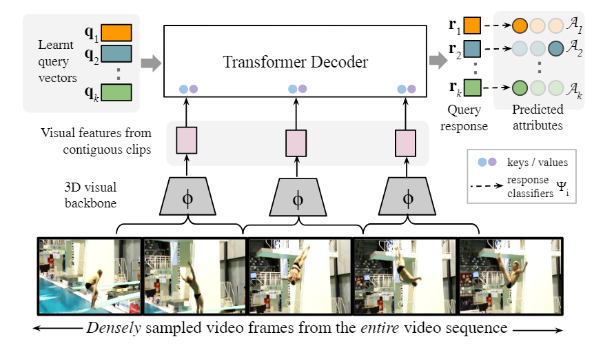
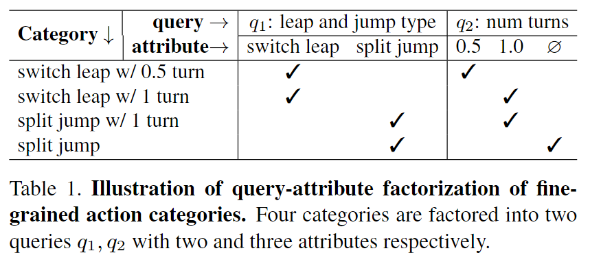
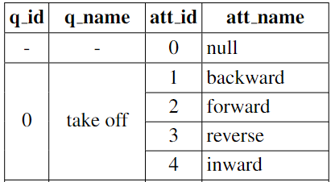
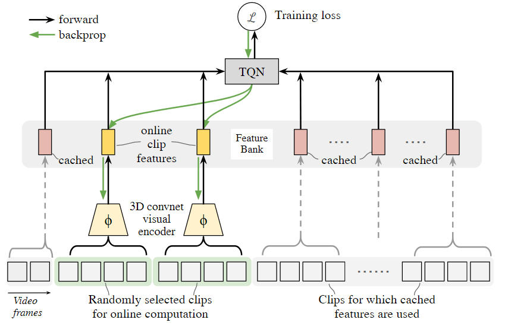
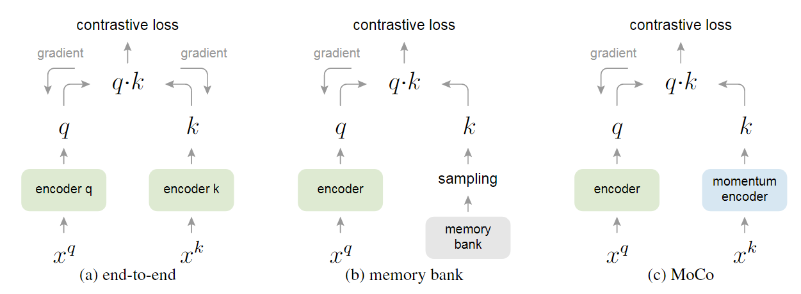
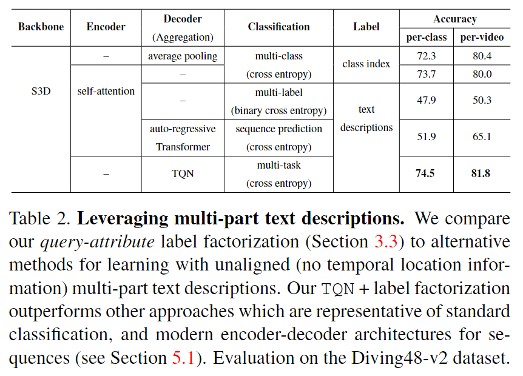
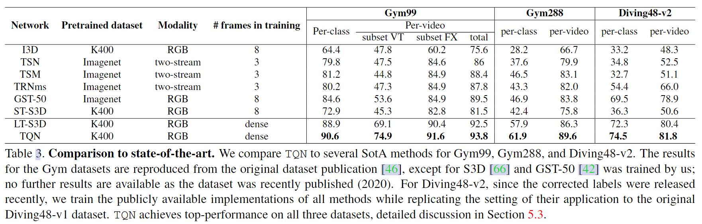

# Temporal Query Networks for Fine-grained Video Understanding

> Chuhan Zhang et al. “Temporal Query Networks for Fine-grained Video Understanding” Computer Vision and Pattern Recognition(2021): n. pag.

## 1. Motivation & Contribution

### 1.1 Motivation

- 细粒度动作识别相对粗粒度动作来说，时间边界更加模糊难以界定，所以处理细粒度动作更多地偏向处于一个未剪辑的视频。而这种特点也是本文选择了一种弱监督的学习方法，即只有类别标签已知，动作时序定位未知。
- 这种在未剪辑视频中识别细粒度动作的弱监督方法类似于视频文本检索任务(或称为字典查找)，即通过遍历整个视频查找与文本标签对应的细粒度动作片段。这种方法可以归纳为query-response, query即为预设的动作类别, 而response则为根据视频图像特征对应每个动作类别的分类分数。已经编码好的query将会作为指导，让视觉编码器能够从视频中找出与query对应的片段。
- 不同于以往粗粒度动作识别普遍采用的稀疏采样和平均池化策略（在未剪辑视频中采用这些方法势必会导致信息遗漏），未剪辑视频中的细粒度动作识别必须密集遍历整个视频。而这势必会导致计算量过大，所以本文借鉴了对比学习中的特征记忆库(feature memory bank)方法，从而减少训练开销。

### 1.2 Contribution

- 提出了一种在未剪辑视频中基于fine-grained text query -- video feature response机制的识别细粒度动作的方法。
- 提出了一种随机特征记忆库更新方法，减少了视频密集采样的计算开销。

## 2. Method

### 2.1 Temporal Query Networks

#### 2.1.1 Query–Attributes

- 每个可学习的query都由预设的label初始化，且将每个query更进一步划分为细粒度的attributes。

$$
\mathcal{A}_i=\left\{a_1^i, a_2^i, \ldots, a_{n_i-1}^i, \varnothing\right\}
$$

#### 2.1.2 3D Visual backbone

- 本文采用S3D作为特征提取8帧大小的连续互不重叠clip的一维特征向量，以便于输入Transformer DEcoder。

#### 2.1.3 TQN Decoder

- 本文参考DETR采用了平行非自回归(parallel nonautoregressive)Transformer Decoder，第一层输入的可学习query是根据数据集提前预设好，每层的response都会作为下一层的query。

$$
\begin{aligned}
& \ell^{(j)}(\cdot, \cdot): \mathbb{R}^{N \times d_q} \times \mathbb{R}^{t \times d} \mapsto \mathbb{R}^{N \times d_q} \\
& \ell^{(j)}\left(\mathbf{r}^{(j-1)}, \boldsymbol{\Phi}\right) \mapsto \mathbf{r}^{(j)}, \quad \text { and } \\
& \mathbf{r}^{(0)} \triangleq \mathbf{q} .
\end{aligned}
$$

#### 2.1.4 Training

- 最后一层的response会被线性分类到对应的属性集合中，所以该模型的损失函数是一个多分类损失函数。

$$
\mathcal{L}_{\text {total }}=\sum_{i=1}^K \mathcal{L}_{C E}^{(i)}\left(a^i, \Psi_i \cdot \mathbf{r}_i^{(M)}\right)
$$

#### 2.1.5 Difference from DETR

- DETR中的query vectors 都是等效的，最后Decoder输出的是目标类别和RoI,本质上是一种可学习的位置编码。而TQN中的query每个都含有不同的语义和属性。
- DETR最后的预测结果还要和ground truth 做一次匈牙利算法，而TQN中的每一个response都由对应的query和attribute label，所以可以直接进行有监督的分类训练。
- TQN属于弱监督学习。

### 2.2 Stochastically Updated Feature Bank

- 特征记忆库将3D 视觉编码器获取的特征保存下来，在每次训练迭代中只随机选择部分clip用于更新特征库，其他部分则从库中检索特征。推理时不使用特征记忆库。

#### 2.2.1 Difference from MoCo

- 其他的一些图像领域的自监督学习方法（MoCo）采用的特征记忆库通常需要缓慢更新以避免破坏query-key的一致性，而TQN毕竟是弱监督而不是自监督，TQN的query都是有明确监督的，不需要保持一致性，所以TQN可以直接更新记忆库，TQN采用这种方法主要是用于减少GPU开销，增大特征库的时序长度。

## 3. Experiment

