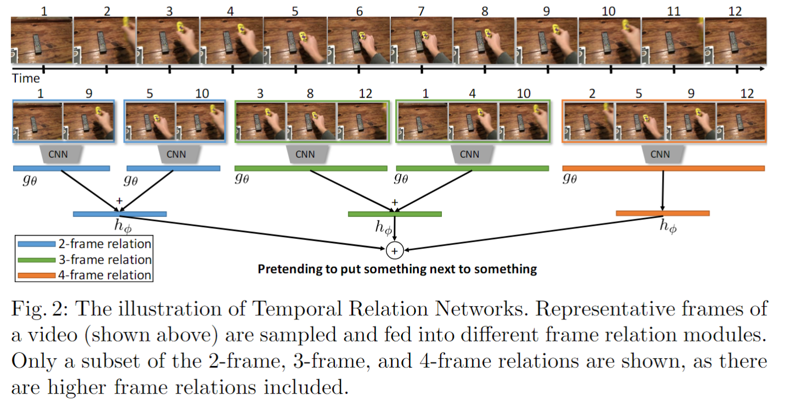

# Temporal Relational Reasoning in Videos

> Bolei Zhou et al. “Temporal Relational Reasoning in Videos” arXiv: Computer Vision and Pattern Recognition(2017): n. pag.

## 1. Motivation & Contribution

### 1.1 Motivation

- 时序关系推理对于动作识别任务来说是重要的。一个动作可以包含几个短期的时序关系，也可能包含几个长期的时序关系。许多视频数据集，例如UCF101,HMDB51.Sport1M，包含的许多动作不需要长期的时序关系就可以识别，静止的帧和光流已经足用。然而，当动作由时序关系组成时，CNN的表现仍不太好。
- 之前的工作存在的一些问题：预先提取光流很耗时；在密集的帧上3D卷积计算代价高；输入网络的帧数限制在20到30帧，难以学习帧间的长期时序关系。

### 1.2 Contribution

- 设计了新型的fusion函数来表征不同 temporal segment 的 relation，文中是通过MLP( concat feature -- ReLU -- FC -- ReLU -- FC)的结构来实现。
- 通过时间维度上 Multi-scale 特征融合，来提高video-level鲁棒性，起码能抗快速动作和慢速动作干扰。

## 2. Multi-Scale Temporal Relations

- 定义d个有序帧的时序关系如下：
    $$T_d(V)=h_{\phi}(\sum{g_{\theta}(f_{i_1},f_{i_2},\cdots,f_{i_d})})$$
    网络的输入是从视频$V=\{f_1,f_2,\cdots,f_n\}$中随机采样的n个有序视频帧，$f_i$表示第i帧输入CNN后得到的特征，$h_{\phi}$ 和 $g_{\theta}$表示特征融合函数（本文采用多层感知机MLP，$\phi$和$\theta$是MLP的参数）
- 多尺度时序关系如下：
    $$MT_N(V)=T_2(V)+T_3(V)+\dots+T_N(V)$$
- 多尺度采样策略如下：
  - 首先从N个片段均匀采样N个帧，从而可以计算$T_N(V)$
  - 对于一个视频流，将等距采样的帧的CNN特征存储到队列中，然后这些特征可以进一步组合成不同顺序的关系元组
  - 对于d < N，从上一步的元组中选择k个d帧组成的元组，从而可以计算$T_d(V)$
- 网络结构如下：

## 3. 实验结果

- 在不同的数据集, TRN和TSN的性能差异很大。在UCF, Kinectics, Moments里两者的性能相近，说明这三个数据集的动作与空间上下文具有强相关性，而对于时间上下文相关性较弱；而 Something-something, Jester, Charades 里动作较为复杂，时间上下文联系较强，TRN的性能明显高于TSN。

## 4. TRN可解释性应用

- 获取视频关键帧序列
- 根据关键帧将视频对齐
- 提前行为识别（动作预测）
