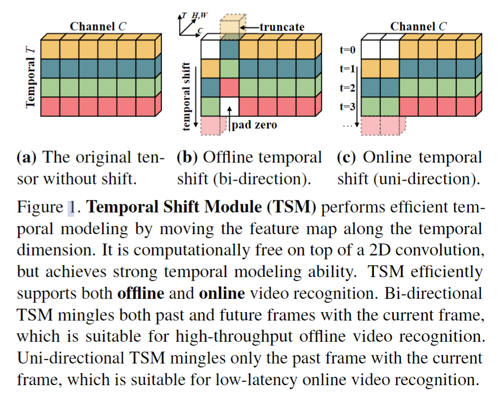
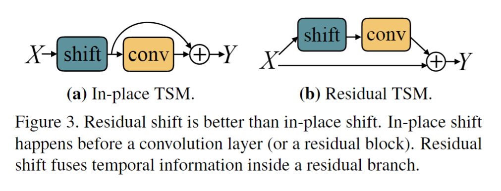
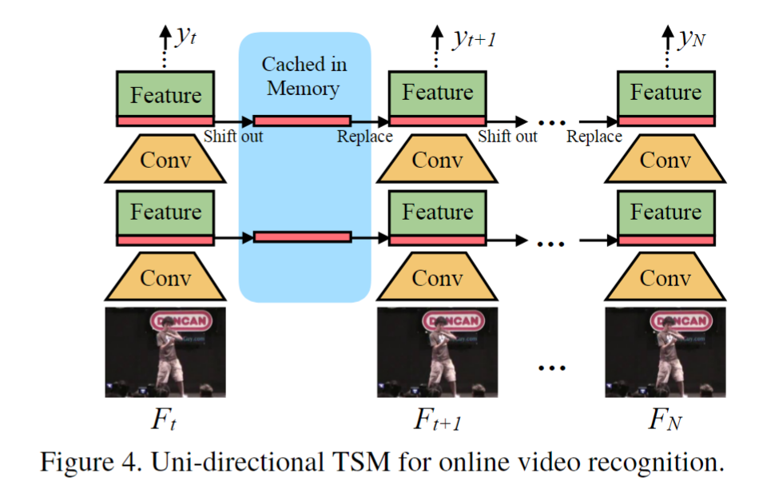
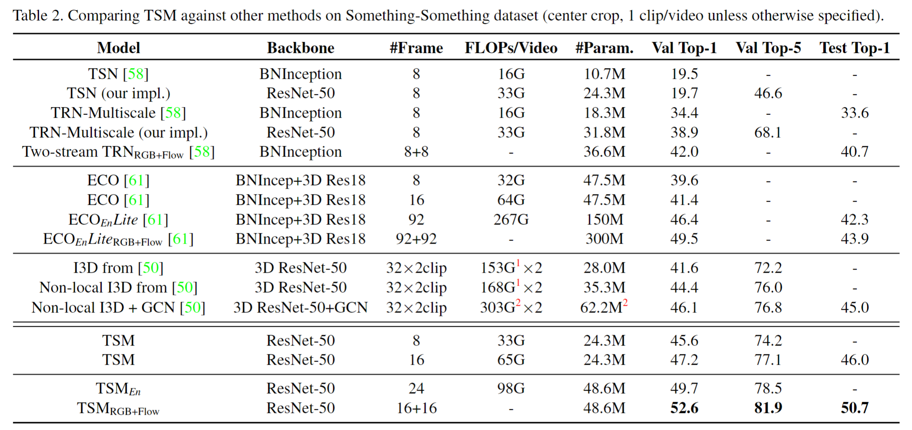
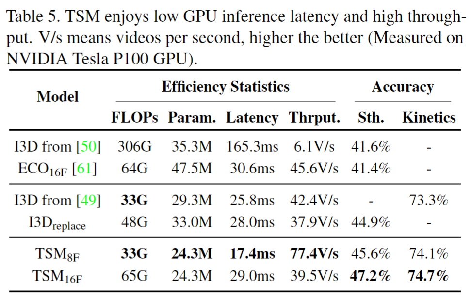

# TSM: Temporal Shift Module for Efficient Video Understanding

> Ji Lin et al. “TSM: Temporal Shift Module for Efficient Video Understanding” international conference on computer vision(2019): n. pag.

## 1 Motivation & Contribution

### 1.1 Motivation

- 传统的2D CNN虽然计算量小，但是却不能好好利用时域上的连续信息。3D CNN虽然效果很好，但是却不得不面临密集的计算量，使得实际应用变得困难。
- 虽然已经提出了许多trade-off技巧（各种fusion，时序多尺度采样等等），但这些技巧往往为了效率牺牲了对低维时序建模的能力，而且一些重要信息在时序融合前的特征提取中已经损失了。
- 传统2D卷积在时间维度T上独立进行，因此缺乏低维时序建模能力，要解决这个问题就要使相邻的两帧产生上下文联系。在传统2D CNN中研究者通过加入光流信息以此捕捉低维时序信息，但计算光流代价较大。

### 1.2 Contribution

- 提出了一种基于时间移位模块的兼顾性能和效率的视频理解模型。
- 提出了两种改进时间移位方法（部分移位、残差移位）弥补了空间移位方法的缺陷。
- 提出了应用于离线视频理解的双向TSM模型和应用于在线视频识别的单向TSM模型。

## 2 Temporal Shift Module

### 2.1 时间移位背后的直觉解释

- 2D CNN中卷积操作可以分解为两步移位操作(shift)和乘法累加操作(multiply-accumulate)，这种操作可以扩展到时间域上。通过对不同时刻的某一通道的特征图做移位操作，即可实现相邻帧间的时间信息交流，从而提取到时空特征。而乘法累加操作则可以合并到下一层的2D卷积中。该模块相较于2D CNN来说只增加了数据移动的开销而未增加计算量，从而既有3D网络的精度，又保持了2D网络的计算效率。
- 时序移位操作如下图所示：

### 2.2 时间移位的缺点

- 时间移位有两个缺点：第一，虽然没有额外的计算开销，但是有很多数据移位开销，尤其在处理视频这样的5D tensor(Batch,T,Channel,H,W)时。
- 第二，由于将部分通道移到相邻帧后，当前帧相当于丢失了移位通道中的信息，这会导致2D CNN的空间建模性能下降。

### 2.3 对时间移位的改进

- 采用部分移位的策略，即只将少数通道进行时间移位，相较于全部移位，能显著减少移位操作量。
- 本文2D网络采用ResNet,受此启发，将时间移位模块加入残差模块中，而不是单独作为一个外部处理模块。改进后的残差模块相当于一个小型双流模型，既不丢失空间信息，又能获取时间信息。
- 实验表明移动1/4或1/8的通道表现最好。对于单向时间移位，移动1/4的通道。而对于双向时间移位，每个方向移动1/8的通道。

## 3 TSM Video Network

- TSM网络在TSN框架基础上分段采样，根据不同视频处理模式（离线或在线），选择不同的时间移位方向（双向或单向）；将特征图的部分通道移动到相邻帧2D网络对于位置，使得2D网络获取时间序列信息；最开始时间移位只能交换短期时间信息，但随着网络层数深入、感知野扩大，时间移位能传播长时间信息。网络结构如下：

## 4 实验

- TSM模型相对于其他模型来说有三个优点：
  - TSM具有更低的推理延迟，TSM只需替换和缓存1/8的特征图。
  - TSM的内存消耗更低。
  - TSM能够多层次融合时间信息，大多数模型只在提取特征后做后期时序融合（如TRN），或者中层次的特征融合(如ECO)。

