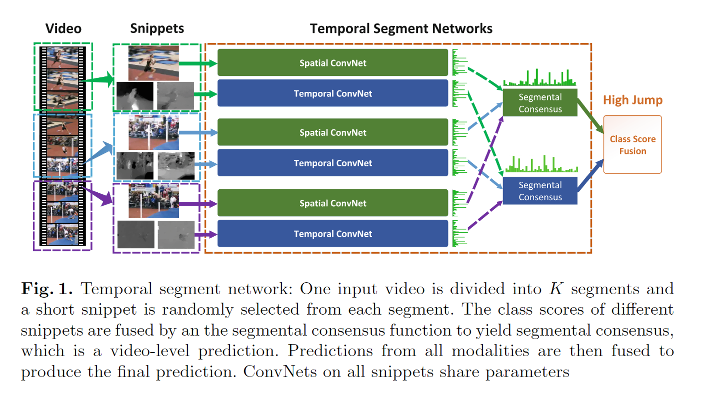

# Temporal Segment Networks

> Limin Wang et al. “Temporal Segment Networks: Towards Good Practices for Deep Action Recognition” european conference on computer vision (2016): n. pag.

## 1. Motivation & Contribution

### 1.1 Motivation

- 长间隔的时间结构信息对于处理视频中的动态信息非常有帮助，但是主流的ConvNet主要集中在较短范围。虽然也有有其他模型尝试解决长时间信息的问题，但是这些模型都依赖于密集采样。由于连续的帧会造成冗余，密集采样会导致计算量增大，并且会丢失超过最大序列长度的视频的重要信息。
- 深度ConvNet需要大规模的训练数据，但当前视频数据集（HMDB51,UCF101）都比较小，容易导致模型过拟合。

### 1.2 Contribution

1. 提出temporal segment network(TSN)网络模型。
   - 通过全局稀疏采样，建模间隔更长视频帧之间时间依赖关系，确保获取视频级信息。
   - TSN包含提取空间信息和提取时间信息两路模型，并基于late fusion方式来融合两路模型的结果。

2. 提出了一系列训练技巧，如数据增强、正则化、交叉模态预训练、多模态数据等，并取得了非常好的效果。

## 2. Temporal Segment Networks

- 将这个视频均匀分成多个片段（本文分为3份），然后在每个片段随机抽取一帧图像及其对应多张光流图像，将RGB图像和光流图像输入双流网络中，每个片段会输出一个类别得分，然后将所有片段的得分进行融合得到最终的结果。在学习过程中，通过迭代更新模型参数来优化视频级预测的损失值，而不是在双流ConvNets中使用片段级预测的损失值。

- TSN模型可以表示为以下公式：

$$TSN(T_1,T_2,\dots ,T_K)=\mathcal{H}(\mathcal{G}(\mathcal{F}(T_1;W),\mathcal{F}(T_2;W),\dots,\mathcal{F}(T_k;W))) $$

- $(T_1,T_2,\dots ,T_K)$为每个片段抽取的视频帧序列；$\mathcal{F}(T_k;W)$参数为$W$的ConvNet，作用在上$T_k$，输出类别得分；$\mathcal{G}$为片段共识函数，将多个片段的结果融合，融合函数的选择包括：最大值、平均值、加权平均值；$\mathcal{H}$为softmax函数。

- 最终的损失函数将交叉熵与片段共识函数结合，公式如下：

$$\mathcal{L}(y,G)=-\sum_{i=1}^{C}{y_i(G_i-\log{\sum^{C}_{j=1}\exp G_j}}) $$

- 梯度更新表达式如下：

$$ \frac{\partial{\mathcal{L}(y,G)}}{\partial{W}}=\frac{\partial{\mathcal{L}}}{\partial{G}}\sum^K_{k=1}\frac{\partial{g}}{\partial{\mathcal{F}(T_k)}}\frac{\partial{\mathcal{F}(T_k)}}{\partial{W}}$$

- 上式可以通过SGD优化

## 3. Good Practices

### 3.1 Network Architectures

- 之前的two-stream模型采用的是相对浅的模型结构，作者选择BN-Inception这种比较深的模型结构来当做building block，因为该模型在速度和准确率上都不错。

### 3.2 Network Inputs

- 之前two-stream模型采用RGB图像作为spatial stream的输入，采用光流作为temporal stream的输入。作者研究了额外的两种模态，RGB difference和warped optical flow。
- RGB difference：两个连续帧之间的 RGB 差分描述了外观变化，这可能对应于运动显着区域。
- warped optical flow:借鉴了IDT的修正光流场，减小了相机运动的影响。

### 3.3 Network Training

1. Cross Modality Pre-training:RGB网络可以使用ImageNet预训练，但是光流网络没有预训练的数据集，所以作者采用ImageNet上预训练的参数来初始化光流模型参数。具体来说，先通过线性变换将光流场离散化为 0 到 255 的区间，然后将RGB通道的权重平均到一个通道上，并将这个通道平均值复制到时域网络输入的所有通道数上。
2. Partial BN with dropout：采用Batch Normalization解决协变量偏移的问题，即训练时网络参数的变化引起网络激活层分布的变化。该操作会使得模型收敛速度变快，但是同时会带来了过拟合的问题。因此作者通过固定住除了第一层以外，其他层的BN参数来解决该问题。而且作者在BN-Inception模型后面加入了dropout层，来解决过拟合的问题。
3. Data Augmentation：主要采用角点裁剪和比例抖动两种方法。
   - corner cropping：在四个图像的四个边角和中心裁剪，以避免隐式聚焦到图像的中心区域。
   - scale jittering：输入图像或光流场的大小固定为256 × 340，裁剪区域的宽度和高度从{256,224,192,168}中随机选取。最后，将这些裁剪区域调整为224 × 224进行网络训练。

## 4. 实验结果

- 实验结果表明，跨模态预训练对two-stream 模型的提升很大。
- RGB Difference和RGB特征有一定的互补性，而将RGB和光流结合后提升更大。

## 5. Feature work

- 光流计算独立于最终任务，没法端到端进行优化。
- 通常使用average的方法来聚合多个视频片段的结果，但在时间维度上进行average聚合，可能不能建模复杂的动作类别。
