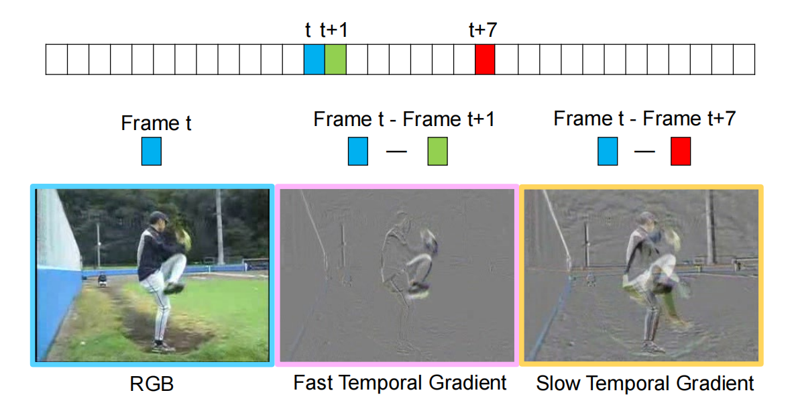

# Temporal Gradient Semi-supervise

> Xiao J, Jing L, Zhang L, et al. Learning from temporal gradient for semi-supervised action recognition[C]. Proceedings of the IEEE/CVF Conference on Computer Vision and Pattern Recognition (CVPR). 2022: 3252-3262.

## 一、引言

1. 半监督动作识别：在标记数据有限的情况下取得卓越的性能。

2. 基于图像的方法（如 FixMatch）不能利用视频的时间信息。因此使用时间梯度（TG）提取运动表示，并在 RGB 模态与 TG 模态间施加一致性。

3. 时间梯度（TG）：帧间差分，是颜色不变的，可以明确编码视频中动作的代表性运动信息。

   

4. 多模态一致性：期望从同一视频剪辑中提取的不同模态的特征相一致，因为它们编码相同的内容。

5. 研究贡献：

   （1）提出一种基于时间梯度的半监督动作识别方法，模型将知识从时间梯度提取到基于RGB的网络中，不需要额外的计算或推理参数。

   （2）该模型简单而有效，在UCF-101 / HMDB-51 / K400 上表现出色。

## 二、Temporal Gradient Semi-supervise

1. 模型构成：

   （1）具有弱-强（weak-strong）增强策略的 FixMatch 框架，用于为未标记的数据生成更好的伪标签。

   （2）跨模态 RGB 和 TG 剪辑间的特征对齐，用于网络学习细粒度运动信号。

   （3）跨模态对比学习，学习 RGB 和 TG 剪辑的高级一致性特征。

2. FixMatch：

   （1）对于有标签的数据直接训练。

   （2）对于无标签的数据，使模型对不同增强强度（α、Α）的相同未标记数据样本产生一致的预测。
   $$
   \mathcal{C}=\left( x_j \mid \max f_\theta\left(\alpha\left(x_j\right)\right) \geq \gamma \right)
   $$

   $$
   \mathcal{L}_u=-\frac{1}{B_u} \sum\hat{y}_j \log f\left(\mathcal{A}\left(x_j\right)\right)
   $$

3. 时间梯度并行框架：

   

4. 跨模态密集特征对齐：为了从时间梯度中学习细粒度运动，使用特征对齐将时间梯度模型中的知识提炼到 RGB 模型中。具体操作是添加对齐损失项：
   $$
   \mathcal{L}_{k d}=\left[\mathcal{D}\left(\mathcal{F}_i^{R G B}, \operatorname{stopgrad}\left(\mathcal{F}_i^{T G}\right)\right)\right]
   $$
   

5. 跨模态对比学习：用于发现在 RGB 和 TG 剪辑中共存的相互信息。将同一视频剪辑的两种模态视为正对，将不同剪辑的两种模态视为负对。学习目标是最大化正对的相似度，最小化负对的相似度。

## 三、结果

