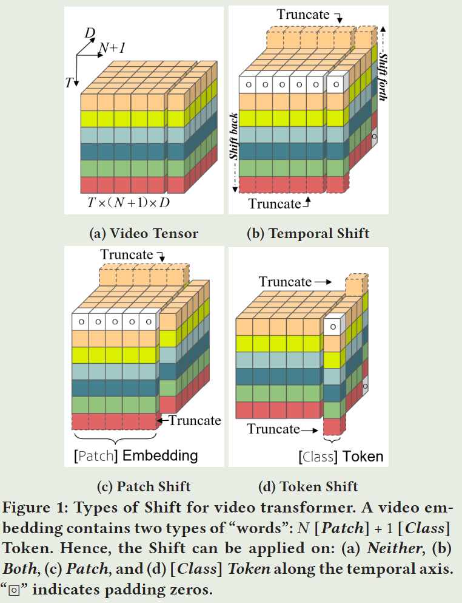

# Token Shift Transformer for Video Classification

> Zhang, Hao, Yanbin Hao, and Chong-Wah Ngo. "Token shift transformer for video classification." Proceedings of the 29th ACM International Conference on Multimedia. 2021.

## 1 Motivation & Contribution

- 将TSM 中的temporal channel shift用于ViT中token的channel，想法比较简单直接。

## 2 Method

- 方法比较简单，看图就能理解，不过多赘述。

## 3 Experiment

