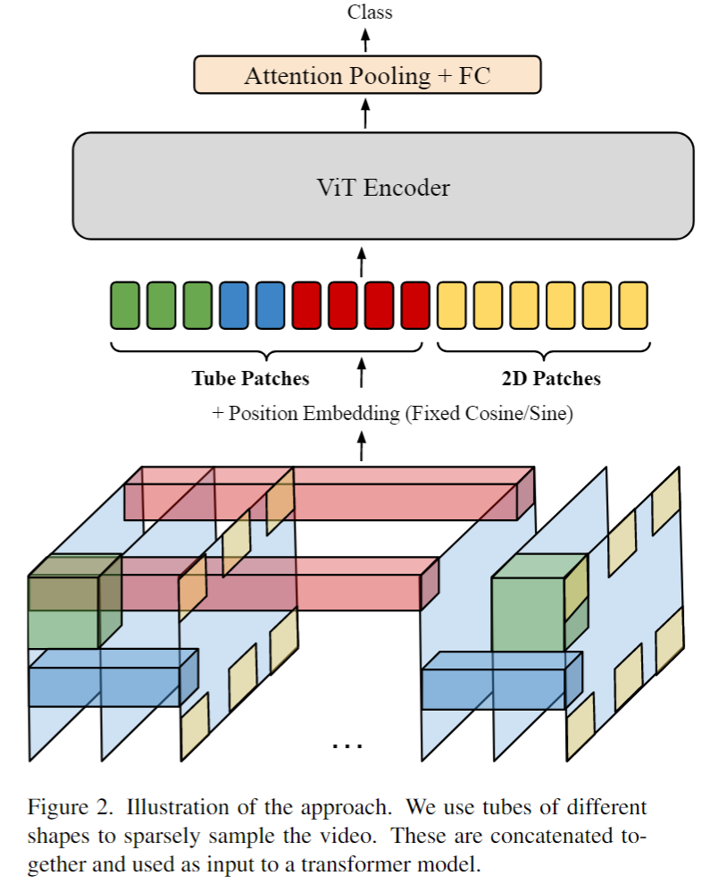
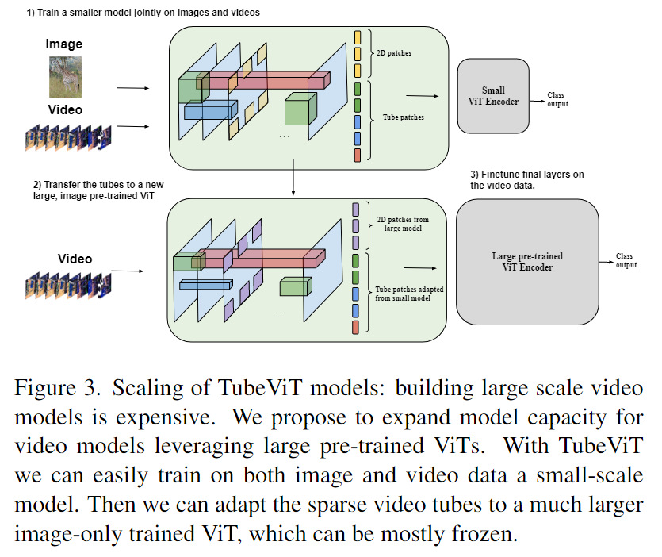
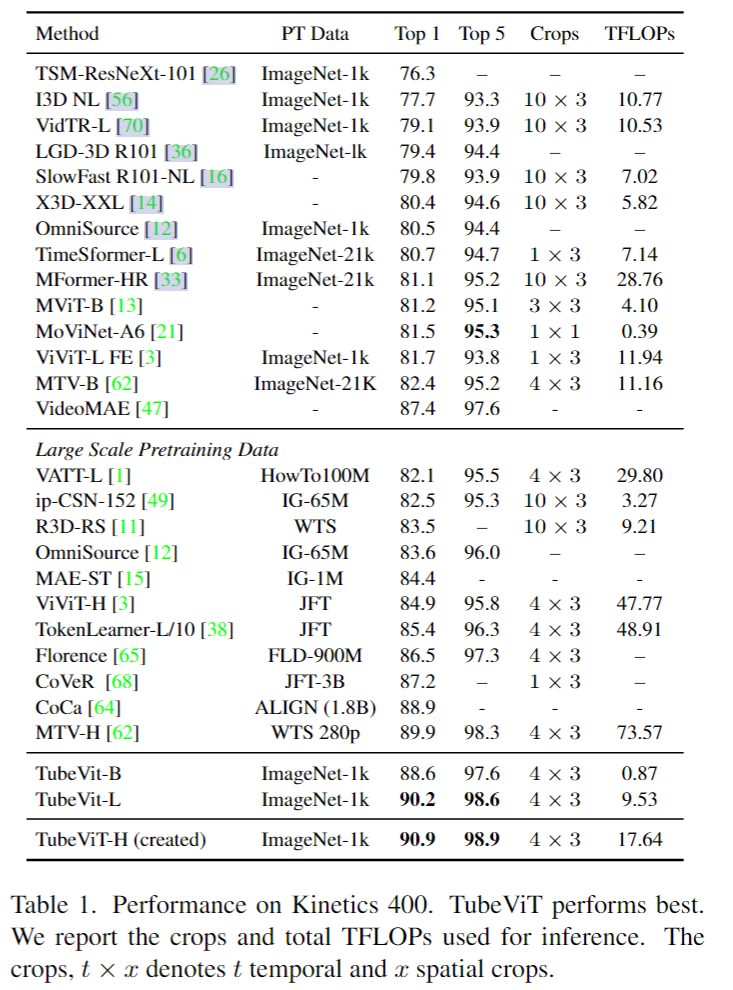
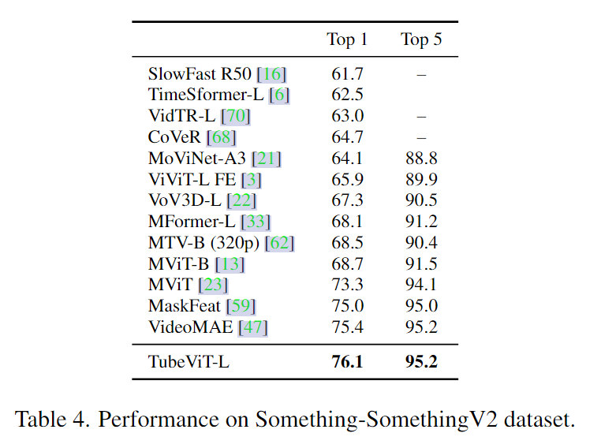
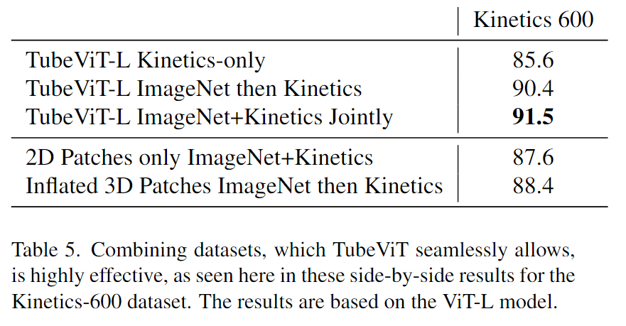
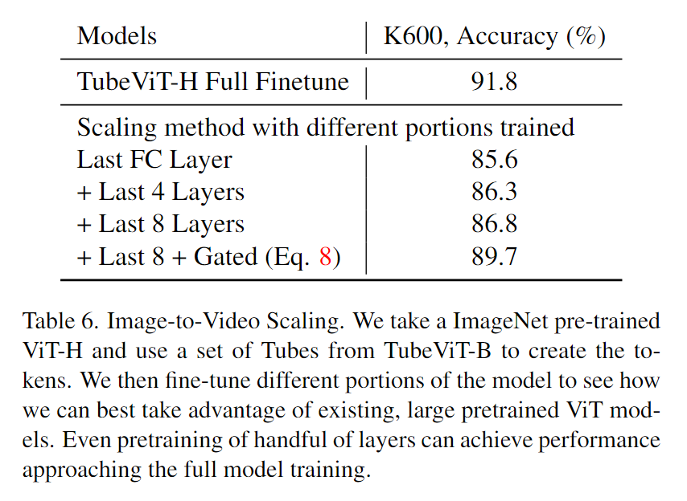

# Rethinking Video ViTs: Sparse Video Tubes for Joint Image and Video Learning

> Piergiovanni, A. J., Weicheng Kuo, and Anelia Angelova. "Rethinking Video ViTs: Sparse Video Tubes for Joint Image and Video Learning." arXiv preprint arXiv:2212.03229 (2022).

## 1. Motivation & Contribution

### 1.1 Motivation

- 之前的大多数工作都将视频和图像看作不同的输入（提供不同的处理方法），但二者联系紧密，单个视觉模型应该能够同时处理这二者。
- 之前设计的2D patch和3D patch比较简单，导致存在过多的tokens，计算量过大且存在过拟合的问题。
- 有工作如VideoMAE尝试了管道式patch，但过于简单且没有考虑和图像共同训练的问题。
- 由工作如Multi-View Transformers也采用了不同形状的tube，但其针对每个View都设计了一个小型编码器，过于复杂，没有整合成一个编码器。
- 视觉模型训练困难且昂贵，所以设计目标模型也考虑利用已有训练好的大规模ViT模型。

### 1.2 Contribution

- 通过对视频进行不同大小3D时空管道的稀疏采样，构建了一个简单通用的易扩展的视频ViT骨干网络，且模型能同时处理图像和视频输入。

## 2. Method

### 2.1 Sparse Video Tubes

- 稀疏视频管道具有不同的形状和构造方式，且管道起点不固定。
- 有两种基础管道，尺寸为$1 \times 16 \times 16 \times d$用于图像，尺寸为$8 \times 8 \times 8 \times 8 \times d$用于视频，二者的步长都为$16 \times 16 \times 16 \times$
- Multi-Tube:根据对时间和空间的侧重点不同，将基础管道进行变形。如尺寸为$16\times4\times4$的管道侧重于时间。
- Space-to-Depth：通过牺牲管道的通道数增大时间或空间尺寸而不改变参数量，即元素重组。
- Interpolated Kernels：只学习一个$8 \times 8 \times 8 \times 8 $的3D kernel，使用三线性插值将kernel重塑为各种大小。

### 2.2 Positional embedding for sparse video tubes

- 采用固定的sine/cosine embedding
- $\tau$为一个常量超参数（文中为10000），$j \in{[0,d//6]}，d为特征数量$

$$
\begin{aligned}
& \omega_j=1 /\left(\tau^j\right) \\
& p_{j, t}=\sin \left(t * \omega_j\right), \cos \left(t * \omega_j\right) \\
& p_{j, x}=\sin \left(x * \omega_j\right), \cos \left(x * \omega_j\right) \\
& p_{j, y}=\sin \left(y * \omega_j\right), \cos \left(y * \omega_j\right) \\
& z_i[t, x, y, 6 j: 6(j+1)]+=\left[p_{j, t}, p_{j, x}, p_{j, y}\right]
\end{aligned}
$$

### 2.3 Image and Video Joint Training

- 图像由2D kernel进行划分，视频则由2D patch和稀疏管道进行划分。

### 2.4 Image-To-Video Scaling Up of Models

- 由于更大的ViT拥有更多的通道数，所以通过采用Space-to-Depth的转换方式可以将小模型patch参数迁移到大模型上。
- 在网络中某层加入一个tanh 门控连接可以用来冻结网络中在该层之前的层数，并在该层融入原始管道信息，逐渐微调后续层参数。

$$
z^s=\operatorname{MLP}\left(\operatorname{LN}\left(y^s\right)\right)+y^s+\tanh (\alpha) z^0
$$

## 3. Experiments

