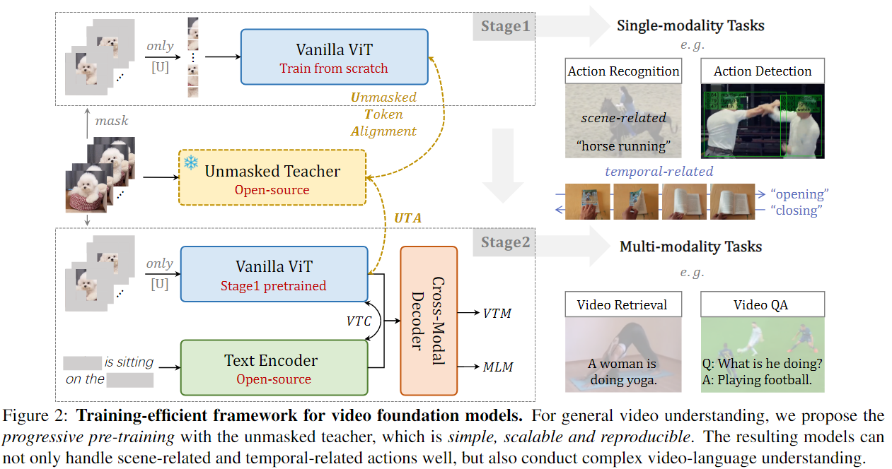
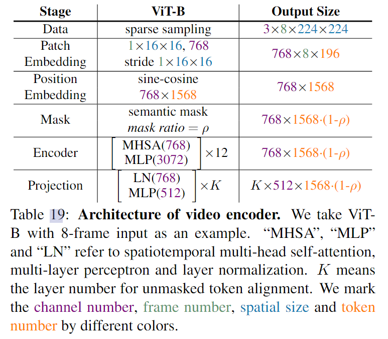
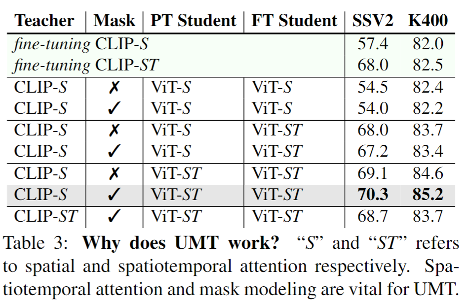
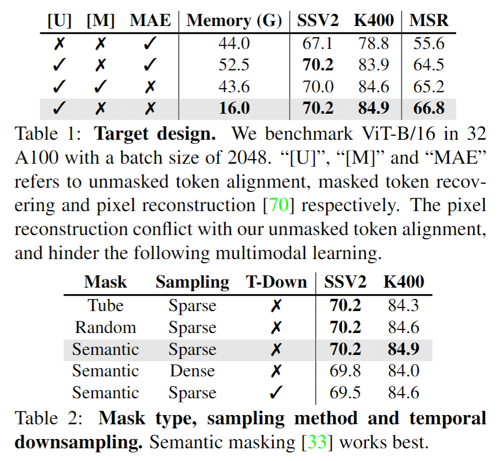
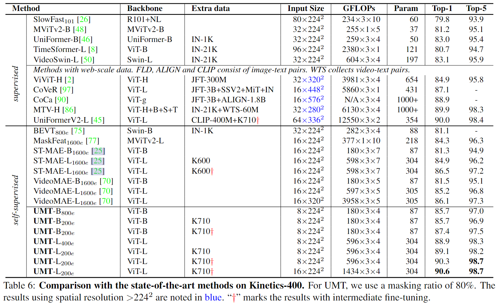
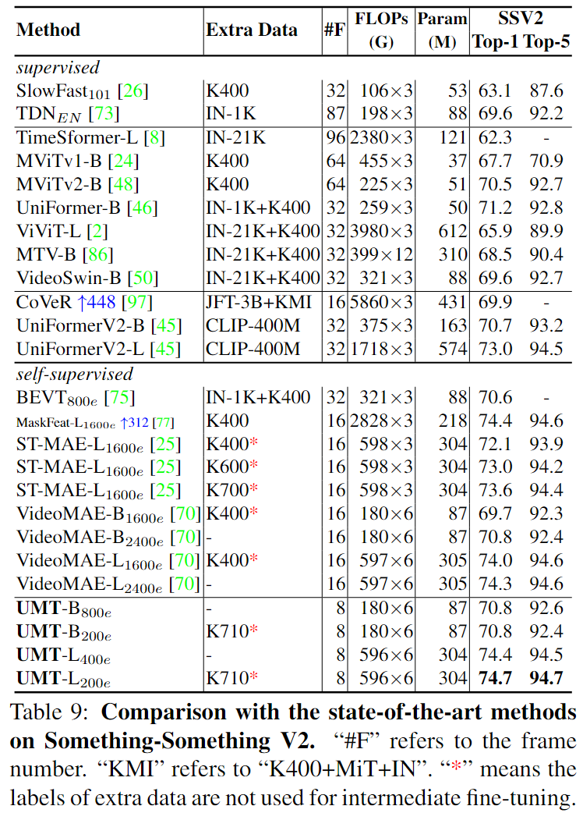

# Unmasked Teacher: Towards Training-Efficient Video Foundation Models

> Li, Kunchang, et al. Unmasked Teacher: Towards Training-Efficient Video Foundation Models. Mar. 2023.

## 1. Motivation & Contribution

### 1.1 Motivation

- 由于视频数据集规模较小，在基于大规模图像预训练基础模型上微调视频模型时，会破坏图像基础模型的泛化性能。如果下游数据集较小，只能把图像基模型参数冻结。
- 图像预训练模型会附带过强的空间初始化，导致模型倾向于从单帧场景中感知行为（即在场景相关的数据集表现不错，但在时序相关的数据集表现不尽人意）。
- 诸如parameter efficient transfer learning中的prompt和adapter方法受限于图像预训练模型的规模，难以进一步scale up。
- 目前另一种流行的方法是由VideoMAE引入的视频掩码预训练，该方法的好处是利用有限的训练数据从头训练视频模型效果优异。但缺点是预训练所需时间和资源过多，且由于重建的是low-level特征，所以难以处理需要更高层语义信息的任务。最后，videoMAE中的decoder限制了模型进一步scale up。

### 1.2 Conyribution

- 提出了一种高效训练视频基础模型的知识蒸馏方法，其不直接迁移图像基模型（如CLIP），而是将其当做非掩码教师，从头训练简单的ViT模型。为了降低训练开销，掩码处理了大部分低语义token，仅对剩下的非掩码token进行处理，并通过线性映射层与教师对齐。
- 该方法既具备掩码训练的高效数据利用率，同时又对多模态任务友好。通过线性层对齐非掩码token，减少了token数量，降低了显存开销。对场景相关行为和时序相关行为，均具备优异的处理能力。

## 2. Method

### 2.1 Unmasked Teacher

#### 2.1.1 Architecture

- 选择了能提取丰富语义信息的CLIP模型作为非掩码教师模型，有利于后续的多模态训练。
- 对于学生模型，采用了最简单的ViT模型（不带class token）。为了促使非掩码token之间的交流，采用时空联合注意力机制。为了更好地和教师模型对齐，在patch embedding中不对时序维度下采样，保证可以逐token对齐信息。

#### 2.1.2 Masking

- 与VideoMAE类似地，采样较高的掩码比例（如80%）来减小视频冗余。
- 但考虑到过于激进的随机掩码可能只保留背景token，无意义的信息会干扰教师信息蒸馏，借鉴了MILAN中的语义掩码策略，逐帧进行语义掩码，这样包含重要信息的token会更大概率地被保留。
- 使用CLIP-ViT最后一层的class token对空间token的affinity matri作为重要性分数，使用多项式分布生成掩码概率。
- 采用稀疏采样策略，增大帧间间隔，保证更复杂的上下文信息，从而促使模型对非掩码对象建立更长时的时空关联。

#### 2.1.3 Target

- 对于教师模型，逐帧输入所有token，得到的输出，送入CLIP预训练时对齐不同模态的projection层，得到最终对齐的目标。对于学生模型，仅输入非掩码token，并通过简单的线性projection层对齐。

### 2.2 Progressive Pre-training

- 在第一阶段，仅使用高质量的视频数据进行掩码预训练。在第二阶段，引入文本编码器和跨模态解码器，使用开源语言大模型进行初始化，并引入额外三种多模态预训练任务：
  - Video-Text Contrastive Learning: 使用symmetric contrastive loss，最大化视觉和文本编码器输出之间互信息；
  - Video-Text Matching: 对跨模态解码器输出进行分类，判断视觉文本是否匹配，采用binary cross-entropy loss，额外引入hard negative mining；
  - Masked Language Modeling: 使用视觉信息辅助，基于可见文本恢复掩码文本token。

## 3. Experiment

- Why does UMT work?:
  - 时空注意力
  - 掩码建模

