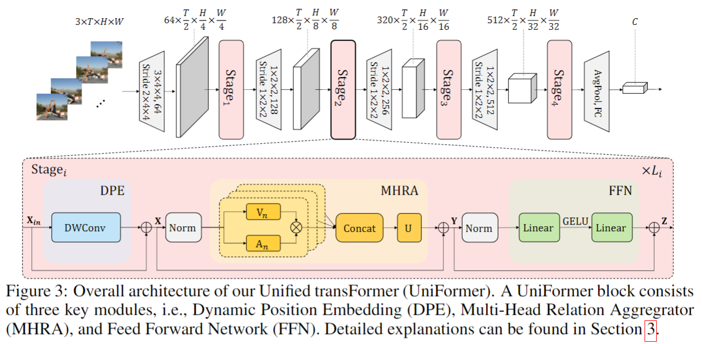
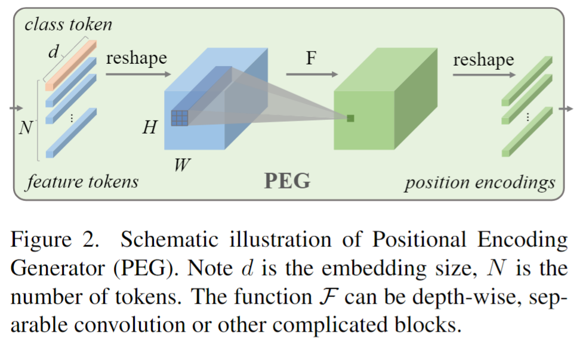
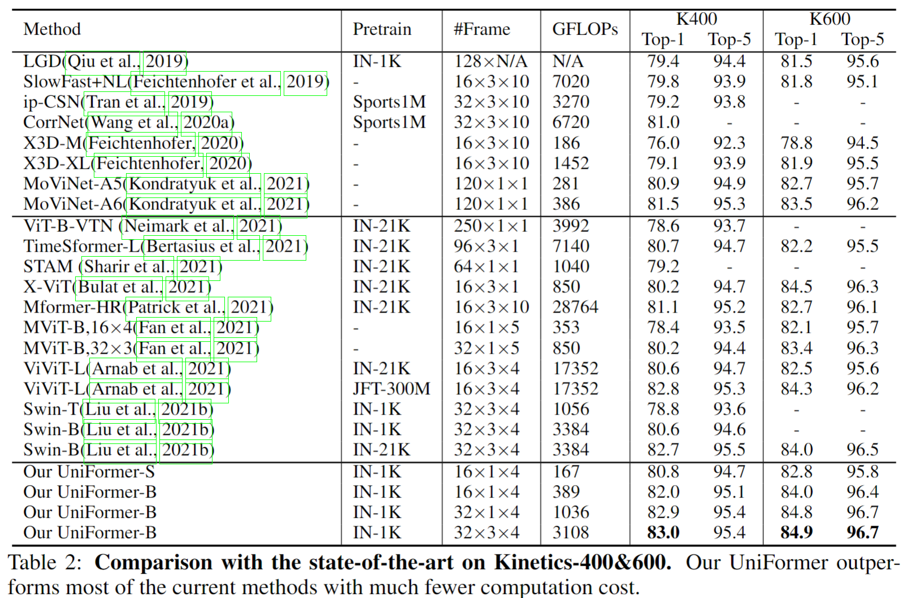
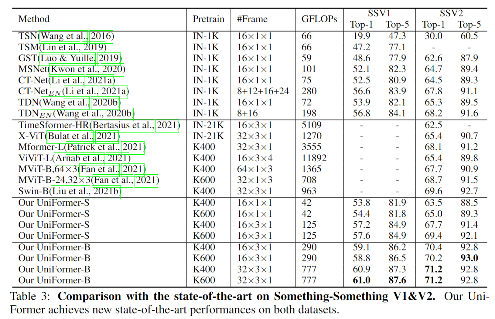

# UniFormer: Unified Transformer for Efficient Spatiotemporal Representation Learning

> Li, Kunchang, et al. "UniFormer: Unified Transformer for Efficient Spatial-Temporal Representation Learning." International Conference on Learning Representations.

## 1. Motivation & Contribution

### 1.1 Motivation

- 对于视频模型，存在着两大痛点。一是局部冗余性，二是全局依赖性。
- convolution只在局部小邻域聚合上下文，避免了冗余的全局计算，但受限的感受野难以建模全局依赖。而self-attention通过比较全局相似度，自然将长距离目标关联，但实验发现，ViT在浅层编码局部特征十分低效。
- 既然ViT的浅层都倾向于关注query token的邻近token，且包含了大量不必要的计算，那么在提取浅层特征时可以尝试用卷积替代自注意力，将convolution和self-attention有机地结合。

### 1.2 Contribution

- 将卷积和自注意力有效地统一成一个transformer模块

## 2. Method

### 2.1 Dynamic position embedding

- 之前ViT中的Position embedding无法适应不同长度的序列、具有排列不变性等问题。
- 因此，本文借鉴了CVPR2021的一篇论文（Conditional Positional Encodingsfor Vision Transformers），采用了一种卷积位置编码，解决了位置编码灵活性的问题。

$$DPE(X_{in})=DWConv(X_{in})$$

- 其中DWConv为零填充的的深度可分离卷积。一方面，卷积对任何输入形式都很友好；另一方面，深度可分离卷积十分轻量，额外的零填充可以提供一定的绝对位置信息。

### 2.2 Multi-head relation aggregation

- 本文将卷积和自注意力统一成一个transformer风格的模块，根据模块深浅分为两种不同的MHRA模块。
- 与多头注意力相似，本文将关系聚合器设计为多头风格，每个头单独处理一组channel的信息。每组的channel先通过线性变换生成上下文token $V_n(X)$，然后在token affinity $A_n$的作用下，对上下文进行有机聚合。
- 在浅层使用Local MHRA，该模块类似3D卷积；在深层使用Global MHRA，类似自注意力。本文通过设计不同的token affinity $A_n$予以区分。

$$R_n(X)=A_nV_n(X) \\ MHRA(X)=Concat(R_1(X);R_2(X);\dotsb;R_N(X))U$$

#### 2.2.1 Local MHRA

$$\begin{equation}
\begin{split}   A_n^{local}(X_i,X_j) &=a_n^{i-j},\space where\space j \in \Omega_i^{t\times h\times w}\\
      &=a[t_i-t_j,h_i-h_j,w_i-w_j]
\end{split}
\end{equation}$$

- $A_n^{local}$为一个可学的参数矩阵，衡量anchor token与局部领域内任一token 的token affinity
- Local MHRA实际与MobileNet block的风格相似，都是PWConv-DWConv-PWConv

#### 2.2.2 Global MHRA

$$
\mathrm{A}_n^{\text {global }}\left(\mathbf{X}_i, \mathbf{X}_j\right)=\frac{e^{Q_n\left(\mathbf{X}_i\right)^T K_n\left(\mathbf{X}_j\right)}}{\sum_{j^{\prime} \in \Omega_{T \times H \times W}} e^{Q_n\left(\mathbf{X}_i\right)^T K_n\left(\mathbf{X}_{j^{\prime}}\right)}}
$$

- 在网络的深层，需要对整个特征空间建立长时关系，这与self-attention的思想一致，因此通过比较全局上下文相似度建立token affinity。
- Global MHRA相当于时空自注意力

## 3. Experiment

