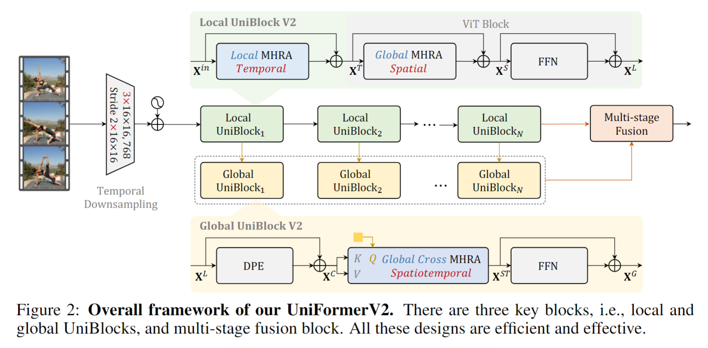

# UniFormerV2: Spatiotemporal Learning by Arming Image ViTs with Video UniFormer

> Li, Kunchang, et al. "UniFormerV2: Spatiotemporal Learning by Arming Image ViTs with Video UniFormer." arXiv preprint arXiv:2211.09552 (2022).

## 1. Motivation & Contribution

### 1.1 Motivation

- 由于UniFormerV1是全新的框架，每次调整结构，都需要先经过一轮ImageNet图像预训练，之后将模型展开后，在Kinetics等视频数据集进行二次微调。根据结果反馈，再进行结构的改进。虽然模型相对其他ViT较小，但二次训练的开销依然较大。
- 因此可以充分利用越来越多开源的预训练图像大模型，设计轻量的时序建模模块，以较小的训练代价迁移到视频任务中。

### 1.2 Contribution

- 设计了高效的局部与全局时空学习模块，可无缝插入到强预训练的图像ViT中，实现强大的视频建模。
- 模型在K400上取得了最优的准确率和计算量权衡，并首次达到90.0%的top-1准确率。

## 2. Method

### 2.1 Temporal Downsampling

- 在Patch Embedding层进行时序下采样，该操作将Patch Embedding拓展为3D卷积，在时序上下采样，变相在相同计算量的前提下，可输入两倍的帧数，可明显提升模型对强时序相关行为的判别能力。

### 2.2 Local UniBlock V2

$$
\mathrm{A}_n^{\mathrm{LT}}\left(\mathbf{X}_i, \mathbf{X}_j\right)=a_n^{i-j}, \text { where } j \in \Omega_i^{t \times 1 \times 1}
$$

$$
\mathrm{A}_n^{\mathrm{GS}}\left(\mathbf{X}_i, \mathbf{X}_j\right)=\frac{\exp \left\{\mathrm{Q}_n\left(\mathbf{X}_i\right)^T \mathrm{~K}_n\left(\mathbf{X}_j\right)\right\}}{\sum_{j^{\prime} \in \Omega_{1 \times H \times W}} \exp \left\{\mathrm{Q}_n\left(\mathbf{X}_i\right)^T \mathrm{~K}_n\left(\mathbf{X}_{j^{\prime}}\right)\right\}}
$$

- 将UniFormerV1的spatialtemporal MHRA拆分为local temporal MHRA 和 global spatial MHRA。
- global spatial MHRA和FFN可以直接利用开源的大规模图像预训练ViT，减少训练开销。
- local temporal MHRA仅在时间维度Depth-Wise Conv，这样不仅能减少计算量，而且提高了网络的时序建模能力。
- 不引入动态位置编码DPE的原因是ViT block中的位置编码已经表征了token的位置。

### 2.3 Global UniBlock V2

$$
\begin{aligned}
\mathrm{R}_n^{\mathrm{C}}(\mathbf{q}, \mathbf{X}) & =\mathrm{A}_n^{\mathrm{C}}(\mathbf{q}, \mathbf{X}) \mathrm{V}_n(\mathbf{X}) \\
\mathrm{C}_{-} \operatorname{MHRA}(\mathbf{q}, \mathbf{X}) & =\operatorname{Concat}\left(\mathrm{R}_1^{\mathrm{C}}(\mathbf{q}, \mathbf{X}) ; \mathrm{R}_2^{\mathrm{C}}(\mathbf{q}, \mathbf{X}) ; \cdots ; \mathrm{R}_N^{\mathrm{C}}(\mathbf{q}, \mathbf{X})\right) \mathbf{U}
\end{aligned}
$$

$$
\mathrm{A}_n^{\mathrm{C}}\left(\mathbf{q}, \mathbf{X}_j\right)=\frac{\exp \left\{\mathrm{Q}_n(\mathbf{q})^T \mathrm{~K}_n\left(\mathbf{X}_j\right)\right\}}{\sum_{j^{\prime} \in \Omega_{T \times H \times W}} \exp \left\{\mathrm{Q}_n(\mathbf{q})^T \mathrm{~K}_n\left(\mathbf{X}_{j^{\prime}}\right)\right\}}
$$

- 为压缩全局时空模块的计算量，引入了交叉注意力(cross attention)，使用单个可学的token作为query，不同层的输出token作为keys和values。并且引入UniFormerV1中的DPE，增强token的时空位置信息。这样，每个全局模块会将对应层的时空信息压缩成单个informative token。

### 2.4 Multi-stage fusion block

- 为了将不同层的informative token融合，得到更复杂的表征，探索了包括串行、并行、层次化等几种融合方式，并最终采用最简单的串行设计。即前面层出来的informative token会作为下一层的query token，不断迭代融合多层信息。最后，这些来自多层融合的时空表征会与骨架网络的输入表征进行加权融合($\mathbf{Z}=\alpha \mathbf{F}+(1-\alpha) \mathbf{F}^C$)，得到最终送入分类层的判别表征。

### 2.5 Implement Details

- 对于Kinetics系列等场景相关视频，也即单图即可较好判断行为的前提下，模型只需要在深层额外插入Global UniBlock，便可以满足这一大类数据的需求。
- 对于Something-Something这类强时序相关视频，对模型的时序建模能力要求极高，除了在Patch Embedding引入temporal downsampling之外，还在每层插入Local UniBlock，在网络的中层和深层插入Global UniBlock，方能实现强大的时序判别。

### 2.6 Kinetics-710

- 本文将同源数据集K400、K600和K700得到一个K710数据集。先在K710上预训练，然后在其他数据集微调，即可实现超过1%的性能提升，同时极大地减小了训练开销。

## 3. Experiment

