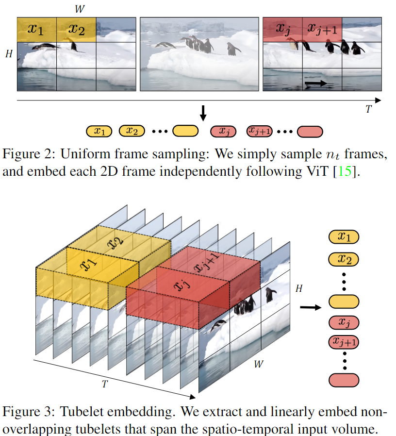
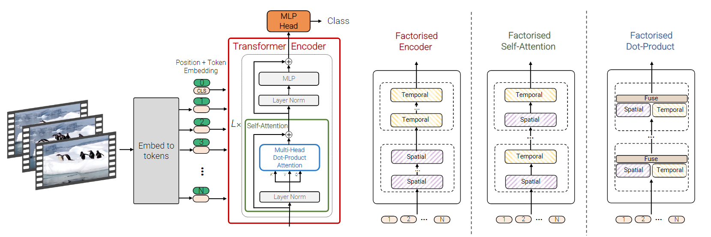
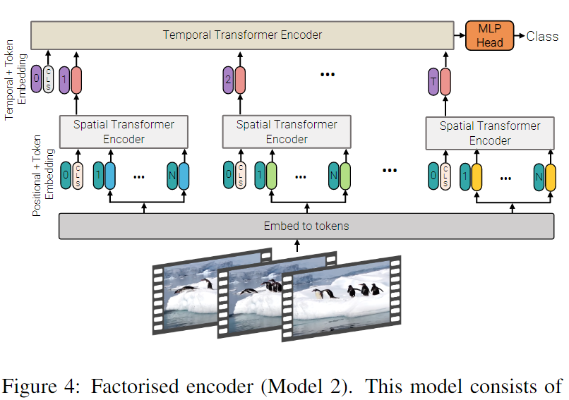
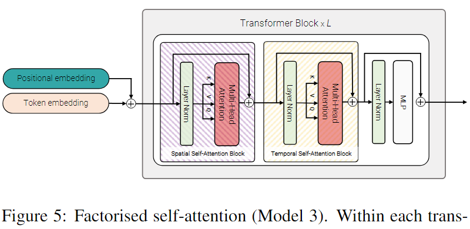
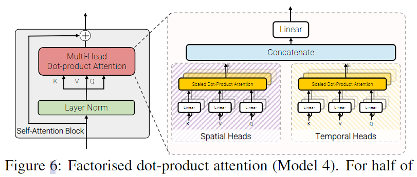
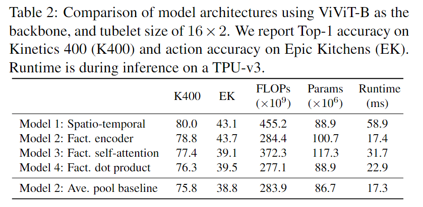
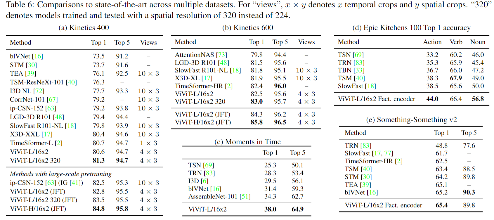

# ViViT: A Video Vision Transformer

> Arnab, Anurag, et al. “ViViT: A Video Vision Transformer.” 2021 IEEE/CVF International Conference on Computer Vision (ICCV), 2022, <https://doi.org/10.1109/iccv48922.2021.00676>.

## 1 Motivation & Contribution

- 提出了两种构建视频token的方法
- 提出了4种时空transformer结构

## 2 Method

### 2.1 Embedding video clips

- Uniform frame sampling
- Tubelet embedding

### 2.2 Transformer Models for Video

#### 2.2.1 Spatio-temporal attention

- joint spatio-temporal attention 计算量过大，存在相当大的冗余。

#### 2.2.2 Factorised encoder

- 先将每帧分别输入spatial encoder 做spatial attention，然后对cls token 做temporal attention，相当于temporal late fusion。
- 将encoder分解

#### 2.2.3 Factorised self-attention

- 相当于Axial Attention，在attention部分建模时空关系
- 先对同一帧的token 做 spatial attention
- 然后对同一位置不同帧的token做temporal attention

#### 2.2.4 Factorised dot-product attention

- 与model 3 类似，只不过时间、空间 attention 是并行的，而不是串行的。
- spatial还是同一帧内不同token，temporal是不同帧同一位置的token

### 2.3 Initialisation by leveraging pretrained models

- Positional embeddings：重复2D Positional embeddings
- Tubelet Embedding weights：central frame initialisation，只用图像模型初始化中间帧，其他帧初始为0，相当于均匀采样。
- Transformer weights for Model 3：spatial attention使用图像模型初始化，temporal attention 零初始化。

## 3 Experiment

