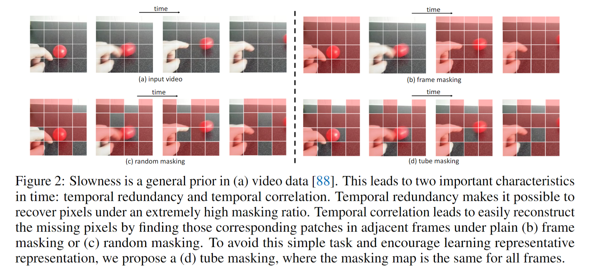
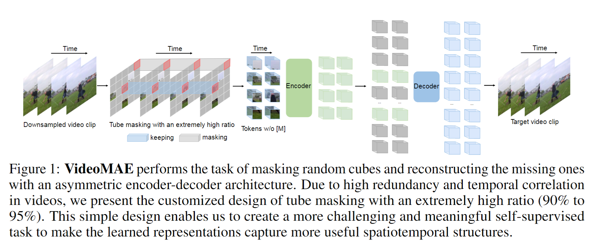
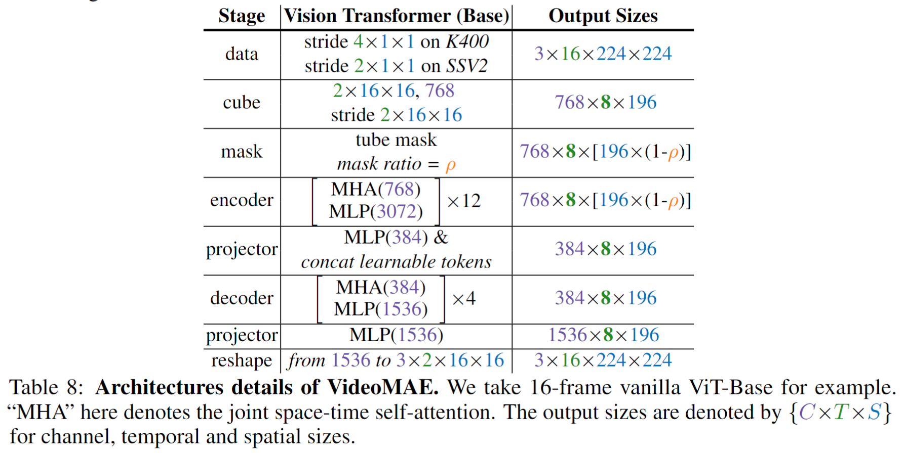
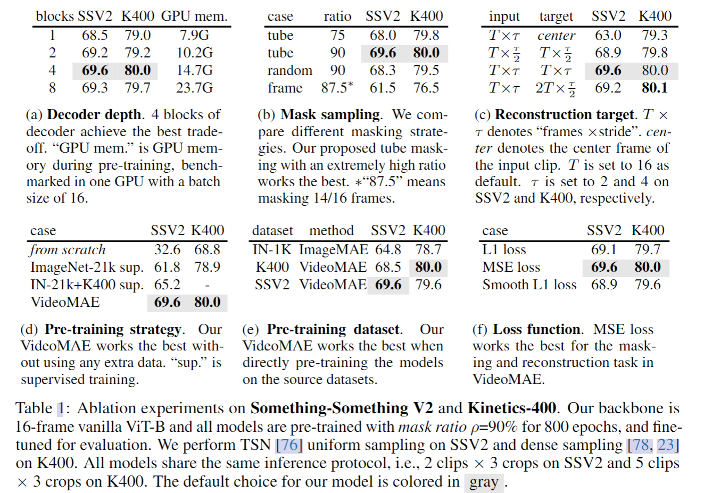
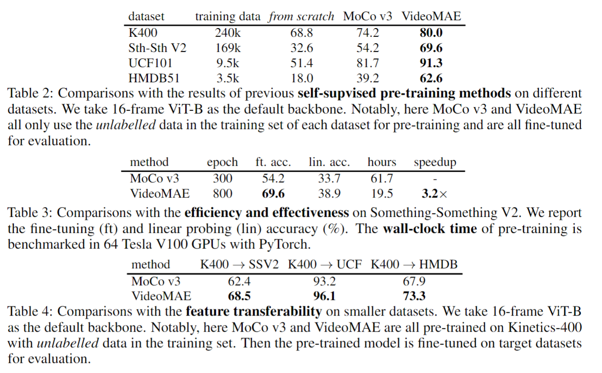
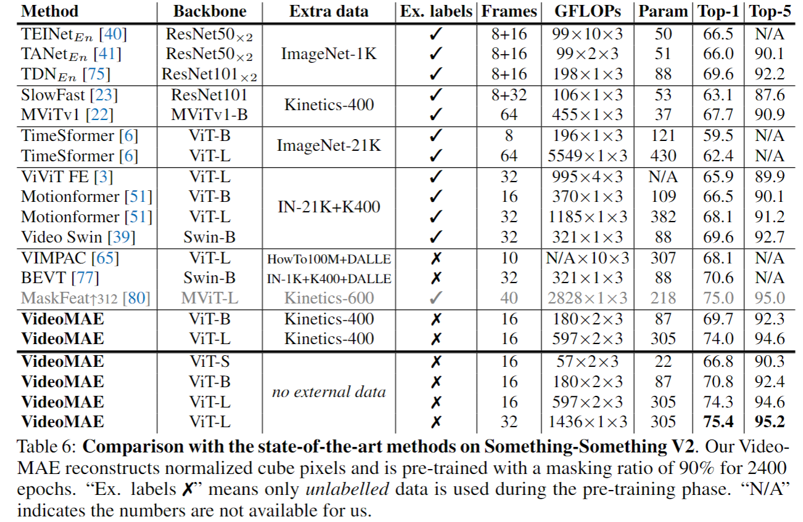
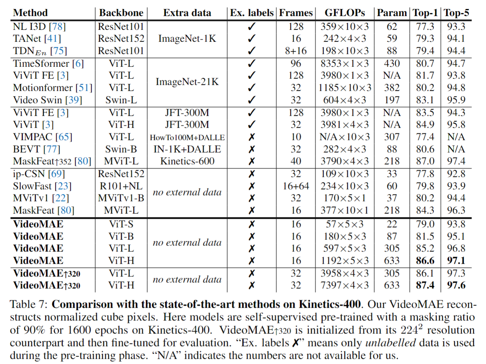
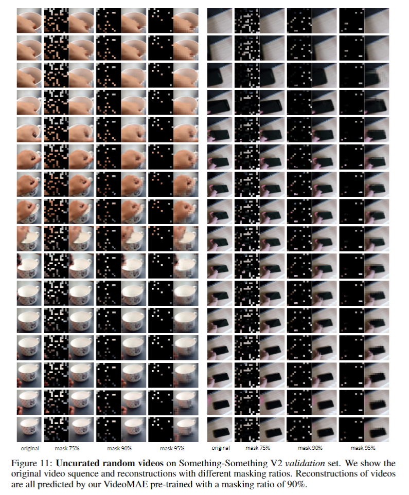

# VideoMAE: Masked Autoencoders are Data-Efficient Learners for Self-Supervised Video Pre-Training

> Tong, Zhan, et al. "Videomae: Masked autoencoders are data-efficient learners for self-supervised video pre-training." arXiv preprint arXiv:2203.12602 (2022).

## 1. Motivation & Contribution

### 1.1 Motivation

- 目前的Video Transformer通常基于图像数据训练的Vision Transformer模型（如 TimeSformer，ViViT等）并且依赖大规模图像数据的预训练模型（例如 ImageNet-1K，ImageNet-21K，JFT-300M等）。TimeSformer，ViViT 均曾尝试在视频数据集中从头开始训练Video Transformer模型，但是都不能取得令人满意的结果。与图像数据集相比，现有的视频数据集的规模相对较小。相比训练图像模型，训练视频模型的计算开销也大了很多。这进一步增加了在视频数据集上训练Video Transformer的难度。
- 如何在不使用任何其他预训练模型或额外图像数据的情况下，直接在视频数据集上有效地训练Video Transformer，特别是最原始的ViT(Vanilla Vision Transformer)，仍然是一个亟待解决的问题。

### 1.2 Contribution

- VideoMAE引入了两种至关重要的设计，即极高的掩码比和管道掩码策略,将MAE运用到了视频领域。

## 2. Proposed Method

### 2.1 Characteristics of Video Data

- Temporal redundancy
  - 视频语义信息随时间变化得非常缓慢，存在时序冗余性。因此，若密集采样视频帧进行预训练，训练效率非常低。其次，视频中的时序冗余性会极大地稀释了视频中的运动特征。若采样原始MAE中的掩码率（50% - 75%），会使得网络更多地关注数据中的静态表象特征或者一些局部变化缓慢的运动。所以，VideoMAE提高了掩码率（90% - 95%）。
- Temporal correlation
  - 如果不针对性地设计掩码策略，这种时序相关性可能会增加重建过程中的“信息泄漏”的风险。如果使用全局随机掩码或随机掩码图像帧，网络可以利用视频中的时序相关性，通过““复制粘贴””相邻帧中时序对应位置的未被遮蔽的像素块来进行像素块重建。

### 2.2 VideoMAE

#### 2.2.1 Temporal downsampling

- 为了解决时序冗余问题，选择了带有时序间隔的采样策略。从原始视频中随机采样一个由 $ t $ 个连续帧组成的视频片段。然后使用带有时序间隔采样将视频片段压缩为$T$帧，每个帧包含$H\times W\times 3$个像素。

#### 2.2.2 Cube embedding

- 对于采样得到的视频片段，采用时空联合的形式进行像素块嵌入。具体来说，将大小为$T \times H \times W$视频片段中大小为$2 \times 16 \times 16$的视觉像素视为一个视觉像素块。同时将视觉像素块的通道维度映射为$D$。

#### 2.2.3 Tube masking with extremely high ratios

- 本方法选择在自监督预训练的过程中采用管道式掩码策略，即不同的帧中相同空间位置的视觉像素块将被遮蔽。
- 相对于图片数据，视频数据具有更强的冗余性，视频数据的信息密度远低于图像。这种特性使得VideoMAE使用极高的掩码率（90% 到 95%）进行预训练。

#### 2.2.4 Backbone: joint space-time attention

- VideoMAE选择使用原始的ViT作为Backbone，同时在注意力层中采用时空联合自注意力（即不改变原始ViT的模型结构）。因此所有未被遮蔽的token都可以在自注意层中相互交互。

### 2.3 Architectures

## 3. Experiments

