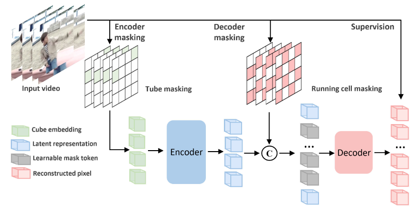
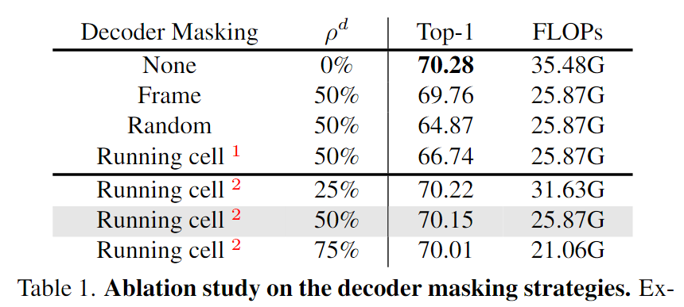
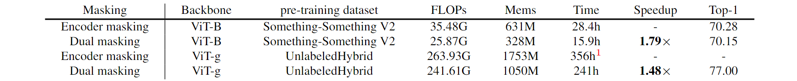
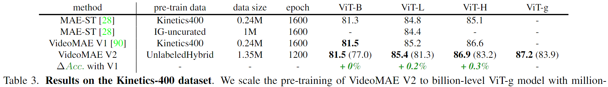
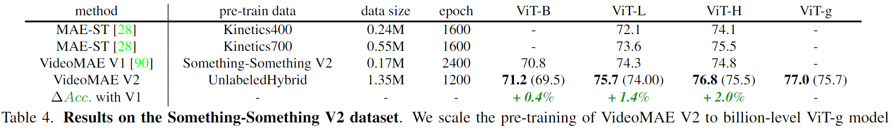
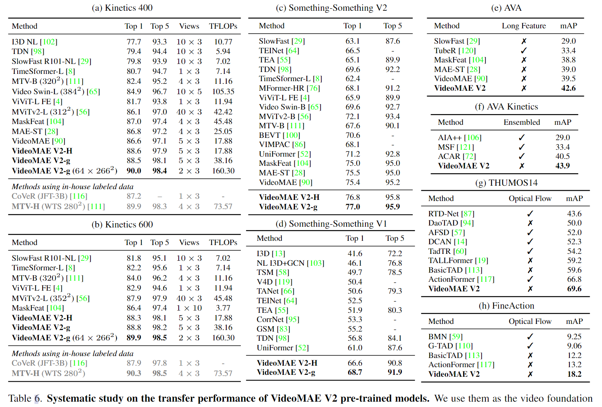
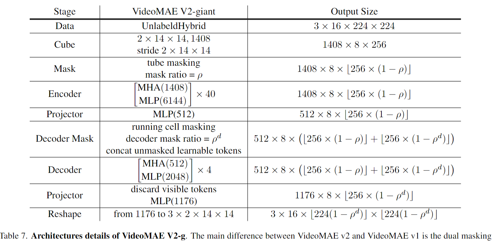

# VideoMAE V2: Scaling Video Masked Autoencoders with Dual Masking

> Wang, Limin, et al. VideoMAE V2: Scaling Video Masked Autoencoders with Dual Masking. Mar. 2023.

## 1 Motivation & Contribution

- 因为视频相较于图像多出来一个时间维度，且视频时序变化多端，导致视频模型训练开销过大，所以一直没有一个十亿参数级别的视频基础大模型。本文提出了视频领域第一个十亿参数级别的大规模模型。
- MAE模型相较于其他MIM模型训练高效的原因来自于其非对称的编码解码器结构，在VideoMAE中encoder输入的tokens数量只有decoder的十分之一。轻量化的encoder带来了训练效率的提升，同时视频又具有时空冗余性，所以本文尝试在decoder上也采用mask减少输入的tokens，通过encoder和decoder双重掩码的策略，提高预训练的batchsize和训练速度。
- 根据语言领域的经验，模型规模和数据规模越大，模型性能越强。视频模型相较于图像数据集来说依然规模较小，所以本文尝试将现有的多种视频数据集混合起来，建立一个更大的视频预训练数据集，以支持更大规模的模型训练，以防止模型过拟合。
- 大模型直接在下游小型数据集上微调容易过拟合，需要设计新的迁移训练方法。本文基于大规模的混合数据集，提出了一个渐进式迁移训练方法。

## 2 Method

### 2.1 Dual Masking for VideoMAE

- Encoder和Decoder各有一个不同的mask map。
- Encoder的mask map与VideoMAE相同都采用了极高掩码率的随机管道掩码。
- Decoder则受MAR中Classifier Branch只采用visible tokens也效果不错的启发，设计了一个一样的running cell mask，用于Decoder。Decoder的输入则变为了Encoder输出的tokens和经decoder mask 后的learnable mask tokens，encoder输入的tokens减少了。
- 二者虽然都能减少训练开销，但出发目的不同。Encoder采用tube mask是为了避免信息泄露，使Enocoder能够从中学到足够好的特征，而Decoder采用running cell mask则是为了鼓励decoder能从信息补偿中减少重建信息损失。

$$
\ell=\frac{1}{\left(1-\rho^d\right) N} \sum_{i \in \mathbb{M}_d \cap \mathbb{M}_e}\left|\mathbf{I}_i-\hat{\mathbf{I}}_i\right|^2 .
$$

### 2.2 Scaling VideoMAE

#### 2.2.1 Model Scaling

- backbone：ViT-B, ViT-L, ViT-H, to ViT-g
- ViT-g 是一个具有十亿参数级的大型模型，从未在视频领域进行过尝试。

#### 2.2.2 Data Scaling

- 构建了一个未标记的混合视频数据集**UnlabeledHybrid**，涵盖来自一般网络、Youtube、Instagram、电影和手动录制的数百万视频。这些视频主要从一些主要视频数据集(Kinetics, Something-Something, AVA, WebVid)中收集，以及从Instagram上爬取。

### 2.3 Progressive training

- 为了让大规模预训练视频模型更好地迁移到下游任务中，并且避免直接在目标数据集上微调导致过拟合，本文采用了一种渐进式迁移训练策略，以更好地利用多源多阶段的语义监督信息。
- 首先在大规模无标记混合数据集**UnlabeledHybrid**进行掩码自监督预训练。
- 然后通过收集和对齐多个现有的具有标注的监督数据集来构建另一个有标注的混合数据集**LabeledHybrid**，接着在这个数据集上进行有监督的后预训练。
- 最后对目标数据集执行特定的微调，将通用语义信息转换为以任务为中心的知识。

## 3 Experiment

