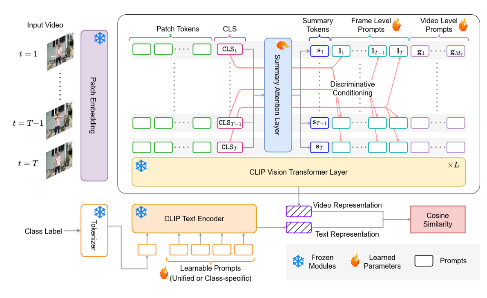
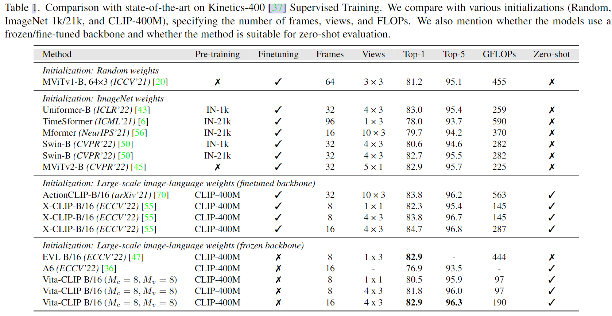
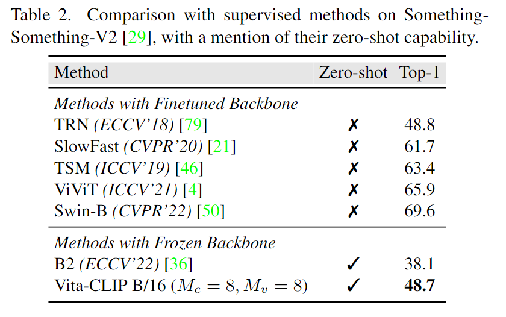
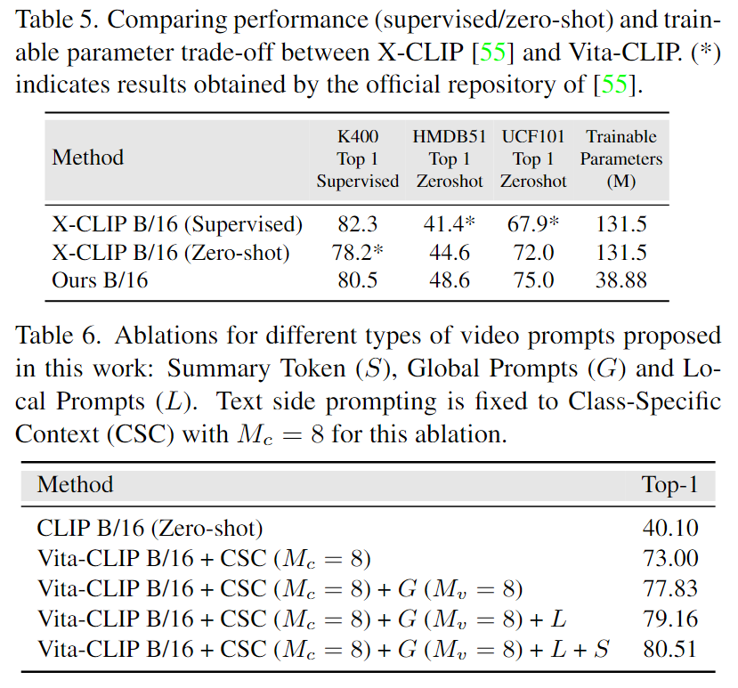

# Vita-CLIP: Video and text adaptive CLIP via Multimodal Prompting

> Wasim, Syed Talal, et al. "Vita-CLIP: Video and text adaptive CLIP via Multimodal Prompting."

## 1. Motivation & Contribution

### 1.1 Motivation

- 目前将预训练好的图像文本大模型迁移到动作识别领域主要通过两种方法，一种是从最近的提示学习(prompt learning)中汲取灵感，并在文本或视觉方面提出针对视频的提示学习方案，以及增加额外的即插即用的模块以改进图像模型的时序建模能力。另一种是端到端的微调视频CLIP模型。
- 这些方法的问题是要么无法有效利用视频任务中视觉和文本的特点，要么微调模型后失去了zero-shot的泛化能力。简而言之，之前的工作都是专注于更好的监督学习或者更好的zero-shot泛化能力，还没有结合二者优点的工作。
- 由于选择frozen CLIP作为backbone，所以如何在此基础上有效增加视频时序信息，成为了关键。本文采用和Visual Prompt Tuning中类似的操作，即在CLIP Encoder输入中增加额外的prompt token，不同之处是本文的更加复杂且针对视频时序信息。

### 1.2 Contribution

- 提出了一种多模态提示学习方法，其中视觉部分增加了多层次的visual prompt，文本部分也添加了额外的text prompt。

## 2. Video and text Prompt Learning

### 2.1 Method

- 该部分的目的主要有两个，一是引入帧间信息交换帮助CLIP模型发掘时序信息，二是增加额外的参数使得CLIP图像模型适应视频模态。
- 这个visual prompt learning在每层增加了三种额外的token，分别是summary token，frame level local prompt tokens，video-levelglobal prompt tokens。

#### 2.1.1 Summary Token

- Summary token 用于总结全局分类信息后增强每帧的分类信息，通过一层线性层和一层MHSA实现。

$$\begin{aligned}\mathbf{Z}_{0, p r o j}^{(l-1)} & =\mathbf{P}_{\text {sum }}^T \mathbf{Z}_0^{(l-1)} \\ S^{(l)} & =\operatorname{MHSA}\left(\operatorname{LN}\left(\mathbf{Z}_{0, \text { proj }}^{(l-1)}\right)\right)+\mathbf{Z}_{0, \text { proj }}^{(l-1)}\end{aligned}$$

- 其中,$\mathbf{Z}_0^{(l-1)}=\left[\mathbf{z}_{1,0}^{(l-1)}, \cdots, \mathbf{z}_{T, 0}^{(l-1)}\right], \mathbf{S}^{(l)}=\left[\mathbf{s}_1^{(l)}, \cdots, \mathbf{s}_T^{(l)}\right]$

#### 2.1.2 Global Prompt Tokens

- Global prompt tokens 都是随机初始化的可学习向量，用于提供额外的参数以学习数据分布。

$$\mathbf{G}^{(l)}=\left[\mathbf{g}_1^{(l)}, \cdots, \mathbf{g}_{M_v}^{(l)}\right]$$

#### 2.1.3 Local Prompt Tokens

- Local prompt tokens 也都是随机初始化的可学习向量，数量与视频clip中帧的数量相等。与global prompt tokens的不同之处在于加入了当前帧的cls token。主要目的是帧间分类信息的信息交互，增强各帧的分类信息。

$$\hat{\mathbf{l}}_t^{(l)}=\mathbf{l}_t^{(l)}+\mathbf{z}_{t, 0}^{(l-1)}$$

#### 2.1.4 Appended Token Sequence

- 附加的token只输入frozen pretrained self-attention，而FFN的输入则去除了额外的tokens。

$$\begin{aligned}{\left[\hat{\mathbf{z}}_t^{(l)}, \mathbf{S}^{(l)}, \mathbf{G}^{(l)}, \mathbf{L}^{(l)}\right]=} & \operatorname{FSA}\left(\operatorname{LN}\left(\left[\mathbf{z}_t^{(l-1)}, \mathbf{S}^{(l)}, \mathbf{G}^{(l)}, \mathbf{L}^{(l)}\right]\right)\right) \\& +\left[\mathbf{z}_t^{(l-1)}, \mathbf{S}^{(l)}, \mathbf{G}^{(l)}, \mathbf{L}^{(l)}\right]\end{aligned}$$

$$\mathbf{z}_t^{(l)}=\operatorname{FFN}\left(\operatorname{LN}\left(\hat{\mathbf{z}}_t^{(l)}\right)\right)+\hat{\mathbf{z}}_t^{(l)}$$

### 2.2 Text Encoder Prompt Learning

- 不采用手工设计的文本提示，而是采用多个可学习的向量作为文本提示。
- 文本提示也有两种方式，一种为统一上下文表示（所有类别共享一组提示向量），另一种为类别特定上下文（每个类别都有一组独立的提示向量），本文采用后一种(效果更好)。其提示向量定义为：$[u _ { i } ^ { n _ { c } } ], i \in \{ 1 , \cdots , M _{ c } \}， n_ { c } \in \{ 1 , \cdots , N _ { c } \}$
- 对于zero-shot任务，由于存在未知类别，所以只使用手工设计的文本提示。

$$C = [ u_{1},u_{2},\cdots ,u_{N},u_{M_c},\{label\}]$$

## 3. Experiment

