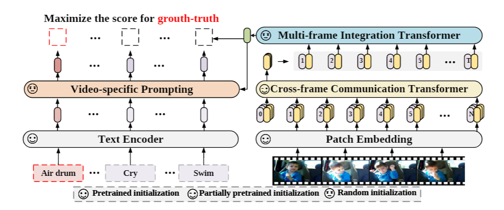
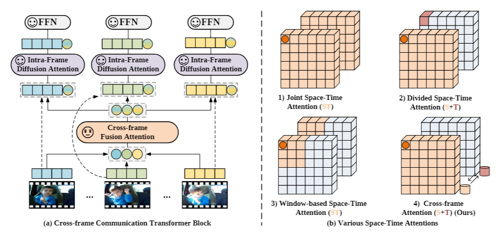
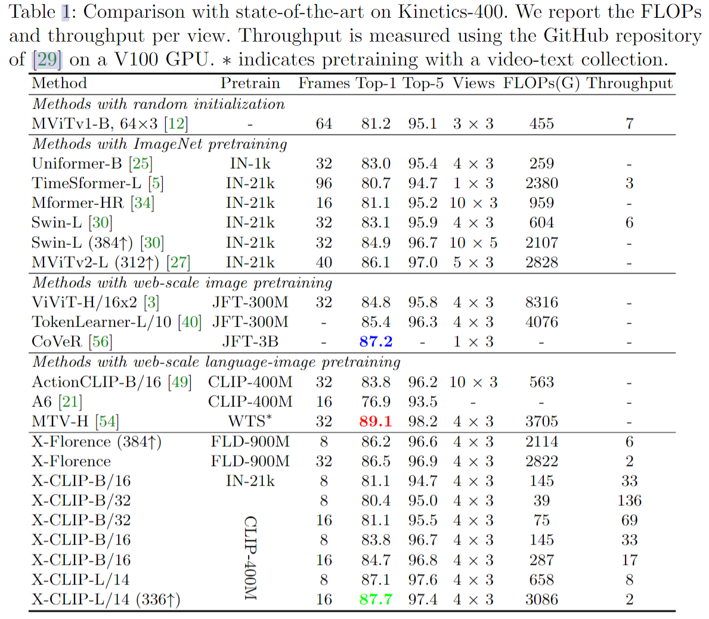
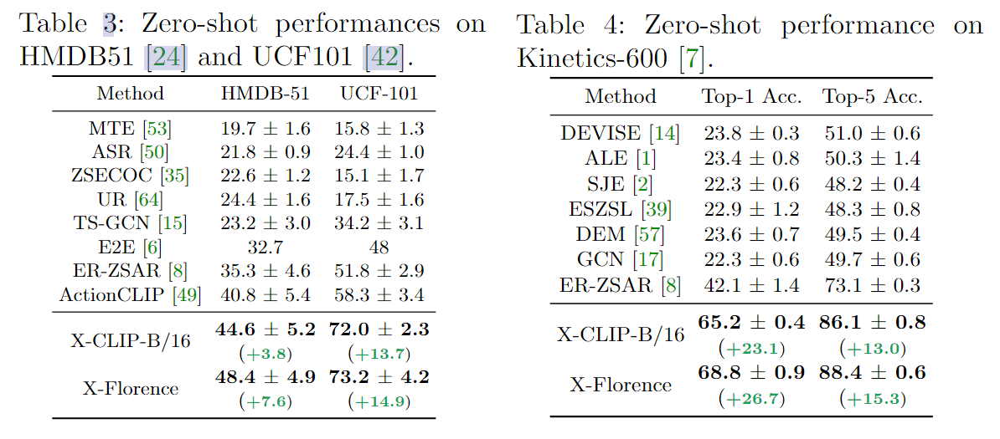
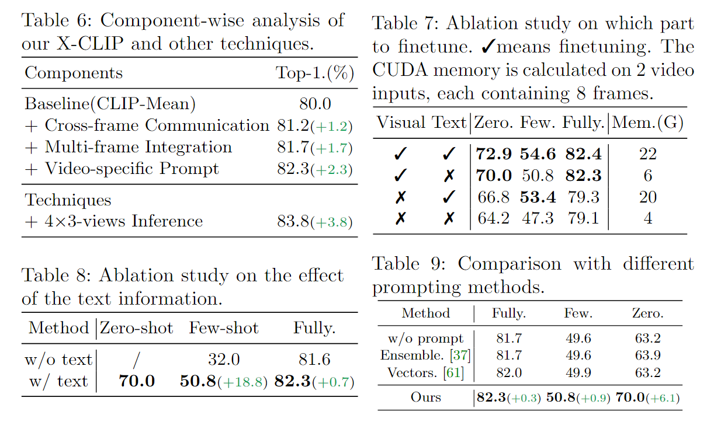

# Expanding Language-Image Pretrained Models for General Video Recognition

> Ni, Bolin, et al. Expanding Language-Image Pretrained Models for General Video Recognition. Aug. 2022.

## 1 Motivation & Contribution

### 1.1 Motivation

- 将预训练的语言 - 图像模型中的知识迁移到视频领域需要解决两个关键问题：
  - 如何在语言 - 图像预训练模型中建模视频的时序信息？
    - 之前的一些video transformer模型都是采用每一帧单独编码和late fusion的方式，无法有效利用时序信息。
    - cls token 能代表一帧的语义信息，通过一个帧间语义信息交流机制，弥补时序信息的损失。
  - 如何利用视频类别标签中的文本信息？
    - 固定的类别标签缺乏上下文信息，而且同一个类别下的视频共享相同的标签信息，但它们的关键视觉线索可能是不同。
    - 相较于手工设计的 text prompt，可学习的自适应text prompt更灵活。通过视频自适应的提示模块，根据视频内容的上下文，自适应地为每个类别生成合适的提示信息。

### 1.2 Contribution

- 提出了一个时序建模的新方法，由两部分组成：cross-frame communication transformer 和 multi-frame integration transformer，在语言-图像预训练模型中引入时序信息。
- 提出了 Video-specific Prompting 机制，用于产生视频自适应的提示信息，充分地利用了类别标签中的文本信息和视频信息。

## 2 Method

### 2.1 Video Encoder

- 由 $L_c$ 层 Cross-frame Communication Transformer (CCT) 和 $L_m$ 层 Multi-frame Integration Transformer (MIT)组成
- CCT在预训练多模态模型中加入了跨帧信息交流机制，获取含有时序信息的帧级特征。
- MIT则将帧级特征聚合为视频特征。

#### 2.1.1 Cross-frame Attention

- 为了避免联合时空建模（join space-time attention）的高计算量，整体上，CCT 采用各帧独立编码的计算方式。
- 具体地，对每一帧编码时，动态地生成各自的 message token（由每一帧的cls_token线性变换得到）携带所在帧的语义信息，再通过 Cross-frame Fusion Attention(CFA) 交换不同帧的 message token 携带的信息，从而弥补时序信息的缺失。随后，每一帧的 message token 再回归到所属帧。

$$\hat{M ^ { ( l ) }} = M ^ { ( l ) } + C F A ( L N ( M ^ { ( l ) } ) )$$

- 接着通过 Intra-frame Diffusion Attention(IFA)（也即是每帧进行空间上的self-attention自注意力计算），每一帧内的 spatial tokens 在建模空间信息的同时，吸收了来自 message token 的全局时序信息。

$$[ \hat{z _ { t }} ^ { ( l ) }  , m _ { t } ^ {(l) }  ] =  [z _ { t } ^ { ( l - 1 ) } , \hat{m _ { t }} ^ { ( l) }  ]+ \operatorname { I F A } ( L N ( [ z _ { t } ^ { ( l - 1 ) } , \hat{m _ { t }} ^ { ( l ) } ] ) )$$

- 最后，每一帧的 spatial tokens 再经过 FFN 进一步编码信息。为了进一步提升性能，研究者在 CCT 产生的每帧的特征上，额外使用一层 Multi-frame Integration Transformer（MIT）聚合每一帧的信息（使用每一帧的cls-token进行multi-self attention自注意力计算），产生视频最终的表达。

$$z _ { t } ^ { ( l ) } = \hat{z _ { t }} ^ { ( l ) } + F F N ( L N ( \hat{z _ { t }} ^ { ( l ) } ) )$$

$$h _ { t } = z _ { t , 0 } ^{(L_c)}$$

$$v = \operatorname {A v g P o o l}  ( \operatorname{MIT} ( H + e ^ { t e m p } ) )$$

- Cross-frame Fusion Attention 和 MIT 是额外添加的模块并使用随机初始化。Intra-Frame Diffusion Attention 和 FFN 对应于预训练 Vision Transformer 中的 self-attention 和 FFN 部分。

### 2.2 Video-specific prompting

- 每个视频自适应提示模块由一个 cross-attention 和一个 FFN 组成。令文本特征当作 query，视频特征的cls_token作为key,value。允许每个类别的文本从视频的上下文中提取有用的提示信息作为自己的补充，最后，使用学习到的提示信息来丰富原本文本信息的表示，使得其具有更强的判别性。

$$\={c} = c + M H S A ( c , \={z} )$$

$$\~{c} = c + F F N ( \={c} )$$

$$\^{c}=c+\alpha \~{c}  $$

## 3 Experiment

